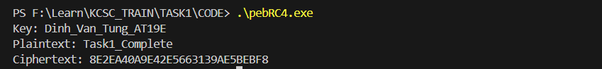
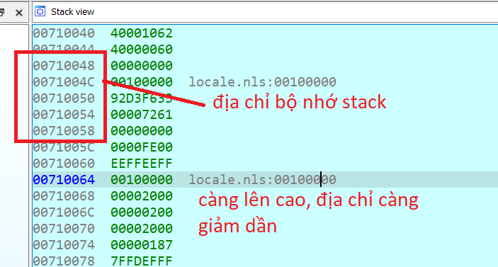
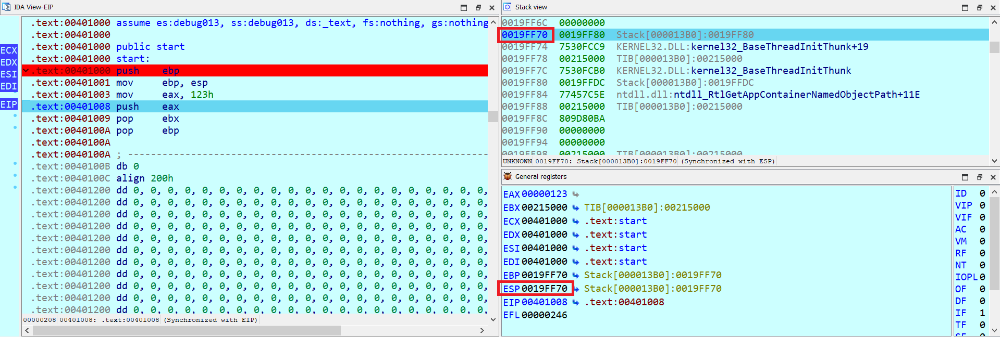
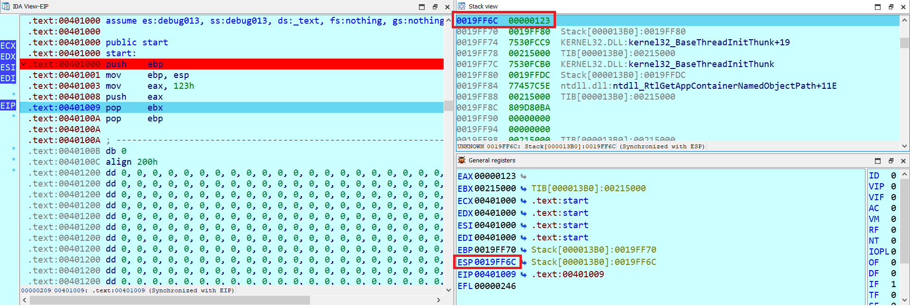
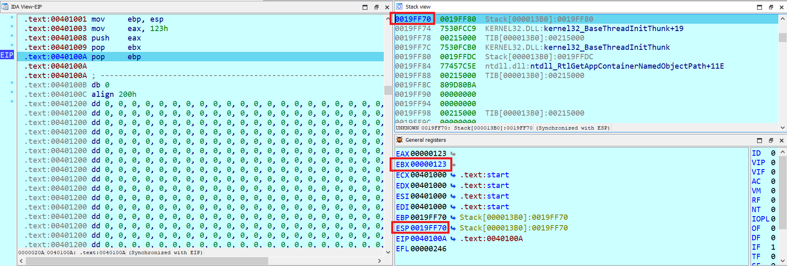
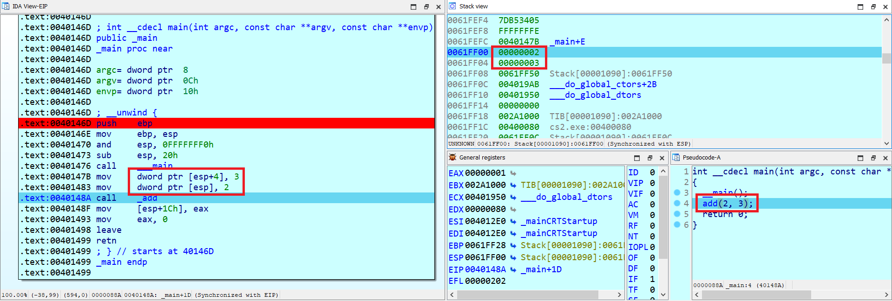
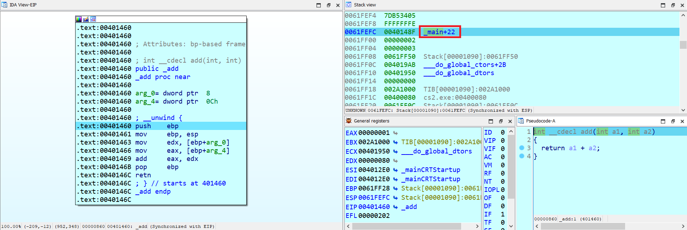
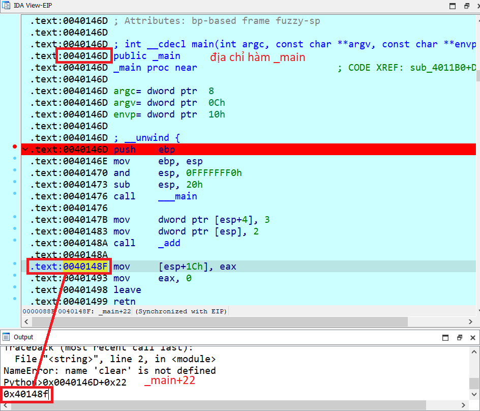
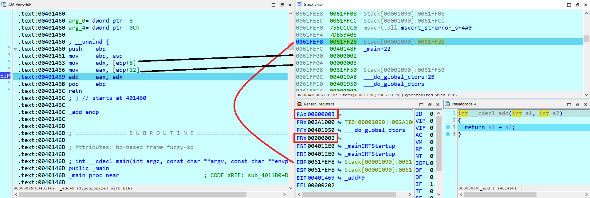
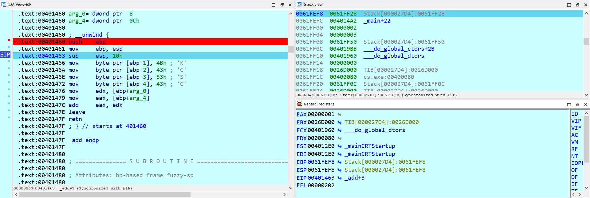

# TASK 1

## Nhiệm vụ

```txt
Code thuật toán mã hóa RC4 bằng masm
Yêu cầu: -  Chạy được và phải đúng
         -  Input: Plain Text + Key
         -  Output: Hex 
         -  Giải thích comment code rõ ràng
         -  RC4 gồm nhiều phase khác nhau, phải tìm hiểu và triển khai các phase đó ở dạng hàm
         -  Không được dùng các thư viện có sẵn (print hex, kể cả kernel32.dll để gọi API,...) 
         -  Bài này chỉ sử dụng 4 WinAPI là GetStdHandle, WriteConsole, ReadConsole và ExitProcess
         -  Sử dụng PEB để resolve 4 A1PI trên
Suggested IDE: https://www.masm32.com/
```

## Code

[pebRC4.asm](CODE/pebRC4.asm)

[pebRC4.exe](CODE/pebRC4.exe)

[pebRC4.obj](CODE/pebRC4.obj)

## Demo



# STACK LÀ GÌ

- Trong Assembly (ASM), ngăn xếp (stack) là một cấu trúc dữ liệu đặc biệt dùng để lưu trữ thông tin **tạm thời** trong quá trình thực thi chương trình. 

- Ngăn xếp hoạt động dựa trên nguyên tắc `LIFO` (Last In, First Out), nghĩa là giá trị được đẩy vào sau cùng sẽ được lấy ra đầu tiên.

- Ngăn xếp được quản lý bởi 2 thanh ghi chính:

    - **ESP (Stack Pointer):** Trỏ đến đỉnh ngăn xếp hiện tại.

    - **EBP (Base Pointer):** Trỏ đến đáy của khung ngăn xếp hiện tại trong các hàm, giúp quản lý các tham số và biến cục bộ của hàm.

    (Tý nữa mình sẽ đề cập một ví dụ khi sử dụng 2 thanh ghi này trong chương trình).

## 1. Cấu trúc của Stack

- Ngăn xếp lưu trữ dữ liệu từ đỉnh ngăn xếp hướng về phía dưới. Trên các kiến trúc x86, ngăn xếp phát triển theo hướng giảm dần địa chỉ bộ nhớ.

    

    - **Đỉnh ngăn xếp:** Được trỏ bởi thanh ghi `ESP`, là nơi các giá trị sẽ được đẩy vào (`push`) hoặc lấy ra (`pop`).

    - **Khung ngăn xếp:** Mỗi hàm tạo ra một khung ngăn xếp (`stack frame`) riêng để lưu trữ các tham số, biến cục bộ, và địa chỉ quay lại (`return address`) cho hàm gọi.

## 2. Các thao tác trên Stack

- Có 2 thao tác cơ bản là `PUSH` và `POP`.

### push

- Lệnh `PUSH` dùng để lưu giá trị vào ngăn xếp.

    - Đầu tiên, giá trị của `ESP` sẽ giảm đi `4` (trên hệ thống 32-bit), do ngăn xếp phát triển theo hướng ngược.

    - Sau đó, **giá trị** cần lưu sẽ được ghi vào địa chỉ mà `ESP` đang trỏ đến.

### pop

- Lệnh `POP` dùng để lấy giá trị từ đỉnh ngăn xếp.

    - Đầu tiên, giá trị hiện tại tại địa chỉ `ESP` được lấy ra và lưu vào thanh ghi đích.

    - Sau đó, `ESP` sẽ tăng lên 4, chỉ đến giá trị trước đó trên ngăn xếp.

### ví dụ

```asm
.386
.model flat, stdcall
.stack 4096
assume fs:nothing

.code
    main proc
        push ebp
        mov ebp, esp

        mov eax, 123h
        push eax
        pop ebx

        pop ebp
    main endp
    end main
```



Như vậy sau câu lệnh `push eax` thì `esp` sẽ giảm đi 4 (0019FF70 - 4 = 0019FF6C), và giá trị tại địa chỉ 0019FF6C sẽ là giá trị của thanh `eax` (123h).



Sau khi thực hiện lệnh `pop ebx` thì esp sẽ tăng lên 4 (0019FF6C + 4 = 0019FF70), và giá trị tại địa chỉ 0019FF6C sẽ được đẩy vào thanh `ebx` (123h).



## 3. Sử dụng ngăn xếp trong các hàm

- Ngăn xếp rất hữu ích khi gọi hàm và xử lý các tham số, biến cục bộ. Mỗi khi một hàm được gọi, một khung ngăn xếp mới được tạo ra để lưu trữ các giá trị cần thiết.

### Trước khi nào một hàm.

- File thực thi (quăng vô IDA): [.exe](CODE/cs2.exe)

    ```C
    #include<stdio.h>

    int add(int a, int b){
        return a + b;
    }

    int main(){
        int k;
        k = add(2, 3);
        return 0;
    }
    ```

- Chương trình sẽ thực hiện truyền những tham số cần cho vào hàm: có 2 cách truyền vào hàm là sử dụng lênhn `push` và `mov` (tuy khác nhau về hình thứ nhưng bản chất vẫn là một).

    Ví dụ trên thì trước khi gọi hàm `_add` thì sẽ cần đẩy các giá trị mà ta muốn truyền vào, trong TH này thì chương trình thực hiện mov giá trị vào địa chỉ của `stack` sao cho vẫn đúng nguyên tắc đẩy tham số ngược vô hàm (không khác push):

    

    Câu lệnh trên tương tự câu lệnh:

    ```asm
    push 3
    push 2
    ```

    Sau khi nhảy vào hàm ta sẽ thấy một giá trị được đẩy vào stack, đóa là `_main+22`, vậy nó là gì?? nó chính là địa chỉ quay lại (return address). Đó chính là địa chỉ của lệnh kế tiếp sau lệnh `call`, khi hàm thực hiện xong lệnh `ret` sẽ lấy giá trị từ đỉnh ngăn xếp rùi thực hiện nhảy đến địa chỉ đó

    

    

### Khi vào một hàm.

- **Lưu `EBP` vào ngăn xếp:** Thực hiện `push ebp` để lưu giá trị hiện tại của `EBP` vào ngăn xếp.

- **Thiết lập khung ngăn xếp mới:** `mov ebp, esp` di chuyển giá trị của `ESP` vào `EBP`. Lúc này, `EBP` sẽ trỏ đến **đỉnh ngăn xếp** và đóng vai trò là điểm tham chiếu **cố định** cho khung ngăn xếp của hàm.

    

    Như vậy ta có thể truy cập tham số của hàm dễ dàng bằng cách dùng các `offset`, như `EBP + 8` cho tham số đầu tiên, `EBP + 12` cho tham số thứ hai, v.v.

### Khi thoát khỏi hàm.

- **Dọn dẹp khung ngăn xếp:** `mov esp, ebp` di chuyển giá trị `EBP` vào `ESP`, giúp khôi phục lại giá trị của `ESP` về trước khi hàm được gọi (Chỉ cần khi mà trong quá trình gọi hàm bạn có làm thay đổi địa chỉ của stack hoặc đẩy thêm giá trị vô stack, thay đổi thanh ghi esp thì câu lệnh này sẽ không xuất hiện).

- **Phục hồi EBP:** Thực hiện `pop ebp` để lấy lại giá trị cũ của `EBP` từ ngăn xếp (khôi phục lại giá trị của `ebp` trước khi gọi hàm, do có lênh push ebp ở trên đầu mỗi hàm roài).

- **Trở về hàm gọi:** `ret` lấy địa chỉ trở về từ ngăn xếp và nhảy đến địa chỉ đó để tiếp tục thực thi.

## 4. Lưu trữ tham số và biến cục bộ

- Các **tham số của hàm** được lưu trên ngăn xếp, thường là ngay trên `EBP` (phía có giá trị **địa chỉ cao hơn**), trong khi các **biến cục bộ** được lưu dưới `EBP` (phía có giá trị **địa chỉ thấp hơn**). Nhờ `EBP`, ta có thể dễ dàng xác định vị trí của các biến cục bộ và tham số bằng cách sử dụng các địa chỉ tương đối:

    - Tham số đầu tiên của hàm ở `EBP + 8` (4 byte của địa chỉ quay lại + 4 byte của giá trị EBP).
    
    - Các **biến cục bộ** có thể được truy cập bằng `EBP - offset`.


- File thực thi (quăng vô IDA): [.exe](CODE/cs.exe)

    ```C
    #include<stdio.h>

    int add(int a, int b){
        char _0 = 'K';
        char _1 = 'C';
        char _2 = 'S';
        char _3 = 'C';
        return a + b;
    }

    int main(){
        int k;
        k = add(2, 3);
        return 0;
    }
    ```

    Như ở ví dụ trên thì ta thấy có những biến cục bộ là `_0`, `_1`, `_2`, `_3`, bây giờ chúng ta xem trên IDA xem nó hoạt động: 

    

    Ở ví dụ này có câu lệnh `sub esp, 10h` (được sử dụng để dành không gian trên ngăn xếp cho các biến cục bộ hoặc dữ liệu tạm thời mà hàm có thể cần trong quá trình thực thi. Cụ thể, lệnh này giảm thanh ghi `ESP` xuống **16 byte**, tạo ra một khoảng trống **16 byte** trên ngăn xếp.)

    Như ta nhìn thấy những biến cục bộ được truy cập bằng `[ebp - offset]`. Và tham số truyền vào được lấy thông qua `[ebp+8]` và `[ebp+12]`.

    Ở ví dụ này có câu lệnh `leave`, câu lệnh `leave` này thay 2 câu lệnh ở trên là (do ví dụ này có sự thay đổi của thanh ghi `esp` nên cần phải thêm câu lện `mov esp, ebp` ở trên):

    ```asm
    mov esp, ebp
    pop ebp
    ```

