# TASK2

## 1_REPLACE

- Chall: [FILE](CHALL/1_REPLACE.rar).

- Chương trình này anti-debug bằng TLSCallback:

    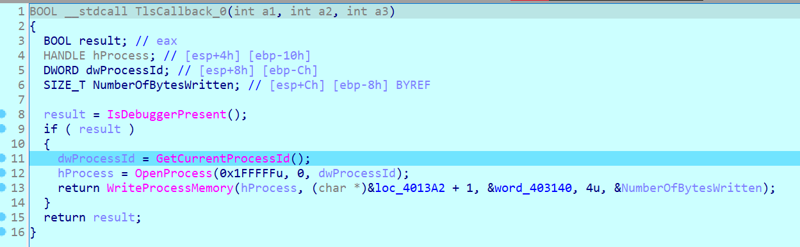

    Gọi `WriteProcessMemory` để ghi dữ liệu vào vùng nhớ tại địa chỉ **loc_4013A2 + 1**.

    Tham số:

    - **hProcess**: Handle của tiến trình với các quyền cần thiết.

    - __(char *)&loc_4013A2 + 1__: Địa chỉ trong bộ nhớ nơi dữ liệu sẽ được ghi vào, dịch thêm 1 byte từ `loc_4013A2`. Ở đây chính là địa chỉ của hàm encrypt kí tự trong hàm main:

        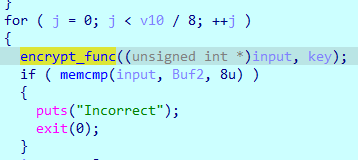

    - __&word_403140__: Con trỏ tới dữ liệu nguồn (4 byte).

    - __4u__: Số byte cần ghi (4 byte).

    - __&NumberOfBytesWritten__: Con trỏ tới một biến nhận số byte đã ghi.

- Xử lý xong phần này ta đến với chương trình chính của chúng ta xong hàm main roài thực hiện xem hàm encrpyt là hàm gì, thì dễ dàng nhận ra đây là hàm mã hóa theo thuật toán `XTEA`:

    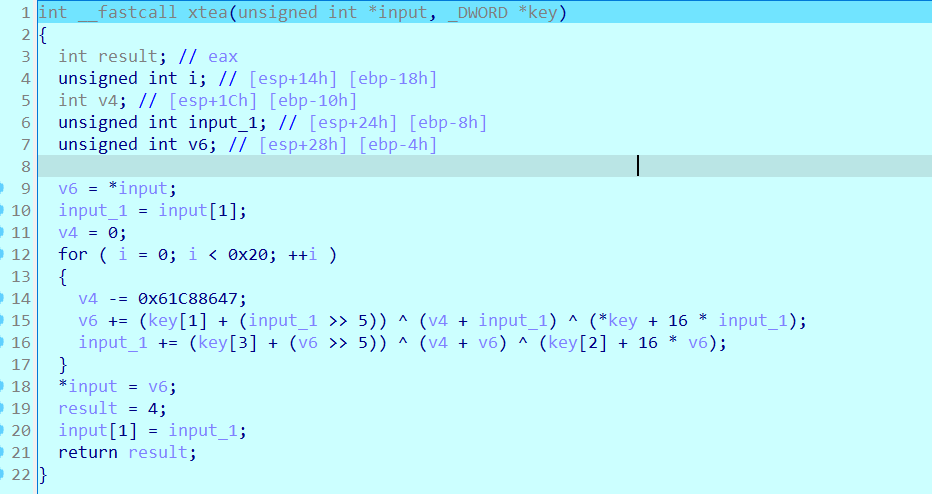

    Với key ở trong hàm main:

    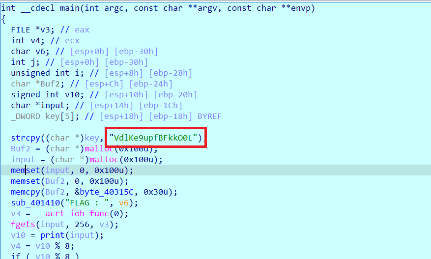

- Bây giờ chúng ta thực hiện viết source code:

    ```python
    cipher = [
        # 0x56, 0x64, 0x6C, 0x4B, 0x65, 0x39, 0x75, 0x70, 0x66, 0x42, 
        # 0x46, 0x6B, 0x6B, 0x4F, 0x30, 0x4C
        0x4b6c6456, 0x70753965, 0x6b464266, 0x4c304f6b
    ]

    flag_en = [
        # 0x19, 0x2C, 0x30, 0x2A, 0x79, 0xF9, 0x54, 0x02, 0xB3, 0xA9, 
        # 0x6C, 0xD6, 0x91, 0x80, 0x95, 0x04, 0x29, 0x59, 0xE8, 0xA3, 
        # 0x0F, 0x79, 0xBD, 0x86, 0xAF, 0x05, 0x13, 0x6C, 0xFE, 0x75, 
        # 0xDB, 0x2B, 0xAE, 0xE0, 0xF0, 0x5D, 0x88, 0x4B, 0x86, 0x89, 
        # 0x33, 0x66, 0xAC, 0x45, 0x9A, 0x6C, 0x78, 0xA6
        0x2a302c19, 0x0254f979, 0xd66ca9b3, 0x04958091, 0xa3e85929, 0x86bd790f, 0x6c1305af, 0x2bdb75fe, 0x5df0e0ae, 0x89864b88, 
        0x45ac6633, 0xa6786c9a
    ]

    import sys
    from ctypes import *

    def decipher(v, k):
        y = c_uint32(v[0])
        z = c_uint32(v[1])
        sum = c_uint32(0xc6ef3720)
        delta = 0x9e3779b9
        n = 32
        w = [0,0]

        while(n>0):
            z.value -= ( y.value << 4 ) + k[2] ^ y.value + sum.value ^ ( y.value >> 5 ) + k[3]
            y.value -= ( z.value << 4 ) + k[0] ^ z.value + sum.value ^ ( z.value >> 5 ) + k[1]
            sum.value -= delta
            n -= 1

        w[0] = y.value
        w[1] = z.value
        return w

    if __name__ == "__main__":
        ans = []
        for i in range(0, len(flag_en), 2):
            v = flag_en[i:i+2:1]
            k = cipher
            tmp = decipher(v, k)
            ans += tmp

        for i in ans:
            while i: 
                print(end = chr(i & 0xff))
                i >>= 8
        # PTITCTF{bdc90e23aa0415e94d0ac46a938efcf3}
    ```

## 2_THIT_NHI

- Chall: [FILE](CHALL/1_REPLACE.rar).

- Chương trình của chúng ta sẽ như sau:

    ```C
    // local variable allocation has failed, the output may be wrong!
    int __cdecl main(int argc, const char **argv, const char **envp)
    {
        FILE *v3; // eax
        int v4; // eax
        int i; // [esp+0h] [ebp-3Ch]
        unsigned int KEY; // [esp+4h] [ebp-38h] BYREF
        char input[16]; // [esp+8h] [ebp-34h] BYREF
        _BYTE ans[3]; // [esp+18h] [ebp-24h] OVERLAPPED BYREF
        int v10; // [esp+1Ch] [ebp-20h]
        int v11; // [esp+20h] [ebp-1Ch]
        __int16 v12; // [esp+24h] [ebp-18h]
        char flag_check[16]; // [esp+28h] [ebp-14h]

        puts("Enter Flag :");
        v3 = _acrt_iob_func(0);
        fgets(input, 14, v3);
        flag_check[0] = 0x7D;
        flag_check[1] = 8;
        flag_check[2] = 0xED;
        flag_check[3] = 0x47;
        flag_check[4] = 0xE5;
        flag_check[5] = 0;
        flag_check[6] = 0x88;
        flag_check[7] = 0x3A;
        flag_check[8] = 0x7A;
        flag_check[9] = 0x36;
        flag_check[10] = 2;
        flag_check[11] = 0x29;
        flag_check[12] = 0xE4;
        flag_check[13] = 0;
        *(_DWORD *)ans = 0;
        v10 = 0;
        v11 = 0;
        v12 = 0;
        v4 = count_opcode((unsigned __int8 *)main);
        KEY = check_opcode_0x33((int)main, v4) ^ 0xDEADBEEF;
        RC4((int)input, 13, &KEY, 4, ans);
        for ( i = 0; i < 13; ++i )
        {
            if ( flag_check[i] != ans[i] )
            {
            print("Failed");
            return 1;
            }
        }
        print("Success!! Here is your Flag : Flag{%s}", input);
        return 0;
    }
    ```

- Bài này chỉ có 3 hàm chính là `count_opcode`, `check_opcode_0x33` và `RC4`. Ta chỉ cần phân tích 3 hàm này là có thể làm được bài này.

- Hàm `count_opcode`:

    ```C
    int __cdecl count_opcode(unsigned __int8 *func_add)
    {
        int v2; // [esp+0h] [ebp-Ch]
        int v3; // [esp+4h] [ebp-8h]

        v3 = 0;
        do
        {
            ++v3;
            v2 = *func_add++;
        }
        while ( v2 != 0xC3 );
        return v3;
    }
    ```

    Hàm này tham số truyền vào là một địa chỉ của một hàm nào đó, khởi tạo biến v3 = 0, thực hiện vòng lặp **while** duyệt từng byte bắt đầu từ địa chỉ `func_add`, vòng **while** chỉ kết thúc khi mà gặp byte `0xC3`. Vậy `0xC3` là gì ??

    Opcode `0xC3` tương ứng với lệnh `ret` hay `retn`, lệnh này thường xuất hiện ở cuối hàm hoặc một đoạn mã thực thi. Vậy thì chức năng của hàm này chính là đếm số `opcode` của một hàm được truyền vào.

- Hàm `check_opcode_0x33`:

    ```C
        int __cdecl check_opcode_0x33(unsigned __int8 *func_add, unsigned int count)
        {
            unsigned int i; // [esp+4h] [ebp-8h]

            for ( i = 0; i < count; ++i )
            {
                if ( (func_add[i] ^ 0x55) == 0x99 )
                return 0x13;
            }
            return 0x37;
        }
    ```

    Hàm này có 2 tham số được truyền vào đó chính là địa chỉ của một hàm và số lượng opcode của hàm đó.

    Chức năng của hàm này thực hiện duyệt lần lượt từng opcode có trong hàm, nếu duyệt mà gặp opcode `0xCC` thì sẽ trả về giá trị `0x13`, còn nếu duyệt hết mà không gặp opcode `0xCC` thì sẽ thực hiện trả về giá trị `0x37`. (`0xCC` = 0x99 ^ 0x55).

    Opcode `0xCC` là một lệnh ngắt được dùng khi chúng ta gỡ lỗi (nó tương đương với **int 3**). Lệnh này được sử dụng trong trình gỡ lỗi IDA. Khi chúng ta thực hiện đặt một **breakpoint** tại 1 địa chỉ nhất định, trình gỡ lỗi sẽ thay thế opcode tại địa chỉ đóa bằng `0xCC`, điều này sẽ giúp chương trình dừng lại đúng thời điểm **breakpoint**.

    NOTE (mở rộng thêm, trực quan sinh động):
    
    - Để có thể quan sát được opcode trong IDA, ta vào **Options -> General**, trong **Disassembly -> Display disassembly line parts -> Number of opcode byte (non-graph) -> Chỉnh sang số opcode muốn quan sát**.

        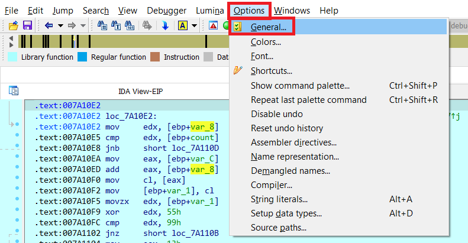

        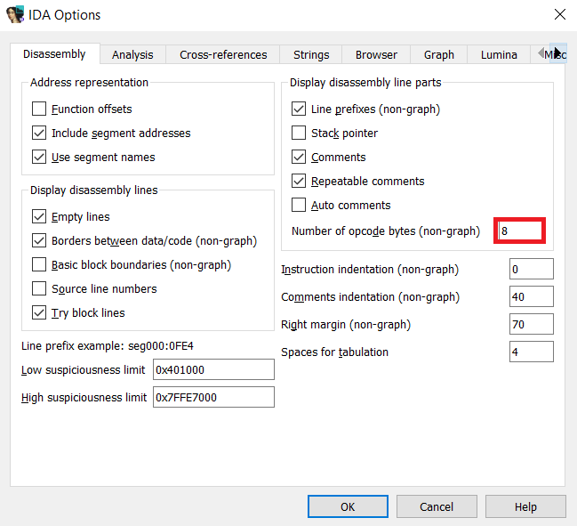

        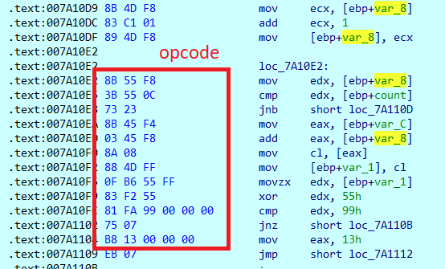

    - Để kiểm chứng sự thay thế opcode khi chúng ta đặt breakpoint, ta sẽ thực hiện xem giá trị mà chương trình đọc được:

        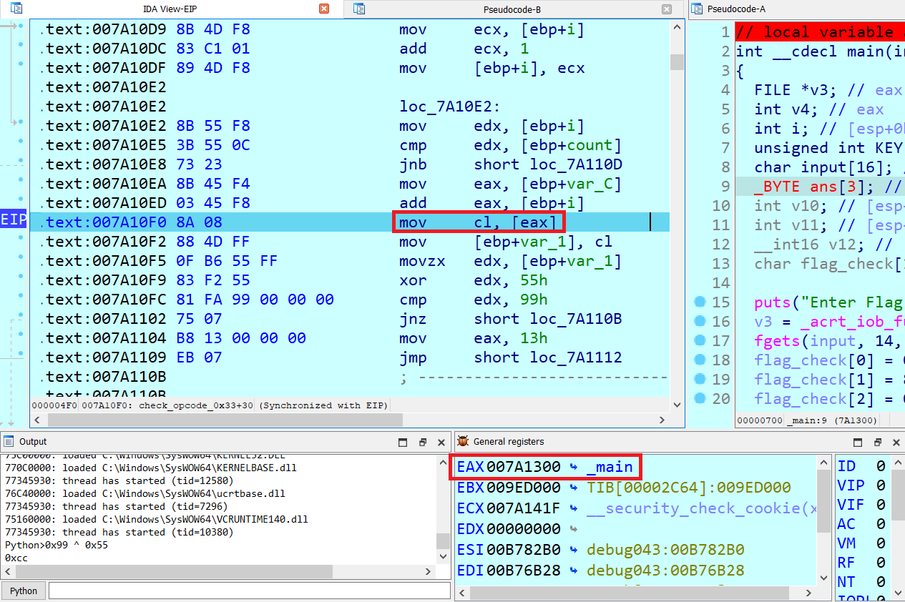

        Ta thấy sau câu lệnh trên thì giá trị trong thanh cl sẽ là byte opcode tại địa chỉ `007A1300`.

        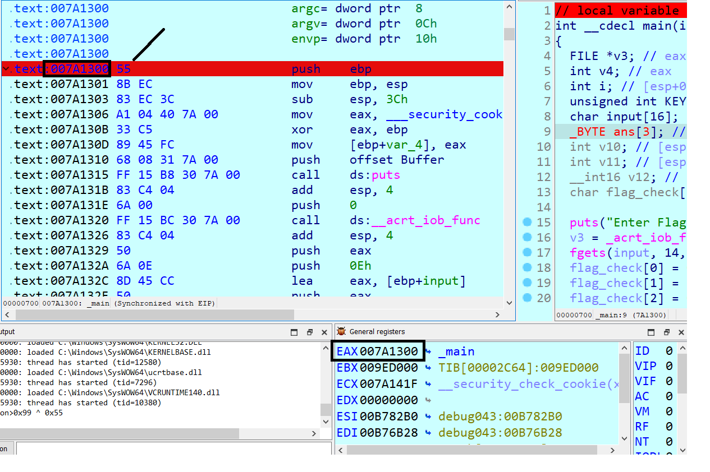

        Nhưng tại địa chỉ đó tui thực hiện đặt một breakpoint thì lúc này opcode đọc được sẽ là `0xCC` thay vì `0x55` như trên hình.

        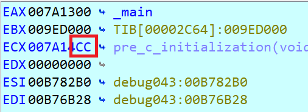

    - Giải thích thêm một xíu về phát hiện ra opcode `0xCC` ở trong hàm main khi chúng ta không thực hiện đặt breakpoint:

        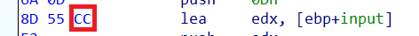

        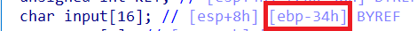

        Opcode `8D 55 xx`: tương đương với với lệnh Assembly là `lea edx, [ebp + xx]`, input được lưu ở `[ebp - 34h]` nhưng mà opcode không lưu được số âm thế nên nó sẽ chuyển sang dạng mod 256 (biểu thị dưới dạng 1 byte), tức là `-0x34 (mod 256) = 0xCC` vậy nên opcode 8D 55 CC tương đương với lệnh `lea edx, [ebp + input]`.

- Hàm `RC4`:

    ```C
    int __cdecl RC4(int input, int _13, _BYTE *key, int _4, _BYTE *ans)
    {
        int v5; // eax
        int result; // eax
        char v7[512]; // [esp+0h] [ebp-21Ch]
        int v8; // [esp+200h] [ebp-1Ch]
        int k; // [esp+204h] [ebp-18h]
        int v10; // [esp+208h] [ebp-14h]
        int j; // [esp+20Ch] [ebp-10h]
        int i; // [esp+210h] [ebp-Ch]
        int v13; // [esp+214h] [ebp-8h]
        char v14; // [esp+21Bh] [ebp-1h]

        v13 = 0;
        v8 = 0;
        v10 = 0;
        v5 = count_opcode((unsigned __int8 *)RC4);
        result = *(_DWORD *)key + check_opcode_0x33((int)RC4, v5);
        *(_DWORD *)key = result;
        for ( i = 0; i < 256; ++i )
        {
            v7[i + 256] = i;
            v7[i] = key[i % _4];
            result = i + 1;
        }
        for ( j = 0; j < 256; ++j )
        {
            v13 = ((unsigned __int8)v7[j] + v13 + (unsigned __int8)v7[j + 256]) % 256;
            v14 = v7[v13 + 256];
            v7[v13 + 256] = v7[j + 256];
            v7[j + 256] = v14;
            result = j + 1;
        }
        v13 = 0;
        for ( k = 0; k < _13; ++k )
        {
            v10 = (v10 + 1) % 256;
            v13 = (v13 + (unsigned __int8)v7[v10 + 256]) % 256;
            v14 = v7[v13 + 256];
            v7[v13 + 256] = v7[v10 + 256];
            v7[v10 + 256] = v14;
            v8 = ((unsigned __int8)v7[v13 + 256] + (unsigned __int8)v7[v10 + 256]) % 256;
            ans[k] = v7[v8 + 256] ^ *(_BYTE *)(k + input);
            result = k + 1;
        }
        return result;
    }
    ```

    Hàm này truyền vào input, chiều dài input (cố định 13), key, chiều dài của key (cố định 4) và một mảng để lưu lại kết quả.

    Trong hàm này thì có sự thay đổi key ở đoạn mã sau (liên quan đến check opcode `0x33`), còn về phần mã hóa `RC4` thì như bình thường:

    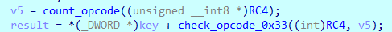

    Như vậy khi ta truy ngược lại giá trị `key` được truyền vào trong hàm thì `key` xuất hiện ở trong hàm `main`:

    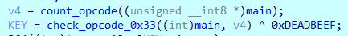
    
    Giá trị đúng mà hàm này sẽ trả về là `0x13` (tức là tìm thấy opcode `0xCC` ở trong hàm main, và đương nhiên là opcode này ko phải từ breakpoint gây ra). Cụ thể:

    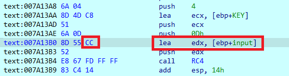

    Để có thể né được việc antidebug check breakpoint rất đơn giản, trước khi vô hàm `check_opcode_0x33` thì ta thực hiện đặt gỡ hết breakpoint tại hàm được truyền vào.

- Sau khi biết được cách có thể biết được giá trị trả về đúng của hàm `check_opcode_0x33` thì ta tiến hành viết source code:

    ```python
    key = [
        0x33, 0xBF, 0xAD, 0xDE
    ]

    flag_en = [
        0x7D, 0x08, 0xED, 0x47, 0xE5, 0x00, 0x88, 0x3A, 0x7A, 0x36, 
        0x02, 0x29, 0xE4
    ]

    map = []
    for i in range(256): map.append(i)
    tmp = 0
    for i in range(256):
        tmp = (key[i % len(key)] + tmp + map[i]) % 256
        map[tmp], map[i] = map[i], map[tmp]

    tmp1, tmp2 = 0, 0
    for i in range(len(flag_en)):
        tmp1 = (tmp1 + 1) % 256
        tmp2 = (tmp2 + map[tmp1]) % 256
        map[tmp1], map[tmp2] = map[tmp2], map[tmp1]
        flag_en[i] ^= map[(map[tmp1] + map[tmp2]) % 256]

    for i in flag_en: print(end = chr(i))
    # D1t_m3_H4_N41
    ```

## 3_ANTI_DEBUG3

- Chall: [FILE](CHALL/3_ANTI_DEBUG3.rar).

- Trước hết đập vô mắt chúng ta là một hàm xử lý ngoại lệ:

    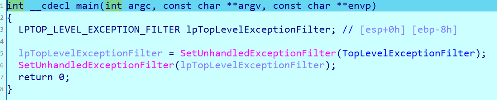

    Hàm `UnhandledExceptionFilter`: Nếu một ngoại lệ xảy ra và không có trình xử lý ngoại lệ nào được đăng ký (hoặc đã đăng ký nhưng không xử lý ngoại lệ như vậy), hàm `UnhandledExceptionFilter()` sẽ được gọi. Có thể đăng ký bộ lọc ngoại lệ chưa xử lý tùy chỉnh bằng cách sử dụng `SetUnhandledExceptionFilter()`. Nhưng nếu chương trình đang chạy dưới trình gỡ lỗi, bộ lọc tùy chỉnh sẽ **không được gọi** và ngoại lệ sẽ được chuyển đến trình gỡ lỗi. Do đó, nếu bộ lọc ngoại lệ chưa xử lý được đăng ký và điều khiển được chuyển đến nó, thì quy trình **không chạy** với trình gỡ lỗi.

- Ta dễ dàng nhận ra trong mã máy ở mía dưới có sự xuất hiện của một ngoại lệ khi chia cho 0:

    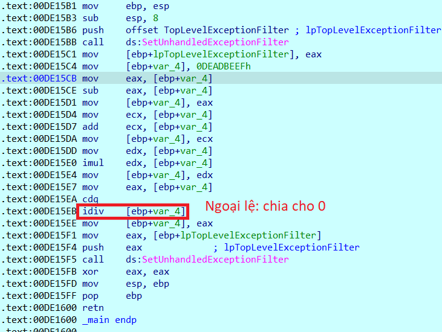

- Như vậy chương trình này chắc chắn sẽ nhảy nhảy vào hàm `TopLevelExceptionFilter` (được đưa vào để xử lý ngoại lệ) khi nó không phát hiện ra chúng ta đang debug, nếu chúng ta đang debug thì nó sẽ không nhảy vô hàm `TopLevelExceptionFilter`. Vậy điều chúng ta cần làm ở đây là nhảy được vô hàm `TopLevelExceptionFilter` để có thể đến được với luồng chương trình chính mà chúng ta cần quan tâm.

- Để có thể nhảy vô hàm `TopLevelExceptionFilter` thì chúng ta có thể thực hiện 2 cách sau: (1) Thực hiện `setIP`, (2) Thực hiện chỉnh sửa thanh `EIP` thành địa chỉ của hàm `TopLevelExceptionFilter`.

    **Mở rộng:** Thanh ghi EIP (Extended Instruction Pointer) là một thanh ghi dùng để lưu trữ địa chỉ của lệnh tiếp theo mà CPU sẽ thực thi.

- Khi vào hàm `TopLevelExceptionFilter` thì ta thấy có một số đoạn mã máy    khá là lạ và không thể chuyển thành mã giả được:

    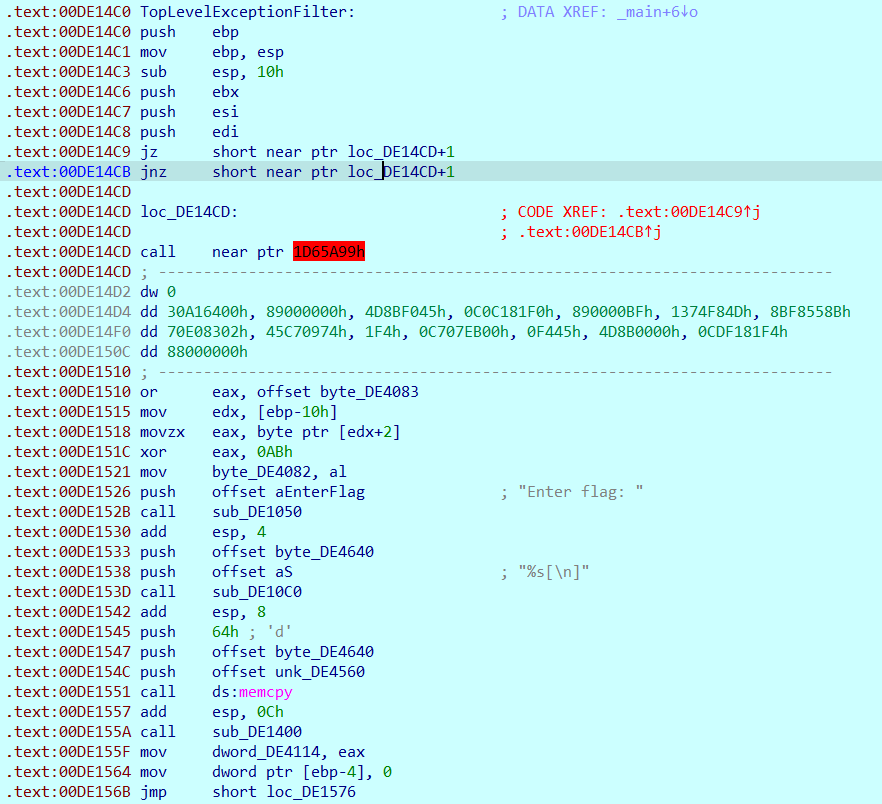

    Chương trình đang cố tình nhét thêm những **byte rác** vào chương trình để làm khó chúng ta, vậy ta sẽ thực hiện chuyển các lệnh của mã máy sang `data` để xem sao (nhấn `D` ở cái đoạn chú thích đỏ).

    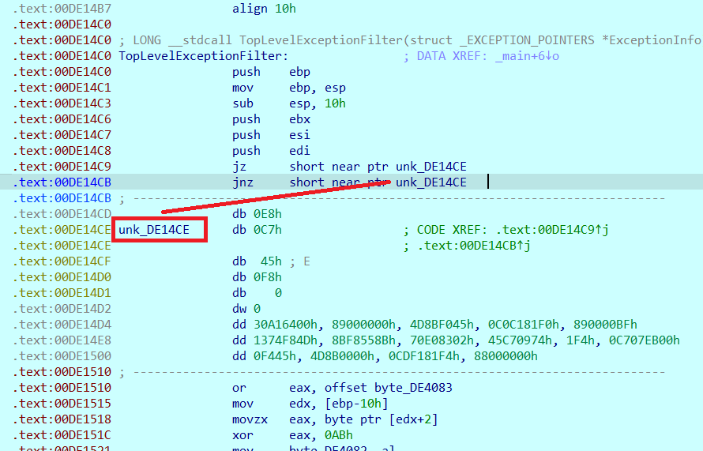

    Đến đây ta thực hiện Make Code lại từ địa chỉ `00DE14CE` để xem sao (Nhấn C để tạo code từ đoạn đó).

    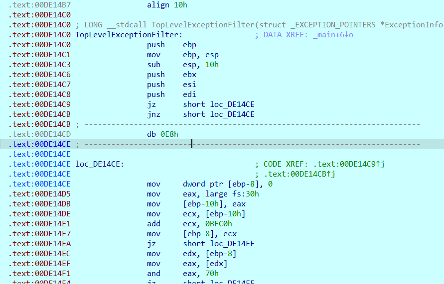

    Có vẻ ta đã tìm được byte rác là byte `0xE8`, ta thực hiện patch byte đóa rùi thực hiện Make Function (phím P) để có thể đọc được mã giả (sau khi patch chương trình nhớ lưu lại để lần sau còn dùng).

    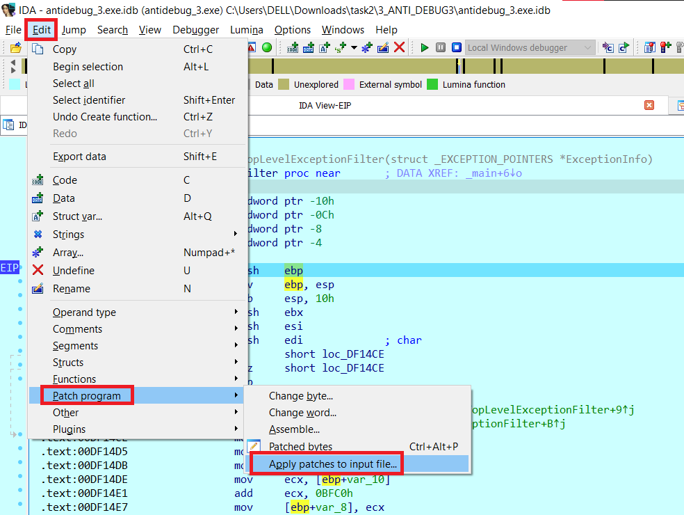

- Sau khi make function thì ta được một đoạn code khá clean:

    ```C
    LONG __stdcall TopLevelExceptionFilter(struct _EXCEPTION_POINTERS *ExceptionInfo)
    {
        char v2; // [esp+0h] [ebp-1Ch]
        struct _PEB *v3; // [esp+Ch] [ebp-10h]
        bool v4; // [esp+10h] [ebp-Ch]
        int i; // [esp+18h] [ebp-4h]

        v3 = NtCurrentPeb();
        v4 = v3 != (struct _PEB *)0xFFFF4040 && ((int)v3[0x54].AtlThunkSListPtr & 0x70) != 0;
        byte_DF4083 = v4 ^ 0xCD;
        is0xAB = v3->BeingDebugged ^ 0xAB;
        print(aEnterFlag, v2);
        scan(aS, (char)input);
        memcpy(&input_, input, 0x64u);
        dword_DF4114 = sub_DF1400();
        for ( i = 0; i < 17; ++i )
            input[i] ^= 1u;
        sub_DF1460(&unk_DF4652);
        return 0;
    }
    ```

    File ban đầu có một sự nhầm một xíu ở file ở đoạn anti-debug chỗ này, điều này khiến cho mình đoán sai đoạn này. Sau khi chỉnh file xong thì đoạn mã giả gen này sẽ như sau:

    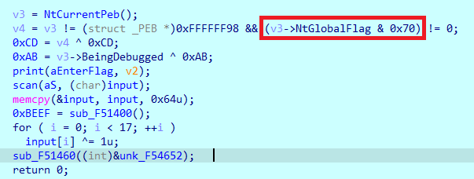

    - Ở đây có 2 phần anti-debug, sử dụng [NtGlobalFlag](https://anti-debug.checkpoint.com/techniques/debug-flags.html#manual-checks-ntglobalflag) và [BeingDebugged](https://anti-debug.checkpoint.com/techniques/debug-flags.html#manual-checks-peb-beingdebugged-flag) với giá trị được gán là v3 và v4 (1 nếu phát hiện đang debug và 0 nếu không phát hiện debug) vậy giá trị tương ứng ở dưới là `0xCD` và `0xAB` (Với dấu hiệu nhận biết của `NtGlobalFlag` là ở phần `& 0x70`)

- Tiếp theo là đến hàm `sub_DF1400()`:

    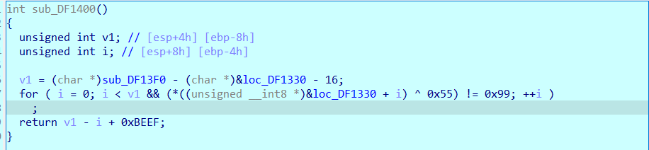

    Chúng ta lại thấy 0xCC được xuất hiện ở đây để thực hiện chống breakpoint lung tung, trong đóa v1 là số opcode của chương trình. Nên hàm này sẽ trả về giá trị 0xBEEF.

- Ban đầu chương trình sẽ thực hiện xor 17 kí tự đầu của flag với 1, kí tự thứ 18 giữ nguyên, rùi thực hiện truyền địa chỉ của kí tự thứ 19 vào hàm `sub_DF1460`:

    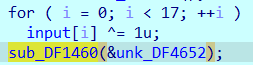

- Trong hàm `sub_DF1460` có gọi đến hàm `loc_DF1330` nhưng có vẻ hàm đó đang bị chèn thêm 1 số byte rác vào nên cũng không thể gen ra mã giả được:

    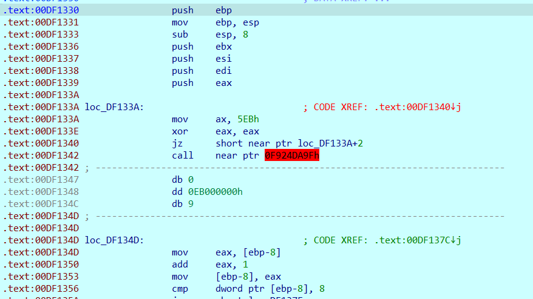

    Ta thực hiện y hệt những thao tác ở trên thì ta sẽ được hàm như sau:

    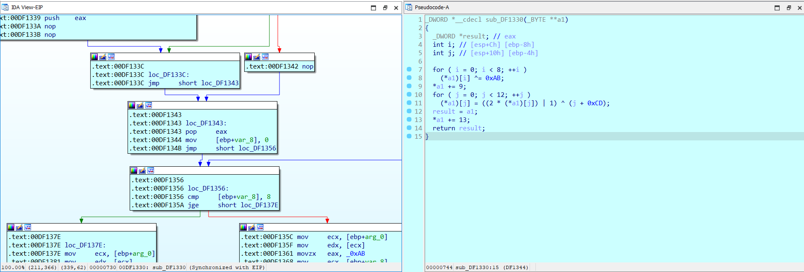

    Như vậy từ kí tự thứ 19 đến kí tự thứ 26 của flag được xor với `0xAB`, kí tự thứ 27 giữ nguyên. Rùi từ kí tự thứ 28 đến kí tự thứ 39 thực hiện mã hóa theo cú pháp `((2 * a[i]) | 1) ^ (i + 0xCD)`. Thực hiện trả về giá trị của địa chỉ kí tự thứ 41 (kí tự 40 giữ nguyên).

- Như vậy từ kí tự thứ 41 đến kí tự thứ 58 chương trình sẽ lấy 2 byte liên tiếp 1 rùi xor với `0xBEEF`.

    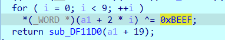
    
    Kí tự thứ 59 giữ nguyên, rùi truyền vào hàm `sub_DF11D0` địa chỉ của kí tự thứ 60.

- Chúng ta sẽ đến hàm `sub_DF11D0` với 2 anti-debug (`int 3` và `int 2Dh`):

    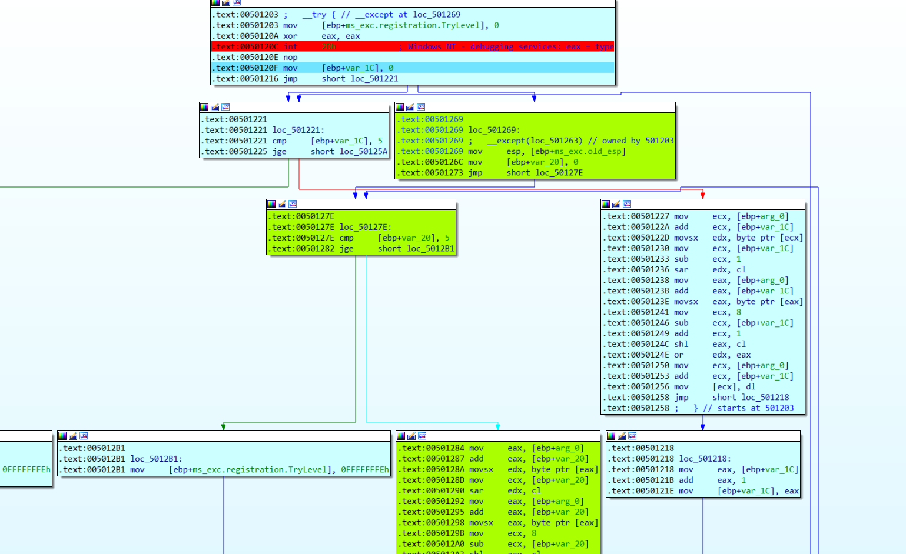

    Với [int 2Dh](https://anti-debug.checkpoint.com/techniques/assembly.html#int2d): sau lệnh này sẽ thực hiện ngắt phần mềm với mã ngắt là `0x2D`, nếu có chương trình gỡ lỗi đang chạy, chương trình sẽ điều hướng đến luồng khác. Còn nếu không phát hiện đang debug thì chương trình sẽ thực hiện tạo ra một ngoại về và nhảy vào luồng xử lý ngoại lệ. Như trên hình mình tô màu xanh biểu thị cho block cần nhảy vào. Phần này biến đổi kí tự thứ 60 đến 64 với nội dung như sau:

    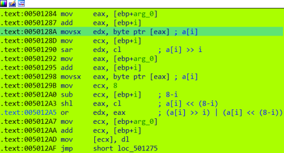

    Với [int 3](https://anti-debug.checkpoint.com/techniques/assembly.html#int3): Nếu trình gỡ lỗi có mặt, quyền điều khiển sẽ không được trao cho trình xử lý ngoại lệ. Như vậy chỗ này là chương trình sẽ lại cần nhảy vô ngoại lệ tiếp (do IDA quá mạnh trong việc xử lý các ngoại lệ này và đã biết được những loại ngoại lệ này sẽ hướng chương trình đến phần nào nên việc debug khá là dễ thì IDA trong 2 phần trên đều điều hướng vào luồng chuẩn).

    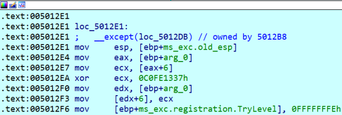

    Từ kí tự thứ 66 đến kí tự thứ 69 sẽ được xor với lần lượt các byte là `0x37`, `0x13`, `0xFE`, `0xC0`.

- Cuối cùng là phần biến đổi với 30 byte cuối cùng bằng việc xor với giá trị trước nó:

    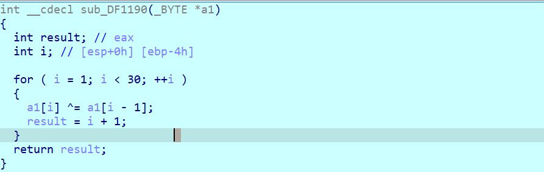

- Sau khi phân tích kĩ file thì việc viết source code chỉ là thủ tục:

    ```python
    flag_en = [
        0x74, 0x6F, 0x69, 0x35, 0x4F, 0x65, 0x6D, 0x32, 0x32, 0x79, 
        0x42, 0x32, 0x71, 0x55, 0x68, 0x31, 0x6F, 0x5F, 0xDB, 0xCE, 
        0xC9, 0xEF, 0xCE, 0xC9, 0xFE, 0x92, 0x5F, 0x10, 0x27, 0xBC, 
        0x09, 0x0E, 0x17, 0xBA, 0x4D, 0x18, 0x0F, 0xBE, 0xAB, 0x5F, 
        0x9C, 0x8E, 0xA9, 0x89, 0x98, 0x8A, 0x9D, 0x8D, 0xD7, 0xCC, 
        0xDC, 0x8A, 0xA4, 0xCE, 0xDF, 0x8F, 0x81, 0x89, 0x5F, 0x69, 
        0x37, 0x1D, 0x46, 0x46, 0x5F, 0x5E, 0x7D, 0x8A, 0xF3, 0x5F, 
        0x59, 0x01, 0x57, 0x67, 0x06, 0x41, 0x78, 0x01, 0x65, 0x2D, 
        0x7B, 0x0E, 0x57, 0x03, 0x68, 0x5D, 0x07, 0x69, 0x23, 0x55, 
        0x37, 0x60, 0x14, 0x7E, 0x1D, 0x2F, 0x62, 0x5F, 0x62, 0x5F
    ]

    for i in range(17):
        flag_en[i] ^= 1

    for i in range(18, 26):
        flag_en[i] ^= 0xAB

    for i in range(27, 39):
        flag_en[i] = ((flag_en[i] ^ (i - 27 + 0xCD)) - 1) // 2

    for i in range(40, 58):
        if i % 2 == 0: flag_en[i] ^= 0xEF
        else: flag_en[i] ^= 0xBE

    for i in range(59, 64):
        flag_en[i] = ((flag_en[i] << (i - 59)) & 0xff) | ((flag_en[i] >> (8 - (i - 59))) & 0xff)

    flag_en[65] ^= 0x37
    flag_en[66] ^= 0x13
    flag_en[67] ^= 0xFE
    flag_en[68] ^= 0xC0

    for i in range(99, 70, -1):
        flag_en[i] ^= flag_en[i - 1]

    for i in flag_en: print(end = chr(i))
    # unh4Ndl33xC3pTi0n_pebDebU9_nt9lob4Lfl49_s0F7w4r38r34Kp01n7_int2d_int3_YXV0aG9ydHVuYTk5ZnJvbWtjc2M===
    ```