# TASK3.

```
Task 3:
Làm bài dưới đây, viết WU và giải thích kĩ về những kĩ thuật được sử dụng trong bài
```

## WRITE UP

- CHALL: [FILE](CHALL/VEH.rar).

- Khi làm bài này mình bị dính 2 vấn đề:

    - Không có mã giả để có thể xem (bắt buộc đọc chương trình bằng mã máy).

    - Chương trình hay dính lỗi chia cho **0** để điều hướng chương trình đến phần xử lý ngoại lệ (khó khăn trong việc debug).

- Sau một hồi debug đọc mã máy thì mình nhận ra là bài này sử dụng các WinAPI có sẵn, sau khi đoán được rùi thì mình men theo mã máy để có thể xây dựng lại chương trình sử dụng các `WinAPI` đó.

- Nhập input đầu vào:

    

- `CryptAcquireContextW(&phProv, 0, 0, PROV_RSA_AES, CRYPT_VERIFYCONTEXT)` ([tham khảo](https://learn.microsoft.com/en-us/windows/win32/api/wincrypt/nf-wincrypt-cryptacquirecontexta)).

    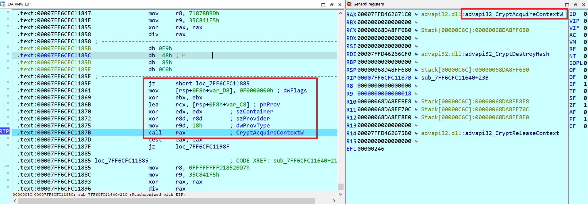

- `CryptCreateHash(phProv, CALG_SHA_256, 0, 0, &phHash)` ([tham khảo](https://learn.microsoft.com/en-us/windows/win32/api/wincrypt/nf-wincrypt-cryptcreatehash)):

    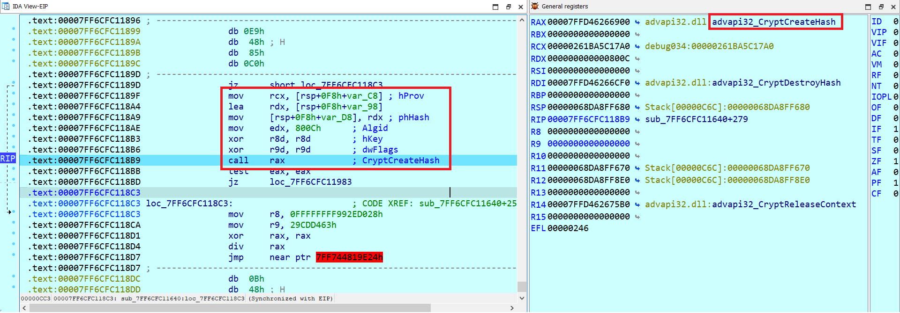

- `CryptHashData(phHash, (BYTE*)link_Ytb, strlen(link_Ytb), 0)` ([tham khảo](https://learn.microsoft.com/en-us/windows/win32/api/wincrypt/nf-wincrypt-crypthashdata)):

    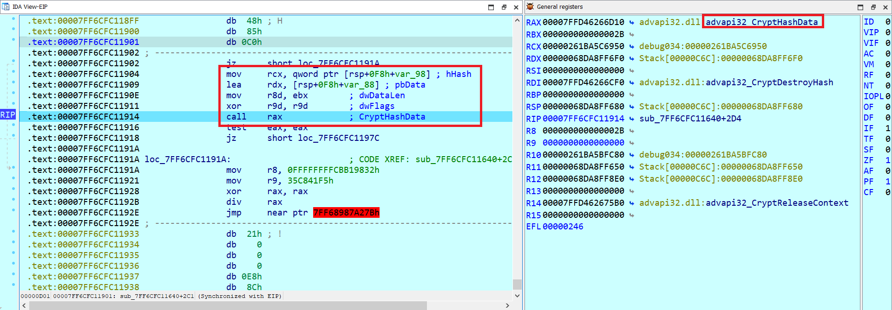

    Trong đó:

    ```C
    char link_Ytb[100] = "https://www.youtube.com/watch?v=dQw4w9WgXcQ";
    ```

- `CryptGetHashParam(phHash, HP_HASHVAL, (BYTE*)_32_byte, &pdwDataLen, 0)` ([tham khảo](https://learn.microsoft.com/en-us/windows/win32/api/wincrypt/nf-wincrypt-cryptgethashparam)): 

    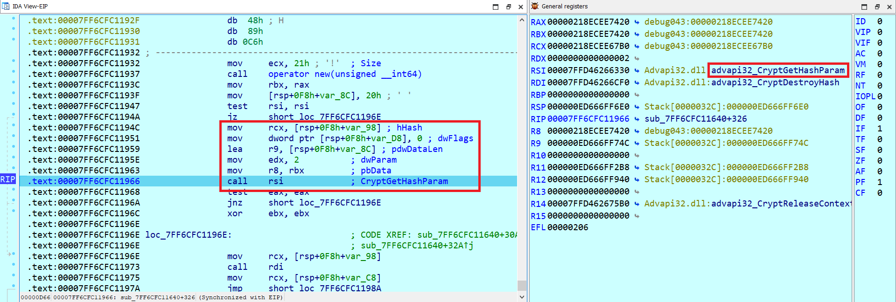

    Trong đó 
    
    ```C
    pdwDataLen = 32;
    unsigned char _32_byte[32];
    ```

- `CryptDestroyHash(phHash)` ([tham khảo](https://learn.microsoft.com/en-us/windows/win32/api/wincrypt/nf-wincrypt-cryptdestroyhash)): 

    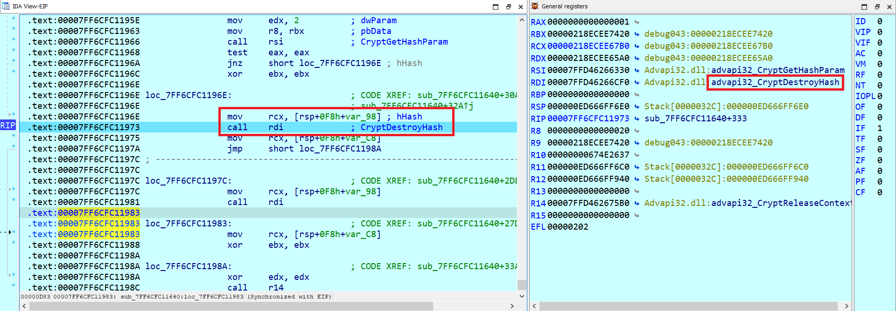

- `CryptReleaseContext(phProv, 0)` ([tham khảo](https://learn.microsoft.com/en-us/windows/win32/api/wincrypt/nf-wincrypt-cryptreleasecontext)):

    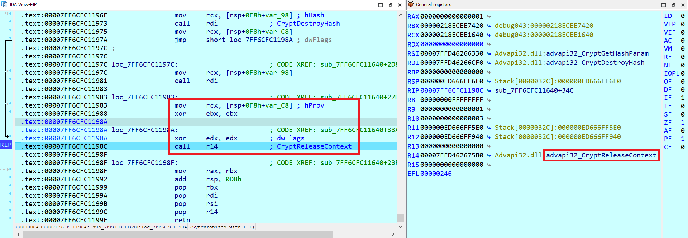

- `CryptAcquireContextW(&phProv, 0, L"Microsoft Enhanced RSA and AES Cryptographic Provider", PROV_RSA_AES, CRYPT_VERIFYCONTEXT)` ([tham khảo](https://learn.microsoft.com/en-us/windows/win32/api/wincrypt/nf-wincrypt-cryptacquirecontexta)):

    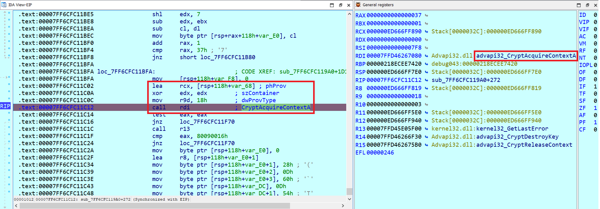

    Trong đó: 

    ```asm
    r8 = szProvider = "Microsoft Enhanced RSA and AES Cryptographic Provider"
    dwFlags = 0xF0000000
    ```

- `CryptImportKey(phProv, (BYTE*)pbData, 0x2C, 0, 0, &phKey)` ([tham khảo](https://learn.microsoft.com/en-us/windows/win32/api/wincrypt/nf-wincrypt-cryptimportkey)):

    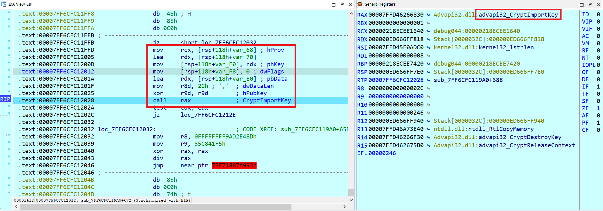

- `CryptSetKeyParam(phKey, KP_MODE, (BYTE*)v6, 0)` ([tham khảo](https://learn.microsoft.com/en-us/windows/win32/api/wincrypt/nf-wincrypt-cryptsetkeyparam)):

    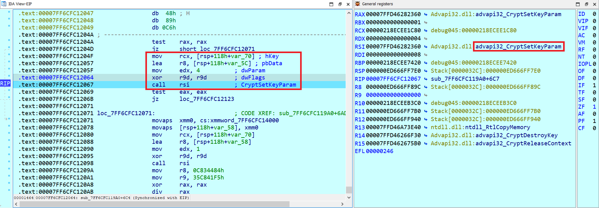

    Trong đó:

    ```C
	int v6[50] = 
	{
		0x01, 0x00, 0x00, 0x00, 0x50, 0xFA, 0x8F, 0xDE, 0xF2, 0x00, 
		0x00, 0x00, 0xC0, 0xFA, 0x8F, 0xDE, 0xF2, 0x00, 0x00, 0x00, 
		0x00, 0x01, 0x00, 0x00, 0xF2, 0x00, 0x00, 0x00, 0x90, 0x02, 
		0xBA, 0x7B, 0xFC, 0x7F, 0x00, 0x00, 0x00, 0x00, 0x00, 0x00, 
		0x00, 0x00, 0x00, 0x00
	};
    ```

- `CryptSetKeyParam(phKey, KP_IV, (BYTE*)map, 0)` ([tham khảo](https://learn.microsoft.com/en-us/windows/win32/api/wincrypt/nf-wincrypt-cryptsetkeyparam)):

    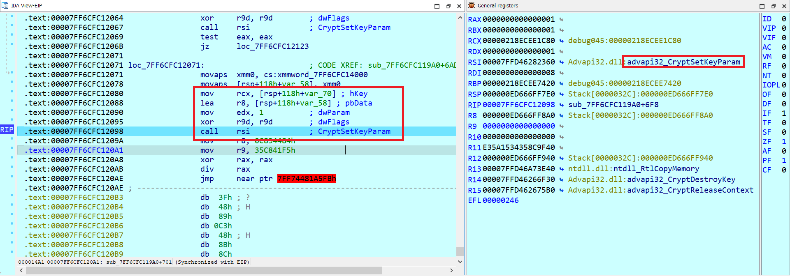

    Chú ý: trong đó map không phải _32_byte ở trên mà là vùng dữ liệu khác có sẵn ở trong máy:

    ```C
	unsigned char map[50] = 
	{
		0x01, 0x02, 0x03, 0x04, 0x05, 0x06, 0x07, 0x08, 0x09, 0x0A, 
		0x0B, 0x0C, 0x0D, 0x0E, 0x0F, 0x10, 0x00, 0x01, 0x00, 0x00, 
		0xF2, 0x00, 0x00, 0x00, 0x90, 0x02, 0xBA, 0x7B, 0xFC, 0x7F, 
		0x00, 0x00, 0x00, 0x00, 0x00, 0x00, 0x00, 0x00, 0x00, 0x00
	};
    ```

- `CryptEncrypt(phKey, 0, 1, 0, (BYTE*)flag, &pdwDataLen, 0x400)` ([tham khảo](https://learn.microsoft.com/en-us/windows/win32/api/wincrypt/nf-wincrypt-cryptencrypt)):

    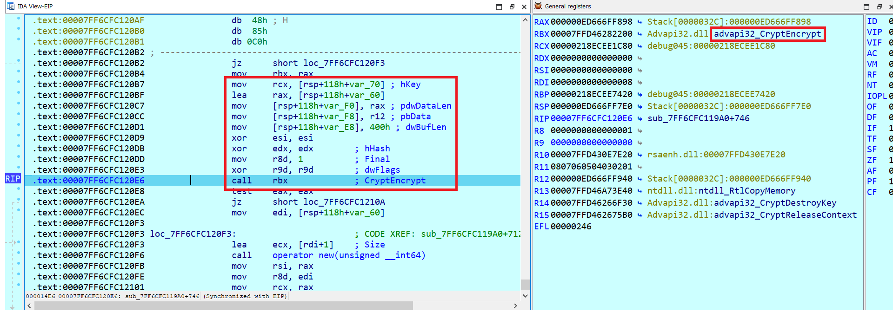

- Sau khi nắm được các hàm WinAPI được sử dụng thì ta có source code như sau:

    ```C
    #include <windows.h>
    #include <wincrypt.h>
    #include <iostream>
    #include <cstring> 

    int main(){
        unsigned char flag_en[32] = 
        {
            0xE5, 0x60, 0x44, 0x09, 0x42, 0xC4, 0xBB, 0xDE, 0xF6, 0xA1, 
            0x2D, 0x93, 0xD9, 0x1D, 0x13, 0x72, 0xAF, 0x8D, 0x4C, 0xF7, 
            0xA7, 0x9F, 0x1F, 0xB9, 0x99, 0x68, 0x9C, 0xB8, 0xC2, 0x4C, 
            0x4F, 0x85
        };

        HCRYPTPROV phProv;
        DWORD pdwDataLen;
        HCRYPTKEY phKey;

        unsigned char pbData[50] =
        {
            0x08, 0x02, 0x00, 0x00, 0x10, 0x66, 0x00, 0x00, 0x20, 0x00, 
            0x00, 0x00, 0x04, 0x24, 0x97, 0x4C, 0x68, 0x53, 0x02, 0x90, 
            0x45, 0x8C, 0x8D, 0x58, 0x67, 0x4E, 0x26, 0x37, 0xF6, 0x5A, 
            0xBC, 0x12, 0x70, 0x57, 0x95, 0x7D, 0x7B, 0x3A, 0xCB, 0xD2, 
            0x4C, 0x20, 0x8F, 0x93
        };

        int v6[50] = 
        {
            0x01, 0x00, 0x00, 0x00, 0x50, 0xFA, 0x8F, 0xDE, 0xF2, 0x00, 
            0x00, 0x00, 0xC0, 0xFA, 0x8F, 0xDE, 0xF2, 0x00, 0x00, 0x00, 
            0x00, 0x01, 0x00, 0x00, 0xF2, 0x00, 0x00, 0x00, 0x90, 0x02, 
            0xBA, 0x7B, 0xFC, 0x7F, 0x00, 0x00, 0x00, 0x00, 0x00, 0x00, 
            0x00, 0x00, 0x00, 0x00
        };

        unsigned char map[50] = 
        {
            0x01, 0x02, 0x03, 0x04, 0x05, 0x06, 0x07, 0x08, 0x09, 0x0A, 
            0x0B, 0x0C, 0x0D, 0x0E, 0x0F, 0x10, 0x00, 0x01, 0x00, 0x00, 
            0xF2, 0x00, 0x00, 0x00, 0x90, 0x02, 0xBA, 0x7B, 0xFC, 0x7F, 
            0x00, 0x00, 0x00, 0x00, 0x00, 0x00, 0x00, 0x00, 0x00, 0x00
        };

        if (CryptAcquireContextW(&phProv, 0, L"Microsoft Enhanced RSA and AES Cryptographic Provider", PROV_RSA_AES, CRYPT_VERIFYCONTEXT)){
            if (CryptImportKey(phProv, (BYTE*)pbData, 0x2Cu, 0, 0, &phKey)){
                if (CryptSetKeyParam(phKey, KP_MODE, (BYTE*)v6, 0) && CryptSetKeyParam(phKey, KP_IV, (BYTE*)map, 0)){
                    DWORD pdwDataLen = 32;		
                    if (CryptDecrypt(phKey, 0, 1, 0, (BYTE*)flag_en, &pdwDataLen)){
                        for (int i = 0; i < 32; i++) printf("%c", flag_en[i]);
                    }
                }
            }
        }
    }
    // KMACTF{3Xc3pTI0n_3v3rYwh3R3@_@}à
    ```

## BONUS

<!-- - Trong bài sử dụng.... -->

- Ban đầu chương trình sẽ load những thư viện cần thiết cho chương trình, bao gồm `NTDLL.dll`, `USER32.dll`, `CRYPT32.dll`, `Advapi32.dll`.

- Chương trình sẽ sử dụng 1 hàm để có thể tìm ra địa chỉ các hàm winAPI cần thiết sử dụng cho chương trình.

    ```C
    __int64 __fastcall find_addr(int a1, int a2)
    {
    struct _PEB_LDR_DATA *Ldr; // r8
    struct _LIST_ENTRY *Flink; // r9
    struct _LIST_ENTRY *p_InMemoryOrderModuleList; // r8
    __int64 result; // rax
    struct _LIST_ENTRY *v6; // r10
    __int16 v7; // di
    unsigned __int64 v8; // rsi
    char v9; // bp
    unsigned __int64 v10; // rbp
    unsigned __int8 v12; // bl
    int v13; // ebp
    unsigned __int8 *v14; // rdi
    struct _LIST_ENTRY *v15; // r11
    __int64 v16; // rbp
    unsigned __int64 v17; // r12
    __int64 v18; // r14
    __int64 v19; // r13
    __int64 v20; // r15
    bool v21; // bp
    __int64 v22; // rdi
    __int64 v23; // rsi
    unsigned __int8 v24; // bl
    unsigned __int8 *v25; // rsi
    int v26; // r10d
    unsigned __int8 v27; // [rsp+0h] [rbp-88h]
    char v28; // [rsp+1h] [rbp-87h] BYREF

    Ldr = NtCurrentTeb()->ProcessEnvironmentBlock->Ldr;
    Flink = Ldr->InMemoryOrderModuleList.Flink;
    p_InMemoryOrderModuleList = &Ldr->InMemoryOrderModuleList;
    result = 0i64;
    while ( 1 )
    {
        if ( Flink == p_InMemoryOrderModuleList )
        return result;
        if ( LOWORD(Flink[4].Blink) <= 0x3Eu )
        {
        v6 = Flink[5].Flink;
        v7 = (__int16)v6->Flink;
        if ( LOWORD(v6->Flink) )
        {
            v8 = 0i64;
            do
            {
            v9 = v7 - 32;
            if ( (unsigned __int8)(v7 - 97) >= 0x1Au )
                v9 = v7;
            *(&v27 + v8) = v9;
            v10 = v8 + 1;
            v7 = *((_WORD *)&v6->Flink + v8 + 1);
            if ( !v7 )
                break;
            }
            while ( v8++ < 0x3E );
        }
        else
        {
            v10 = 0i64;
        }
        *(&v27 + v10) = 0;
        v12 = v27;
        v13 = 0x811C9DC5;
        if ( v27 )
        {
            v14 = (unsigned __int8 *)&v28;
            do
            {
            v13 = 0x1000193 * (v13 ^ v12);
            v12 = *v14++;
            }
            while ( v12 );
        }
        if ( v13 == a2 )
        {
            v15 = Flink[2].Flink;
            v16 = *(int *)((char *)&v15[8].Blink + SHIDWORD(v15[3].Blink));
            if ( *(_DWORD *)((char *)&v15[2].Flink + v16) )
            {
            v17 = *(unsigned int *)((char *)&v15[1].Blink + v16);
            if ( *(_DWORD *)((char *)&v15[1].Blink + v16) )
                break;
            }
        }
        }
    LABEL_2:
        Flink = Flink->Flink;
    }
    v18 = *(int *)((char *)&v15[2].Flink + v16 + 4);
    v19 = (__int64)v15 + *(int *)((char *)&v15[2].Flink + v16);
    v20 = *(int *)((char *)&v15[1].Blink + v16 + 4);
    v21 = 1;
    v22 = 0i64;
    while ( 1 )
    {
        v23 = *(int *)(v19 + 4 * v22);
        v24 = *((_BYTE *)&v15->Flink + v23);
        if ( v24 )
        break;
        if ( a1 == 0x811C9DC5 )
        return (__int64)v15
            + *(int *)((char *)&v15->Flink
                        + 4 * *(unsigned __int16 *)((char *)&v15->Flink + 2 * (unsigned int)v22 + v18)
                        + v20);
    LABEL_21:
        v21 = ++v22 < v17;
        if ( v22 == v17 )
        goto LABEL_2;
    }
    v25 = (unsigned __int8 *)&v15->Flink + v23 + 1;
    v26 = 0x811C9DC5;
    do
    {
        v26 = 0x1000193 * (v26 ^ v24);
        v24 = *v25++;
    }
    while ( v24 );
    if ( v26 != a1 )
        goto LABEL_21;
    if ( !v21 )
        goto LABEL_2;
    return (__int64)v15
        + *(int *)((char *)&v15->Flink
                    + 4 * *(unsigned __int16 *)((char *)&v15->Flink + 2 * (unsigned int)v22 + v18)
                    + v20);
    }
    ```

    Ta thấy tham số truyền vào hàm này gồm 2 giá trị là tham số truyền vào lần lượt là `moduleHash` (thanh ghi **ecx**) và `funcHash` (thanh ghi **edx**). Ban đầu chương trình sẽ thực hiện truy cập danh sách các module thông qua PEB, đồng thời lấy tên của các hàm để tính toán giá trị băm. 

    Sử dụng thuật toán hash FN1-1a (với 2 hằng số đặc trưng là `0x1000193` và `0x811C9DC5`) để tính toán rùi so sánh với `funcHash`, nếu thấy thì hàm sẽ tiếp tục duyệt các mục trong module để tính toán lại giá trị băm khác rùi so sánh với `moduleHash`. Nếu thấy thì sẽ trả về địa chỉ của hàm WinAPI cần tìm.

    [Thao khảo 1](https://www.zscaler.com/blogs/security-research/dodgebox-deep-dive-updated-arsenal-apt41-part-1#technical-analysis)

    

- Chương trình dùng hàm [RtlAddVectoredExceptionHandler](https://learn.microsoft.com/en-us/windows/win32/api/errhandlingapi/nf-errhandlingapi-addvectoredexceptionhandler) để đăng ký một **vectored exception handler**, cho phép chương trình nhận và xử lý ngoại lệ. Với 2 tham số truyền vào là **First** và **Handler**. Trong đó **First = 1** để cho thấy mức độ ưu tiên cao hơn ở đầu danh sách xử lý, còn **Handler** sẽ trỏ tới hàm xử lý ngoại lệ khi ngoại lệ xảy ra.

    ```C
    // positive sp value has been detected, the output may be wrong!
    void __noreturn sub_7FF6CFC12540()
    {
    void (__fastcall *RtlAddVectoredExceptionHandler)(__int64, __int64 (__fastcall *)(__int64)); // rax

    load_library();
    dword_7FF7DC045108 = 0;
    RtlAddVectoredExceptionHandler = (void (__fastcall *)(__int64, __int64 (__fastcall *)(__int64)))find_addr(
                                                                                                        0xC11AD5C5,
                                                                                                        0x145370BB);
    RtlAddVectoredExceptionHandler(1i64, solve_exception);
    dword_7FF7DC04510C = 0;
    JUMPOUT(0x7FF6CFC1258Fi64);
    }
    ```

- Hàm xử lý ngoại lệ:

    ```asm
    push    rsi
    sub     rsp, 20h
    mov     rsi, rcx
    mov     rcx, [rcx]
    xor     eax, eax
    cmp     dword ptr [rcx], 0C0000094h
    nop
    nop
    mov     rax, [rsi+8]
    mov     ecx, [rax+0B8h]
    mov     edx, [rax+0C0h]
    call    find_addr
    mov     rcx, [rsi+8]
    mov     [rcx+78h], rax
    mov     rax, [rsi+8]
    add     qword ptr [rax+0F8h], 4
    mov     eax, 0FFFFFFFFh
    add     rsp, 20h
    pop     rsi
    retn
    ```

    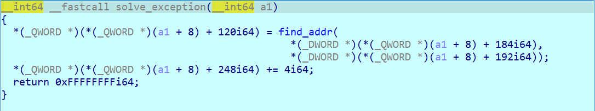

    Khi có ngoại lệ xảy ra, hàm này sẽ truyền 2 giá trị `moduleHash` và `funcHash` để tìm ra địa chỉ của hàm cần tìm. 2 giá trị này sẽ được lưu trong thanh r8 và r9 trước khi chương trình dính vào ngoại lệ chia cho 0.

    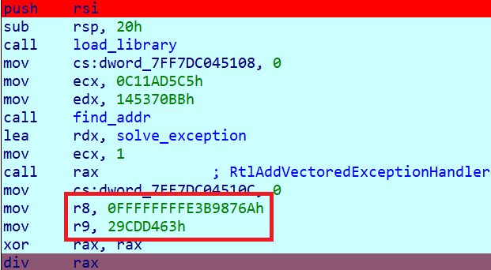


    <!-- Lấy danh sách mô-đun đã tải

    ```C
    struct _PEB_LDR_DATA *Ldr = NtCurrentTeb()->ProcessEnvironmentBlock->Ldr;
    struct _LIST_ENTRY *Flink = Ldr->InMemoryOrderModuleList.Flink;
    struct _LIST_ENTRY *p_InMemoryOrderModuleList = &Ldr->InMemoryOrderModuleList;
    ```

    - `NtCurrentTeb()->ProcessEnvironmentBlock->Ldr` lấy con trỏ đến PEB (Process Environment Block) của tiến trình hiện tại, từ đó truy cập đến Loader Data (Ldr), nơi chứa danh sách các mô-đun đã được tải vào tiến trình.

    - `Flink` và `p_InMemoryOrderModuleList` lần lượt trỏ đến phần tử đầu tiên và danh sách liên kết của các mô-đun đã tải.

    Duyệt qua danh sách mô-đun đã tải và kiểm tra mã băm

    ```C
    while (1) {
        if (Flink == p_InMemoryOrderModuleList) return result;
        if (LOWORD(Flink[4].Blink) <= 0x3E) {
            ...
        }
        Flink = Flink->Flink;
    }
    ```

    - Vòng lặp này duyệt qua từng mô-đun đã được tải bằng cách sử dụng danh sách liên kết kép (`Flink`).

    - Nếu đến cuối danh sách (`Flink == p_InMemoryOrderModuleList`), hàm sẽ trả về result, có thể là giá trị không hợp lệ hoặc NULL.

    Tạo mã băm cho tên mô-đun:

    ```C
    int v13 = 0x811C9DC5;
    if (v27) {
        unsigned __int8 *v14 = (unsigned __int8 *)&v28;
        do {
            v13 = 0x1000193 * (v13 ^ v12);
            v12 = *v14++;
        } while (v12);
    }
    ```

    - Giá trị `0x811C9DC5` là giá trị khởi đầu của thuật toán băm FNV-1a.
    
    - Vòng lặp này tạo mã băm của tên mô-đun hiện tại và so sánh nó với `funcHash`. Nếu khớp, mô-đun phù hợp được tìm thấy và tiến trình kiểm tra tiếp tục bên trong.

    Lấy địa chỉ hàm trong mô-đun:

    ```C
    v18 = *(int *)((char *)&v15[2].Flink + v16 + 4);
    ...
    if (moduleHash == 0x811C9DC5)
        return (__int64)v15 + *(int *)((char *)&v15->Flink + 4 * *(unsigned __int16 *)((char *)&v15->Flink + 2 * (unsigned int)v22 + v18) + v20);
    ```

    - Khi tìm thấy mô-đun, hàm duyệt qua các mục trong bảng xuất của mô-đun để kiểm tra các hàm và so sánh mã băm (`moduleHash`) với giá trị hàm hiện tại.

    - Nếu mã băm khớp, hàm trả về địa chỉ của hàm tương ứng (`v15 + ...`), đây là địa chỉ thực của hàm trong không gian địa chỉ của tiến trình
     -->