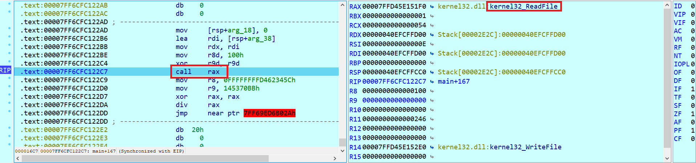

# TASK3.

```
Task 3:
Làm bài dưới đây, viết WU và giải thích kĩ về những kĩ thuật được sử dụng trong bài
```

- CHALL: [FILE](CHALL/VEH.rar).

- Xem qua bài này thì mình thấy có vấn đề: Chương trình có rất nhiều nơi bị lỗi ngoại lệ chia cho 0 rất nhiều, chính điều đó khiến cho trong những hàm được gọi bị chia làm nhiều phần riêng biệt và không thể gen ra mã giả để đọc.

- Trước khi nhảy vô hàm chính thì mình đã gặp một lỗi ngoại lệ khi debug, minhd thử đặt breakpoint để xem nó làm gì ở đó.

    <!--  -->

    ```C
    void __noreturn sub_7FF6B2482540()
    {
    void (__fastcall *RtlAddVectoredExceptionHandler)(__int64, __int64 (__fastcall *)(_EXCEPTION_POINTERS *)); // rax

    load_library();
    dword_7FF6B2485108 = 0;
    RtlAddVectoredExceptionHandler = (void (__fastcall *)(__int64, __int64 (__fastcall *)(_EXCEPTION_POINTERS *)))find_addr(0xC11AD5C5i64, 0x145370BBi64);
    RtlAddVectoredExceptionHandler(1i64, exception_solve);
    dword_7FF6B248510C = 0;
    JUMPOUT(0x7FF6B248258Fi64);
    }
    ```

- Trong hàm này thì hàm `load_library()` được để tải các thư viện, bao gồm **NTDLL.dll**, **USER32.dll**, **CRYPT32.dll**, **Advapi32.dll**.

- Tiếp đến là hàm `find_addr()`: được dùng để tìm những hàm WinAPI có trong các thư viện được tải ở trên.

    ```C
    __int64 __fastcall find_addr(int a1, int a2)
    {
    struct _PEB_LDR_DATA *Ldr; // r8
    struct _LIST_ENTRY *Flink; // r9
    struct _LIST_ENTRY *p_InMemoryOrderModuleList; // r8
    __int64 result; // rax
    struct _LIST_ENTRY *v6; // r10
    __int16 v7; // di
    unsigned __int64 v8; // rsi
    char v9; // bp
    unsigned __int64 v10; // rbp
    unsigned __int8 v12; // bl
    int v13; // ebp
    unsigned __int8 *v14; // rdi
    struct _LIST_ENTRY *v15; // r11
    __int64 v16; // rbp
    unsigned __int64 v17; // r12
    __int64 v18; // r14
    __int64 v19; // r13
    __int64 v20; // r15
    bool v21; // bp
    __int64 v22; // rdi
    __int64 v23; // rsi
    unsigned __int8 v24; // bl
    unsigned __int8 *v25; // rsi
    int v26; // r10d
    unsigned __int8 v27; // [rsp+0h] [rbp-88h]
    char v28; // [rsp+1h] [rbp-87h] BYREF

    Ldr = NtCurrentTeb()->ProcessEnvironmentBlock->Ldr;
    Flink = Ldr->InMemoryOrderModuleList.Flink;
    p_InMemoryOrderModuleList = &Ldr->InMemoryOrderModuleList;
    result = 0i64;
    while ( 1 )
    {
        if ( Flink == p_InMemoryOrderModuleList )
        return result;
        if ( LOWORD(Flink[4].Blink) <= 0x3Eu )
        {
        v6 = Flink[5].Flink;
        v7 = (__int16)v6->Flink;
        if ( LOWORD(v6->Flink) )
        {
            v8 = 0i64;
            do
            {
            v9 = v7 - 32;
            if ( (unsigned __int8)(v7 - 97) >= 0x1Au )
                v9 = v7;
            *(&v27 + v8) = v9;
            v10 = v8 + 1;
            v7 = *((_WORD *)&v6->Flink + v8 + 1);
            if ( !v7 )
                break;
            }
            while ( v8++ < 0x3E );
        }
        else
        {
            v10 = 0i64;
        }
        *(&v27 + v10) = 0;
        v12 = v27;
        v13 = 0x811C9DC5;
        if ( v27 )
        {
            v14 = (unsigned __int8 *)&v28;
            do
            {
            v13 = 0x1000193 * (v13 ^ v12);
            v12 = *v14++;
            }
            while ( v12 );
        }
        if ( v13 == a2 )
        {
            v15 = Flink[2].Flink;
            v16 = *(int *)((char *)&v15[8].Blink + SHIDWORD(v15[3].Blink));
            if ( *(_DWORD *)((char *)&v15[2].Flink + v16) )
            {
            v17 = *(unsigned int *)((char *)&v15[1].Blink + v16);
            if ( *(_DWORD *)((char *)&v15[1].Blink + v16) )
                break;
            }
        }
        }
    LABEL_2:
        Flink = Flink->Flink;
    }
    v18 = *(int *)((char *)&v15[2].Flink + v16 + 4);
    v19 = (__int64)v15 + *(int *)((char *)&v15[2].Flink + v16);
    v20 = *(int *)((char *)&v15[1].Blink + v16 + 4);
    v21 = 1;
    v22 = 0i64;
    while ( 1 )
    {
        v23 = *(int *)(v19 + 4 * v22);
        v24 = *((_BYTE *)&v15->Flink + v23);
        if ( v24 )
        break;
        if ( a1 == 0x811C9DC5 )
        return (__int64)v15
            + *(int *)((char *)&v15->Flink
                        + 4 * *(unsigned __int16 *)((char *)&v15->Flink + 2 * (unsigned int)v22 + v18)
                        + v20);
    LABEL_21:
        v21 = ++v22 < v17;
        if ( v22 == v17 )
        goto LABEL_2;
    }
    v25 = (unsigned __int8 *)&v15->Flink + v23 + 1;
    v26 = 0x811C9DC5;
    do
    {
        v26 = 0x1000193 * (v26 ^ v24);
        v24 = *v25++;
    }
    while ( v24 );
    if ( v26 != a1 )
        goto LABEL_21;
    if ( !v21 )
        goto LABEL_2;
    return (__int64)v15
        + *(int *)((char *)&v15->Flink
                    + 4 * *(unsigned __int16 *)((char *)&v15->Flink + 2 * (unsigned int)v22 + v18)
                    + v20);
    }
    ```

    Ta thấy tham số truyền vào hàm này gồm 2 giá trị là tham số truyền vào lần lượt là `moduleHash` (thanh ghi **ecx**) và `funcHash` (thanh ghi **edx**). Ban đầu chương trình sẽ thực hiện truy cập danh sách các module thông qua PEB, đồng thời lấy tên của các hàm để tính toán giá trị băm. 

    Sử dụng thuật toán hash FN1-1a (với 2 hằng số đặc trưng là `0x1000193` và `0x811C9DC5`) để tính toán rùi so sánh với `funcHash`, nếu thấy thì hàm sẽ tiếp tục duyệt các mục trong module để tính toán lại giá trị băm khác rùi so sánh với `moduleHash`. Nếu thấy thì sẽ trả về địa chỉ của hàm WinAPI cần tìm ([Thao khảo 1](https://www.zscaler.com/blogs/security-research/dodgebox-deep-dive-updated-arsenal-apt41-part-1#technical-analysis), [Tham khảo 2](https://gist.github.com/rad9800/ccfbf5f085aff2218699d92d354fe91e)).

- Chương trình dùng hàm [RtlAddVectoredExceptionHandler](https://learn.microsoft.com/en-us/windows/win32/api/errhandlingapi/nf-errhandlingapi-addvectoredexceptionhandler) để đăng ký một **vectored exception handler**, cho phép chương trình nhận và xử lý ngoại lệ. Với 2 tham số truyền vào là **First** (`ULONG`) và **Handler** ( `PVECTORED_EXCEPTION_HANDLER`). Trong đó **First = 1** để cho thấy mức độ ưu tiên cao hơn ở đầu danh sách xử lý, còn **Handler** sẽ trỏ tới hàm xử lý ngoại lệ khi ngoại lệ xảy ra.
    
    Hàm xử lý ngoại lệ `exception_solve()`, hàm này sẽ truyền vào thông tin của ngoại lệ **ExceptionInfo** (`_EXCEPTION_POINTERS`).

    ```C
    __int64 __fastcall exception_solve(_EXCEPTION_POINTERS *ExceptionInfo)
    {
    ExceptionInfo->ContextRecord->Rax = find_addr(
                                            LODWORD(ExceptionInfo->ContextRecord->R8),
                                            LODWORD(ExceptionInfo->ContextRecord->R9));
    ExceptionInfo->ContextRecord->Rip += 4i64;
    return 0xFFFFFFFFi64;
    }
    ```

    **ExceptionInfo** chứa 2 cấu trúc là **ExceptionRecord** (`PEXCEPTION_RECORD`) và **ContextRecord** (`PCONTEXT`).
    
    - Trong đó [ExceptionRecord](https://learn.microsoft.com/en-us/windows/win32/api/winnt/ns-winnt-exception_record) sẽ mô tả ngoại lệ đang diễn ra, chúng ta có thể xem tham số đầu tiên là mã lỗi của ngoại lệ thông qua chương trình khi debug:

        

        

    - Còn [ContextRecord](https://learn.microsoft.com/en-us/windows/win32/api/winnt/ns-winnt-context) sẽ lưu lại dữ liệu các thanh ghi cụ thể của bộ xử lý tại thời điểm khi xảy ra ngoại lệ (xem trong dữ liệu trong IDA trước và sau):

        

        

    Như vậy hàm `exception_solve()` sẽ gán lại giá trị cho thanh **eax** bằng địa chỉ trả về từ hàm **find_addr()** với các tham số truyền vào là là 32 bit thấp của 2 thanh **r8** và **r9**. Sau đó thực hiện tăng giá trị thanh **rip** lên 4 byte, có thể coi như là sẽ bỏ qua 4 byte kế tiếp trong mã lệnh. 

    Thanh ghi **rip** sẽ lưu trữ địa chỉ của lệnh tiếp theo sẽ được thực thi, vậy ta thử một chỗ có ngoại lệ xem sao và make code từ đoạn đó có gì.

    

    

    Khi ta make code đoạn đó thì thấy có câu lệnh mã máy xuất hiện, như vậy ý đồ của tác gỉa là sẽ cố tình chèn thêm byte `0xE9` rác để khiến cho chúng ta khó khăn trong việc nhìn được chương trình hay có thể gen ra mã giả, bên cạnh đó lại sử dụng việc xử lý ngoại lệ bằng việc thay đổi giá trị của thanh `eax` và `rip` để điều hướng luồng chương trình.

    

    Hiểu được sương sương ý tư tưởng của chương trình, ta mem theo bài rùi code lại dần dần.

- Nhập input đầu vào:

    

- `CryptAcquireContextW(&phProv, 0, 0, PROV_RSA_AES, CRYPT_VERIFYCONTEXT)` ([tham khảo](https://learn.microsoft.com/en-us/windows/win32/api/wincrypt/nf-wincrypt-cryptacquirecontexta)).

    

- `CryptCreateHash(phProv, CALG_SHA_256, 0, 0, &phHash)` ([tham khảo](https://learn.microsoft.com/en-us/windows/win32/api/wincrypt/nf-wincrypt-cryptcreatehash)):

    

- `CryptHashData(phHash, (BYTE*)link_Ytb, strlen(link_Ytb), 0)` ([tham khảo](https://learn.microsoft.com/en-us/windows/win32/api/wincrypt/nf-wincrypt-crypthashdata)):

    

    Trong đó:

    ```C
    char link_Ytb[100] = "https://www.youtube.com/watch?v=dQw4w9WgXcQ";
    ```

- `CryptGetHashParam(phHash, HP_HASHVAL, (BYTE*)_32_byte, &pdwDataLen, 0)` ([tham khảo](https://learn.microsoft.com/en-us/windows/win32/api/wincrypt/nf-wincrypt-cryptgethashparam)): 

    

    Trong đó 
    
    ```C
    pdwDataLen = 32;
    unsigned char _32_byte[32];
    ```

- `CryptDestroyHash(phHash)` ([tham khảo](https://learn.microsoft.com/en-us/windows/win32/api/wincrypt/nf-wincrypt-cryptdestroyhash)): 

    

- `CryptReleaseContext(phProv, 0)` ([tham khảo](https://learn.microsoft.com/en-us/windows/win32/api/wincrypt/nf-wincrypt-cryptreleasecontext)):

    

- `CryptAcquireContextW(&phProv, 0, L"Microsoft Enhanced RSA and AES Cryptographic Provider", PROV_RSA_AES, CRYPT_VERIFYCONTEXT)` ([tham khảo](https://learn.microsoft.com/en-us/windows/win32/api/wincrypt/nf-wincrypt-cryptacquirecontexta)):

    

    Trong đó: 

    ```asm
    r8 = szProvider = "Microsoft Enhanced RSA and AES Cryptographic Provider"
    dwFlags = 0xF0000000
    ```

- `CryptImportKey(phProv, (BYTE*)pbData, 0x2C, 0, 0, &phKey)` ([tham khảo](https://learn.microsoft.com/en-us/windows/win32/api/wincrypt/nf-wincrypt-cryptimportkey)):

    

- `CryptSetKeyParam(phKey, KP_MODE, (BYTE*)v6, 0)` ([tham khảo](https://learn.microsoft.com/en-us/windows/win32/api/wincrypt/nf-wincrypt-cryptsetkeyparam)):

    

    Trong đó:

    ```C
	int v6[4] = 
	{
		0x01, 0x00, 0x00, 0x00
	};
    ```

    `v6` được thiết lập là {0x01, 0x00, 0x00, 0x00} hay là số 1 (dạng `DWORD`), tương đương với **Cipher Block Chaining (CBC)**.

- `CryptSetKeyParam(phKey, KP_IV, (BYTE*)pbIV, 0)` ([tham khảo](https://learn.microsoft.com/en-us/windows/win32/api/wincrypt/nf-wincrypt-cryptsetkeyparam)):

    

    Chú ý: trong đó pbIV là vùng dữ liệu khác có sẵn ở trong máy từ 1 cho đến 16 (Kích thước của pbIV trong mã hóa AES là 16 byte):

    ```C
	unsigned char pbIV[16] = 
	{
		0x01, 0x02, 0x03, 0x04, 0x05, 0x06, 0x07, 0x08, 0x09, 0x0A, 
		0x0B, 0x0C, 0x0D, 0x0E, 0x0F, 0x10
	};
    ```

- `CryptEncrypt(phKey, 0, 1, 0, (BYTE*)flag, &pdwDataLen, 0x400)` ([tham khảo](https://learn.microsoft.com/en-us/windows/win32/api/wincrypt/nf-wincrypt-cryptencrypt)):

    

- Sau khi nắm được các hàm WinAPI được sử dụng thì ta có source code như sau:

    ```C
    #include <windows.h>
    #include <wincrypt.h>
    #include <iostream>
    #include <cstring> 

    int main(){
        unsigned char flag_en[32] = 
        {
            0xE5, 0x60, 0x44, 0x09, 0x42, 0xC4, 0xBB, 0xDE, 0xF6, 0xA1, 
            0x2D, 0x93, 0xD9, 0x1D, 0x13, 0x72, 0xAF, 0x8D, 0x4C, 0xF7, 
            0xA7, 0x9F, 0x1F, 0xB9, 0x99, 0x68, 0x9C, 0xB8, 0xC2, 0x4C, 
            0x4F, 0x85
        };
        HCRYPTPROV phProv;
    //	HCRYPTHASH phHash;
    //	char link_Ytb[100] = "https://www.youtube.com/watch?v=dQw4w9WgXcQ";
        DWORD pdwDataLen;
        unsigned char _32_byte[32];
        if (CryptAcquireContextW(&phProv, 0, 0, PROV_RSA_AES, CRYPT_VERIFYCONTEXT)){
            if (CryptCreateHash(phProv, CALG_SHA_256, 0, 0, &phHash)){
                if (CryptHashData(phHash, (BYTE*)link_Ytb, strlen(link_Ytb), 0)){
                    pdwDataLen = 32;
                    CryptGetHashParam(phHash, HP_HASHVAL, (BYTE*)_32_byte, &pdwDataLen, 0);
                    CryptDestroyHash(phHash);
                    CryptReleaseContext(phProv, 0);
                }
            }		
        }

        
        unsigned char pbData[50] =
        {
            0x08, 0x02, 0x00, 0x00, 0x10, 0x66, 0x00, 0x00, 0x20, 0x00, 
            0x00, 0x00, 0x04, 0x24, 0x97, 0x4C, 0x68, 0x53, 0x02, 0x90, 
            0x45, 0x8C, 0x8D, 0x58, 0x67, 0x4E, 0x26, 0x37, 0xF6, 0x5A, 
            0xBC, 0x12, 0x70, 0x57, 0x95, 0x7D, 0x7B, 0x3A, 0xCB, 0xD2, 
            0x4C, 0x20, 0x8F, 0x93
        };
    //	unsigned char flag[32] =
    //	{
    //		0x74, 0x75, 0x6E, 0x67, 0x64, 0x76, 0x61, 0x6E, 0x64, 0x65, 
    //		0x70, 0x74, 0x72, 0x61, 0x69, 0x74, 0x68, 0x69, 0x63, 0x68, 
    //		0x62, 0x61, 0x63, 0x68, 0x68, 0x61, 0x69, 0x70, 0x68, 0x75, 
    //		0x6F, 0x6E
    //	};
        
        HCRYPTKEY phKey;
        int v6[4] = 
        {
            0x01, 0x00, 0x00, 0x00
        };
        unsigned char pbIV[16] = 
        {
            0x01, 0x02, 0x03, 0x04, 0x05, 0x06, 0x07, 0x08, 0x09, 0x0A, 
            0x0B, 0x0C, 0x0D, 0x0E, 0x0F, 0x10
        };
        if (CryptAcquireContextW(&phProv, 0, L"Microsoft Enhanced RSA and AES Cryptographic Provider", PROV_RSA_AES, CRYPT_VERIFYCONTEXT)){
            if (CryptImportKey(phProv, (BYTE*)pbData, 0x2Cu, 0, 0, &phKey)){
                if (CryptSetKeyParam(phKey, KP_MODE, (BYTE*)v6, 0) && CryptSetKeyParam(phKey, KP_IV, (BYTE*)pbIV, 0)){
                    DWORD pdwDataLen = 32;		
    //				if (CryptEncrypt(phKey, 0, 1, 0, (BYTE*)flag, &pdwDataLen, 0x400)){
    //					for (int i = 0; i < 32; i++) printf("0x%x, ", flag[i]);
    //				}
                    if (CryptDecrypt(phKey, 0, 1, 0, (BYTE*)flag_en, &pdwDataLen)){
                        for (int i = 0; i < 32; i++) printf("%c", flag_en[i]);
                    }
                }
            }
        }
    }
    ```

## BONUS

- Có thể thấy khi ta làm bài này thì ta thấy chúng ta hay phải click mỗi khi có ngoại lệ xảy ra để IDA xử lý :

    

- Chúng ta có thể sử dụng viết script để có thể pass qua mà không cần IDA xử lý phần ngoại lệ này. Do việc xử lý ngoại lệ chỉ thay đổi giá trị thanh `eax` và giá trị thanh `rip` (trong đóa thanh `eax` trả về địa chỉ còn thanh `rip` tăng thêm 4 đơn vị). Chúng ta có thể viết script để thay thế hàm xử lý ngoại lệ này:

    ```python
    set_reg_value(Appcall.sub_7FF6B6E61000(idaapi.get_reg_val("r8"),idaapi.get_reg_val("r9")).value, "rax")
    set_reg_value(idaapi.get_reg_val("rip") + 4, "rip")
    ```

    Vậy là mỗi khi đến câu lệnh `div rax` thì chúng ta thực hiện chạy script này (script này có nhiệm vụ như phần xử lý ngoại lệ trên, chú ý khi chạy script là không được để chương trình bị lỗi ngoại lệ chia cho 0 trước, nếu chương trình đã dính ngoại lệ chia cho 0 thì script không chạy được)).

# Một số câu lệnh IDAPython thường dùng.

## get_reg_val()

- Câu lệnh này dùng để lấy giá trị thanh ghi.

    ```python
    import idaapi
    eax_value = idaapi.get_reg_val("eax")
    print(hex(eax_value)) # in giá trị hexa của thanh eax
    # print(hex(get_reg_val("eax")))
    ```

## set_reg_val()

- Câu lệnh này dùng để cập nhật/thay đổi giá trị thanh ghi.

    ```python
    import idaapi
    idaapi.set_reg_val("eax", 0x12345678) # gán eax = 0x12345678
    # idaapi.set_reg_val("eax", 0x12345678)
    ```

## get_bytes()

- Lấy giá trị của 1 ô nhớ:

    ```python
    import idaapi

    # Đọc 4 byte (32-bit) từ địa chỉ 0x00007FF6B6E6258D
    value = idaapi.get_bytes(0x00007FF6B6E6258D, 4) # đọc 4 byte từ địa chỉ 0x00007FF6B6E6258D
    print(hex(value))
    ```

    `get_byte()`, `get_word()`, `get_dword()`, `get_qword()`: những hàm này chỉ cho phép đọc 1 giá trị duy nhất từ địa chỉ.

    `get_bytes(addr, num)`: cho phép đọc nhiều byte từ địa chỉ đó.

## patch_bytes()

- Ghi vào một địa chỉ cụ thể:

    ```python
    import idaapi

    # Ghi giá trị 0x00007FF6B6E6258D vào bộ nhớ tại địa chỉ 0x1000
    idaapi.patch_bytes(0x00007FF6B6E6258D, b'\x78\x56\x34\x12')
    ```

    Chú ý dữ liệu điền vào là byte, nếu ta không đặt là byte thì nó mặc định là string và sẽ là giá trị mã `ASCII`.

## Appcall

- Sử dụng `Appcall` để gọi hàm trong binary với các tham số tùy chỉnh. Đây là một cách tiện dụng để kiểm tra và mô phỏng các hàm mà không cần phải thực thi toàn bộ chương trình hoặc trong TH chúng ta không thể muốn kiểm tra xem hàm đó trả về giá trị như thế nào.

    ```python
    Appcall.func_name(param1, param2).value
    ```

