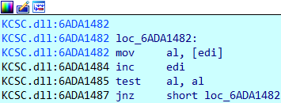

# KCSC.DLL

- Chall: [FILE](CHALL/KCSC.rar).

- Bài này cung cấp một file `.dll` 32 bit, yêu cầu phải phân tích file đó để có thể lấy được flag:

    

- Sau khi đưa thử file vào IDA để xem bên trong file `.dll` này có gì thì ta thấy có thể đoán được hàm **HelloWorld** có chức năng dùng để mã hóa và kiểm tra xem chuỗi đầu vào:

    

    Về việc phân tích trực tiếp file `.dll` này khá là bất tiện nên ta thực hiện viết một chương trình bằng C đơn gian để có thể gọi hàm HelloWorld từ thư viện `KSCS.dll` rùi bắt đầu debug.

    ```C
    #include <windows.h>
    #include <stdio.h>
    #include <stdbool.h>
    #include <stdlib.h>

    typedef bool (*CheckFunction)(const char*);

    int main() {
        HMODULE hDll = LoadLibrary("KCSC.dll");
        if (hDll == NULL) {
            printf("Failed to load KCSC.dll\n");
            return 1;
        }

        CheckFunction check_func = (CheckFunction)GetProcAddress(hDll, "HelloWorld");
        if (check_func == NULL) {
            printf("Failed to locate function 'HelloWorld'\n");
            FreeLibrary(hDll);
            return 1;
        }

        char input[100];
        printf("Flag: ");
        gets(input);

        int result = check_func(input);
        if (result) printf("Correct :>\n");
        else printf("Wrong :<\n");

        FreeLibrary(hDll);
        return 0;
    }
    ```

- Sau đó ta tiền hành debug chương trình này, ta có thể thấy hàm HelloWorld có nội dung chính như sau:

    ```C
    int __cdecl kcsc_HelloWorld(int a1)
    {
    const char *v1; // eax
        ......... Khai báo biến
    char v37[390]; // [esp+492h] [ebp-18Ah] BYREF

    if ( ((int (__cdecl *)(int, const char *, int))ucrtbase_strncmp)(a1, "de(RYpt3d_bu", 12) )
        return 0;
    v34[0] = xmmword_6ADB3360;
        ....... gán những tham số
        .......
        .......
    v34[68] = xmmword_6ADB3310;
    ((void (__cdecl *)(char *, _DWORD, int))unk_6ADB2371)(v37, 0, 390);
    v27[0] = xmmword_6ADB3470;
    v27[1] = xmmword_6ADB31E0;
    v28 = 0x299EA9D6;
    v29 = 0x48AA7364;
    v30 = 0xBAC246DF;
    v1 = (const char *)((int (__cdecl *)(int))ucrtbase__mbsdup)(a1);
    v2 = 0;
    v3 = v1;
    v31 = 0;
    if ( strlen(v1) == 44 )
    {
        v32 = v4;
        v5 = v4;
        while ( 1 )
        {
        v6 = 0;
        if ( (v4 & 1) != 0 )
        {
            v7 = *v3;
            v33 = v3 + 1;
            v8 = &v3[strlen(v3) + 1] == v3 + 1;
            v9 = v31;
            if ( !v8 )
            {
            while ( 1 )
            {
                v10 = v9 / 3;
                v11 = v31++;
                v12 = v11 - 3 * v10;
                if ( !v12 )
                {
                v33 = v3 + 1;
                v15 = (unsigned int)&v3[strlen(v3) + 1];
                v16 = v7;
                if ( v6 != v15 - (_DWORD)(v3 + 1) - 1 )
                    v16 = v3[v6 + 1];
                v3[v6] ^= v16 - *((_BYTE *)v34 + v2);
                goto LABEL_19;
                }
                v13 = v12 - 1;
                if ( !v13 )
                break;
                if ( v13 == 1 )
                {
                v33 = v3 + 1;
                if ( v6 == strlen(v3) - 1 )
                    v3[v6] = v7 + *((_BYTE *)v34 + v2) - v3[v6];
                else
                    v3[v6] = *((_BYTE *)v34 + v2) + v3[v6 + 1] - v3[v6];
    LABEL_19:
                ++v2;
                }
                ++v6;
                v33 = v3 + 1;
                v17 = v6 < strlen(v3);
                v9 = v31;
                if ( !v17 )
                goto LABEL_40;
            }
            v33 = v3 + 1;
            if ( v6 == strlen(v3) - 1 )
                v14 = v7 ^ *((_BYTE *)v34 + v2);
            else
                v14 = *((_BYTE *)v34 + v2) ^ v3[v6 + 1];
            v3[v6] += v14;
            goto LABEL_19;
            }
            goto LABEL_40;
        }
        v33 = v3 + 1;
        v8 = &v3[strlen(v3) + 1] == v3 + 1;
        v18 = v31;
        if ( !v8 )
            break;
    LABEL_40:
        v4 = v32 + 1;
        v32 = v4;
        if ( v4 >= 24 )
            goto LABEL_41;
        }
        while ( 1 )
        {
        v19 = v18 / 3;
        v20 = v31++;
        v21 = v20 - 3 * v19;
        if ( !v21 )
        {
            if ( !v6 )
            {
            v5 = *v3 ^ *((_BYTE *)v34 + v2);
            goto LABEL_36;
            }
            v23 = v3[v6] ^ (v3[v6 - 1] - *((_BYTE *)v34 + v2));
            goto LABEL_35;
        }
        v22 = v21 - 1;
        if ( !v22 )
            break;
        if ( v22 == 1 )
        {
            if ( !v6 )
            {
            v5 = *v3 - *((_BYTE *)v34 + v2);
    LABEL_36:
            ++v2;
            goto LABEL_37;
            }
            v23 = v3[v6 - 1] + *((_BYTE *)v34 + v2) - v3[v6];
            goto LABEL_35;
        }
    LABEL_37:
        if ( v6 == strlen(v3) - 1 )
            v3[v6] = v5;
        ++v6;
        v33 = v3 + 1;
        v17 = v6 < strlen(v3);
        v18 = v31;
        if ( !v17 )
            goto LABEL_40;
        }
        if ( !v6 )
        {
        v5 = *v3 + *((_BYTE *)v34 + v2);
        goto LABEL_36;
        }
        v23 = v3[v6] + (v3[v6 - 1] ^ *((_BYTE *)v34 + v2));
    LABEL_35:
        v3[v6 - 1] = v5;
        v5 = v23;
        goto LABEL_36;
    }
    LABEL_41:
    v24 = 0;
    v25 = v3 - (const char *)v27;
    while ( *((_BYTE *)v27 + v24 + v25) == *((_BYTE *)v27 + v24) )
    {
        if ( ++v24 >= 44 )
        return 1;
    }
    return 0;
    }
    ```

- Ban đầu chương trình sẽ thực hiện kiểm tra 12 kí tự đầu tiên của input với chuỗi `de(RYpt3d_bu`, nếu ko đúng thì sẽ **return 0**. Sau đó tiến hành kiểm tra chiều dài của chuỗi với `44`, nếu ko thì sẽ **return 0** và thoát chương trình.

    

    

- Sau đó chương trình sẽ thực hiện 24 vòng lặp, nếu là vòng lặp chẵn thì sẽ thực hiện mã hóa input theo một cách, còn vòng lặp lẻ sẽ mã hóa input theo một cách khác.

    ```python
    for MODE in range(24):
        if MODE % 2 == 0:
            # code
        else:
            # code
    ```

- Trong mỗi vòng lặp thì thực hiện mã hóa từng kí tự trong input với các TH lần lượt là 0, 1, 2:

    ```python
    if MODE % 2 == 0:
        for i in range(len(input)):
            if (i + MODE * len(input)) % 3 == 0:
                # code0
            elif (i + MODE * len(input)) % 3 == 1:
                # code1
            else:
                # code2
    else:
        for i in range(len(input)):
            if (i + MODE * len(input)) % 3 == 0:
                # code0
            elif (i + MODE * len(input)) % 3 == 1:
                # code1
            else:
                # code2
    ```

- Như bài này thì ta thấy phần code đã được tối ưu trong việc giảm thiểu việc trùng lặp đoạn code có cùng chức năng nên chương trình sử dụng `goto LABEL` khá nhiều, điều đó khiến cho đoạn mã giả trở nên khó đọc hơn. Để làm bài này ta có thể mem theo những LABEL trong mã giả rùi thực hiện ghi lại để tiện theo dõi. Ví dụ như trong vòng lặp chẵn như sau:

    ```C
    // VONG LAP 0
    if ( !INPUT_I )
    {
        v6 = *INPUT ^ DATA[DATA_I];
        ++DATA_I;
        if ( INPUT_I == strlen(INPUT) - 1 )
            INPUT[INPUT_I] = v6;
        ++INPUT_I;
        v34 = INPUT + 1;
        v18 = INPUT_I < strlen(INPUT);
        v19 = v32;
        if ( !v18 )
            goto LABEL_40;
    }
    else 
    {
        v24 = INPUT[INPUT_I] ^ (INPUT[INPUT_I - 1] - DATA[DATA_I]);
        INPUT[INPUT_I - 1] = v6;
        v6 = v24;
        ++DATA_I;
        if ( INPUT_I == strlen(INPUT) - 1 )
            INPUT[INPUT_I] = v6;
        ++INPUT_I;
        v34 = INPUT + 1;
        v18 = INPUT_I < strlen(INPUT);
        v19 = v32;
        if ( !v18 )
            goto LABEL_40;
    }

        // VONG LAP 1
    if ( !INPUT_I )
    {
        v6 = *INPUT + DATA[DATA_I];
        ++DATA_I;
        if ( INPUT_I == strlen(INPUT) - 1 )
            INPUT[INPUT_I] = v6;
        ++INPUT_I;
        v34 = INPUT + 1;
        v18 = INPUT_I < strlen(INPUT);
        v19 = v32;
        if ( !v18 )
            goto LABEL_40;
    }
    else
    {
        v24 = INPUT[INPUT_I] + (INPUT[INPUT_I - 1] ^ DATA[DATA_I]);
        INPUT[INPUT_I - 1] = v6;
        v6 = v24;
        ++DATA_I;
        if ( INPUT_I == strlen(INPUT) - 1 )
            INPUT[INPUT_I] = v6;
        ++INPUT_I;
        v34 = INPUT + 1;
        v18 = INPUT_I < strlen(INPUT);
        v19 = v32;
        if ( !v18 )
            goto LABEL_40;
    }

        // VONG LAP 2
    if ( !INPUT_I )
    {
        v6 = *INPUT - DATA[DATA_I];
        ++DATA_I;
        if ( INPUT_I == strlen(INPUT) - 1 )
            INPUT[INPUT_I] = v6;
        ++INPUT_I;
        v34 = INPUT + 1;
        v18 = INPUT_I < strlen(INPUT);
        v19 = v32;
        if ( !v18 )
            goto LABEL_40;
    }
    else
    {
        v24 = INPUT[INPUT_I - 1] + DATA[DATA_I] - INPUT[INPUT_I];
        INPUT[INPUT_I - 1] = v6;
        v6 = v24;
        ++DATA_I;
        if ( INPUT_I == strlen(INPUT) - 1 )
            INPUT[INPUT_I] = v6;
        ++INPUT_I;
        v34 = INPUT + 1;
        v18 = INPUT_I < strlen(INPUT);
        v19 = v32;
        if ( !v18 )
            goto LABEL_40;
    }
    ```

- Sau khi dựng lại được xong thì ta dễ dàng xây dựng lại phần mã hóa của chương trình:

    ```python
    def hello(flag):
        for MODE in range(0, 24):
            if MODE % 2 == 0:
                tmp = 0
                for i in range(44):
                    if (i + MODE * 44) % 3 == 0:
                        if i == 0: tmp = flag[i] ^ dataX[i + MODE * 44]
                        else:
                            v12 = flag[i] ^ ((flag[i - 1] - dataX[i + MODE * 44]) & 0xFF)
                            flag[i - 1] = tmp
                            tmp = v12
                            if i == 43: flag[i] = tmp
                    elif (i + MODE * 44) % 3 == 1:
                        if i == 0: tmp = (flag[i] + dataX[i + MODE * 44]) & 0xFF
                        else:
                            v12 = (flag[i] + (flag[i - 1] ^ dataX[i + MODE * 44])) & 0xFF
                            flag[i - 1] = tmp
                            tmp = v12
                            if i == 43: flag[i] = tmp
                    elif (i + MODE * 44) % 3 == 2:
                        if i == 0: tmp = (flag[i] - dataX[i + MODE * 44]) & 0xFF
                        else:
                            v12 = (flag[i - 1] + dataX[i + MODE * 44] - flag[i]) & 0xFF
                            flag[i - 1] = tmp
                            tmp = v12
                            if i == 43: flag[i] = tmp
            else:
                v8 = flag[0]
                for i in range(44):
                    if (i + MODE * 44) % 3 == 0:
                        if i != 43: flag[i] ^= (flag[i + 1] - dataX[i + MODE * 44]) & 0xFF
                        else: flag[i] ^= (v8 - dataX[i + MODE * 44]) & 0xFF
                    elif (i + MODE * 44) % 3 == 1:
                        if i == 43: flag[i] = (flag[i] + (v8 ^ dataX[i + MODE * 44])) & 0xFF
                        else: flag[i] = (flag[i] + (dataX[i + MODE * 44] ^ flag[i + 1])) & 0xFF
                    elif (i + MODE * 44) % 3 == 2:
                        if i == 43: flag[i] = (v8 + dataX[i + MODE * 44] - flag[i]) & 0xFF
                        else: flag[i] = (dataX[i + MODE * 44] + flag[i + 1] - flag[i]) & 0xFF
        return flag
    ```

    Có một điều lưu ý khi ta dựng lại hàm `HelloWord` là việc sử dụng hàm `strlen`, hàm này thực hiện đếm chiều dài của chuỗi bằng việc so sánh byte đó với byte `0x00`:

    

    Như chương trình thì mỗi lần mã hóa từng kí tự của input thì đều thực hiện 1 bước là kiểm tra chiều dài của chuỗi với ví trí kí tự hiện tại, nếu mà vì trí đó nhỏ hơn chiều dài hiện tại của chuỗi thì dừng lại và bắt đầu vòng lặp mã hóa mới:

    

    Điều này xảy ra một TH đó chính là nếu mà trong một lần mã hóa ở vị trí thứ `k` mà byte `input[k] = 0x00` thì lúc này chiều dài của chuỗi sẽ bị giảm xuống là `k` chứ không còn là `44`. Và lúc đó thì việc mã hóa chỉ là phần mã hóa `k` byte đầu tiên của input chứ không phải mã hóa tất cả `44` byte nữa.

    Nhưng mà may mắn thay vì các byte `flag_en` của chương trình không có một byte `0x00` nào, tức là flag của tác giả khi mã hóa không có một bước nào mà chiều dài bị giảm cả. Tức là phần code python ở trên dù chưa mã hóa chuẩn theo như đúng chương trình nhưng mà nó lại mã hóa đúng flag. Nếu mà trong các byte của `flag_en` có byte `0x00` thì chúng ta cần thêm một bước kiểm tra chiều dài ở trên để có thể `Z3` cho chính xác.

- Bây giờ ta chỉ cần nhặt ra các byte của `flag_en` và dùng `Z3` để xử lý nốt bài này ([tham khảo](KCSC/sc.py)).

- Flag: 

    ```txt
    de(RYpt3d_but_m@y_be_you_5th_this_i5nt_f|agg
    ```

# MIXTURE

- Chall: [FILE](CHALL/MIXTURE.rar).

    Note: Run as administrator.

- Khi bắt đầu tiến vào hàm main, ta thấy chương trình gán một loạt các giá trị rùi thực hiện một loạt các phép toán biến đổi để mã chuyển đổi những kí tự đó sang kí tự khác, đây mà một kĩ thuật giúp có thể giấu đi các tên hàm winAPI muốn gọi, tránh lộ trực tiếp.

    

    Sau khi chạy xong vòng for kia ta nhận được chuỗi có nghĩa là: `KERNEL32.DLL`.

    

- Ta thấy trong hàm main có gọi hàm để load thư viện `kernel32.dll`  và thực hiện lấy các hàm winAPI cần thiết cho chương trình thông qua hàm là `resAPI`, ví dụ như hàm winAPI sau:

    

    Về hàm resAPI thì nó như sau:

    ```C
    int __fastcall sub_1F11B3(int kernel32, char *a2)
    {
    int v3; // edi
    int v4; // ecx
    int v5; // eax
    _DWORD *v6; // eax
    int v7; // edx
    int v8; // ebx
    int v10; // [esp+Ch] [ebp-10h]
    int v11; // [esp+10h] [ebp-Ch]
    unsigned int v12; // [esp+14h] [ebp-8h]

    v3 = 0;
    v4 = 0;
    if ( *(_WORD *)kernel32 == 'ZM' )
    {
        v5 = *(_DWORD *)(kernel32 + 60);
        if ( *(_DWORD *)(v5 + kernel32) == 'EP' )
        v4 = v5 + kernel32 + 24;
    }
    v6 = (_DWORD *)(kernel32 + *(_DWORD *)(v4 + 96));
    v7 = kernel32 + v6[8];
    v8 = kernel32 + v6[7];
    v11 = v7;
    v10 = kernel32 + v6[9];
    v12 = v6[6];
    if ( !v12 )
        return 0;
    while ( sub_1F10F9((char *)(kernel32 + *(_DWORD *)(v7 + 4 * v3)), a2) )
    {
        v7 = v11;
        if ( ++v3 >= v12 )
        return 0;
    }
    return kernel32 + *(_DWORD *)(v8 + 4 * *(unsigned __int16 *)(v10 + 2 * v3));
    }
    ```

    Hàm này thực ban đầu thực hiện kiểm tra xem có phải là tệp PE không thông qua phần kiểm tra header đầu tiên với `ZM` và kiểm tra giá trị tại địa chỉ DOS header so sánh với `EP`. Xong đó thực hiện lấy địa chỉ của bảng Export, duyệt qua các mục của bằng rùi thực hiện kiểm tra các mục đó với tham số a2 truyền vào (là tên của hàm winAPI cần lấy). Nếu thấy thì sẽ trả về địa chỉ của hàm cần tìm, không thì sẽ duyệt tiếp.

- Sau khi biết được chương trình sẽ thực hiện lấy các hàm winAPI để phục vụ cho chương trình thì ta sẽ thấy được hàm main sẽ có nội dung tóm lại như sau:

    ```C
    scan(&_kernel32[1], input, 1024);
    WriteFile(hFile, input, strlen(input), lpNumberOfBytesWritten, 0);
    v16 = operator new(100);
    ReadFile(hFile, v16, 0x64, &lpNumberOfBytesRead, 0);
    print(&ReadFile[1], v16);
    CloseHandle(hFile);
    TerminateProcess(dword_1F643C, -1);
    ```

- Như vậy sau khi nhập input xong chương trình sẽ sử dùng hàm `WriteFile` để khi dữ liệu input vào một tệp gì đó. Lúc này khi ta nhấn nào handle `hFile` thì ta thấy trong hàm main này ngoài 2 hàm WriteFile và ReadFile thì không còn chỗ nào có có đề cập đến giá trị này nữa (muốn ghi được dữ liệu thì ít nhất là ta phải biết dữ liệu đó được ghi ở đâu, vì lúc kiểm tra giá trị của handle `hFile` thì ta đã thấy nó có giá trị sẵn, tức là nó đã được tạo ở đâu đó trong chương trình), nên ta thử `xref` xem `hFile` còn được gọi ở đâu không:

    

    Lúc này ta nhận ra việc tạo ra một handle `hFile` được tạo trước hàm main, ta tiến hành đặt break-point và F9 lại.

-  Khi ta thấy có hàm được gọi trước hàm main, nếu ta `xref` hàm `main` thì ta sẽ thấy chương trình sẽ như sau: 
    
    

    Ở đây chương trình có có sử dụng 2 hàm là `initterm` và `initterm_e`. Hai hàm này được sử dụng trong quá trình khởi động để gọi các hàm khởi tạo trước khi bắt đầu thực thi mã chính của chương trình. Thì ta thấy trong hàm `initterm` có 3 hàm được gọi trước khi bắt đầu vào hàm main như sau:

    

    Ở đây có 3 hàm được gọi trước hàm main, bao gồm hàm `sub_1F340E`, `j__1`, `j__4`. Hàm `sub_1F340E` thiết lập cơ chế xử lý lỗi, hàm `j__1` tạo process hollowing, `j__4` để tạo registry. Chi tiết các hàm như sau:

- Hàm `sub_1F340E`:

    ```asm
    call    ds:SetUnhandledExceptionFilter
    call    UserMathErrorFunction
    ```

    hàm này sử dụng 2 hàm chính là **SetUnhandledExceptionFilter** (dể thiết lập bộ lọc ngoại lệ toàn cục nếu có lỗi) và **UserMathErrorFunction** dùng để đăng kí và xử lý các lỗi toán học.

- Hàm `j__1`: hàm tạo tiến trình process Hollowing và thực hiện kết nối với một name pipe. Chi tiết như sau:

    - **Tạo một process ở trạng thái treo**: bằng việc sử dụng hàm `CreateProcessW()` với tham số `dwCreationFlags` là `CREATE_SUSPENDED`, tiến trình ở trạng thái treo là `cmd.exe`.

        

    - **Tìm một tài nguyên trong chương trình, tải và sử dụng tài nguyên đó**: sử dụng 3 hàm là `FindResourceW`, `LoadResource`, `LockResource`.

        Tài nguyên được tải mang ID là `101` và loại của tài nguyên cần tìm là `PFE`. Ta có thể sử dụng công cụ [CFF Explorer](https://ntcore.com/explorer-suite/) để nhìn thấy tài nguyên được tải.

        

        

        

        Sau khi tải tài nguyên xong thì chương trình sẽ thực hiện biến đổi tài nguyên đã tải để được dữ liệu mong muốn và sử dụng.

        

        Ta thấy phần header là `MZ` nên có thể đoán được tài nguyên này khả năng cao là một file `PE`.

    - **Giải phóng bộ nhớ** từ một địa chỉ của tiến trình đang treo, **cấp phát bộ nhớ** (bao gồm cả quyền với bộ nhớ đấy) và **ghi dữ liệu** vào bộ nhớ của một tiến trình đó: Sử dụng `NtUnmapViewOfSection` và `WriteProcessMemory`.

        

        

        

    - **Cập nhật ngữ cảnh của luồng** được ghi đề và thực hiện **tiếp tục luồng** bị tạm dừng: sử dụng `GetThreadContext`, `SetThreadContext`, `ResumeThread`.

        

        > Ta thấy phần ghi tài nguyên ghi đè lên là phần tài nguyên đã tải ở trên, sau khi ghi đè xong thì tiếp tục tiến trình đã tạm dừng. Đến đây có thể kết luận chương trình đang thực hiện kĩ thuật [Process Hollowing](https://sec.vnpt.vn/2019/01/process-hollowing/) để có thể che giấu đi process chính. Ta thực hiện lấy tài nguyên đã tải và chuyển nó về file thực thi. Ta có thể viết script để lấy:

        ```python
        len = 0x4800
        addr = 0xEC65040
        bin= idc.get_bytes(addr,int(len))
        open(r"bin.exe","wb").write(bin)
        ```

    - **Kết nối tới một pipe có sẵn**: `CreateFileW("\\.\pipe\KCSCCTF2022",0xE0000000,0,0,3,0,0);`.

        

- Hàm `j__4`: có chức năng chính là **tạo một khóa** trong Windows Registry và **đặt dữ liệu** vào một giá trị cụ thể của khóa: 
    
    `RegCreateKeyExA(0x80000000, &v37, 0, 0, 0, 0x20006, 0, &v27, 0)`: ý nghĩa là tạo một khóa con trong HKEY_CLASSES_ROOT (`0x80000000`) với tên được lưu là `.KCSC\shell\open\command`. Nếu thành công hàm sẽ trả về giá trị `ERROR_SUCCESS` (thường là 0).

    

    `RegSetValueExA`: Ghi một chuỗi vào một giá trị cụ thể `cn`/`jn` trong khóa trên.

    

    Ta có thể sử dụng **Registry Editor** để có thể nhìn thấy chi tiết hơn những dữ liệu được khi vào khóa:

    

- Như vậy ta có thể tóm tắt lại những điều tiến trình `mixture.exe` sẽ làm:

    - `1`: Tạo process ở trạng thái dừng.

    - `2`: Tải tài nguyên và thực hiện ghi đè tài nguyên đó vào process đang dừng.

    - `3`: Tiếp tục process sau khi ghi thành công.

    - `4`: Thực hiện kiểm tra mở thành công cổng pipe hay không.

    - `5`: Thực hiện ghi dữ liệu vào khóa.

    - `6`: Đọc dữ liệu từ bàn phím, gửi cho tiến trình ProcHollowing.

    - `7`: Đọc dữ liệu mà tiến trình ProcHollowing gửi và in ra màn hình.


- Như ta có thể thấy thì tiến trình hiện tại đang giao tiếp với một tiến trình khác đã được load vào và thực thi, vì trong tiến trình hiện tại không có việc tạo pipe mà chỉ có việc kiểm tra kết nối pipe có thành công hay không, như vậy khả năng cao là file kia thực hiện việc tạo pipe và chứa hàm `check_flag`.

- Phân tích file `bin.exe`:

    

    Ta thấy chương trình thực hiện tạo một pipe bằng hàm `CreateNamedPipeW`: hàm tạo một named pipe và trả về một handle cho named pipe đã tạo. Xong dùng hàm `ConnectNamedPipe` để cho phép một tiến trình khác kết nối đến named pipe đã được tạo. Đến đây là tiến trình `bin.exe` sẽ chờ đến khi tiến trình `mixture.exe` thực hiện kết nối pipe thì tiến trình bên `bin.exe` sẽ thực hiện tiếp.

    

    Tiếp theo là đến với phần `check_flag` của chương trình: ban đầu chương trình sẽ sử dụng hàm `RegOpenKeyExA` để mở khóa đã được tạo trong Windows Registy ở trong tiến trình **mixture.exe**, `RegQueryValueExA` dùng để lấy giá trị đã được lưu trữ trong khóa ở trên.

    

    Chương trình sử dụng `CryptAcquireContextA`, `CryptImportKey`, `CryptSetKeyParam` để thực mã hóa input với thuật toán mã hóa là `RSA`, ta thực hiện bắt `key`, `IV` và `byte_enc` trong chương trình  và thực hiện giải mã bằng cycberchef.

    ```txt
    Key: 31737427745F376C40675F755F326830756C646E27745F7335626D31745F3174
    IV: 05172B0C22410C2D0C22205E1C228E4B
    byte_enc: 99286748B056C365A16C1199FE885AA470FD5EA7963A1FCCB2DFCB278B7CC396A89E58BA9E9765130524486ABC7D1929
    ```

    

    Sau khi đưa lên cycberchef thì ta lấy được flag, nhưng mà lúc này flag có vẻ có 2 kí tự bị lỗi.

    Có sự khác biệt này là do trong tiến trình `mixture.exe` IV chỉ được khởi tạo có 14 byte đầu, còn 2 byte cuối sẽ được đấy từ số seri của volume mỗi ổ đĩa của máy bằng việc sử dụng hàm `GetVolumeInformationA`.

    

    Sau hàm `check_flag` thì tiến trình sẽ thực hiện gửi thông điệp đến tiến trình `mixture.exe` dựa trên việc kiểm tra đúng hay sai.

- Flag:

    ```txt
    KCSC{C0n9r@tul**10n2_0n_mak1ng_1t(^.^)}
    ```
