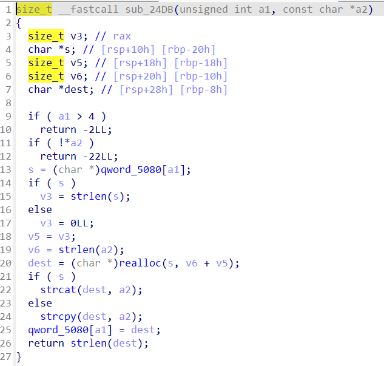
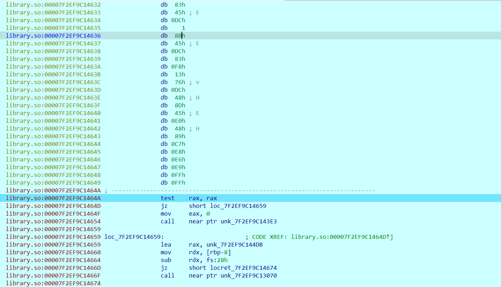

# X64_ESTENSION

- Chall: [FILE](CHALL/X64_Estension.zip).

- Bài này hàm xử lý chính của chương trình sẽ như sau:

    ```C
    __int64 sub_4048F7()
    {
    unsigned int len_input; // ebx
    __int64 _input; // rax
    __int64 v2; // rcx
    __int64 v3; // r8
    __int64 result; // rax
    unsigned __int64 v5; // rdx
    char v6; // [rsp+Fh] [rbp-541h] BYREF
    __int64 v7[2]; // [rsp+10h] [rbp-540h] BYREF
    __int64 v8[2]; // [rsp+20h] [rbp-530h] BYREF
    char input[32]; // [rsp+30h] [rbp-520h] BYREF
    char v10[512]; // [rsp+50h] [rbp-500h] BYREF
    _QWORD v11[66]; // [rsp+250h] [rbp-300h] BYREF
    __int64 v12[2]; // [rsp+460h] [rbp-F0h] BYREF
    __int64 v13[4]; // [rsp+470h] [rbp-E0h] BYREF
    __int64 v14[20]; // [rsp+490h] [rbp-C0h] BYREF
    char v15; // [rsp+530h] [rbp-20h]
    unsigned __int64 v16; // [rsp+538h] [rbp-18h]

    v16 = __readfsqword(0x28u);
    v12[0] = 0xF8F9FAFBFCFDFEFFLL;
    v12[1] = 0xF0F1F2F3F4F5F6F7LL;
    v13[0] = 0x706050403020100LL;
    v13[1] = 0xF0E0D0C0B0A0908LL;
    v13[2] = 0x1716151413121110LL;
    v13[3] = 0x1F1E1D1C1B1A1918LL;
    memset(v14, 0, sizeof(v14));
    v15 = 0;
    sub_44AD50((__int64)v11, (__int64)"flag.txt", 4);
    sub_406240();
    sub_404D36((__int64)v8);
    sub_404CEC((__int64)v7, v11);
    sub_404D60(input, v7[0], v7[1], v8[0], v8[1], &v6);
    sub_406260(&v6);
    len_input = sub_474A00(input);
    _input = sub_476220(input);
    encrypt(_input, len_input, v12, v13, v14);    // rdi, esi, rdx, rcx, r8
    sub_44AEC0(v10, "flag.txt.enc", 4LL);
    sub_46DB60(v10, v14, 160LL);
    sub_44B340(v10);
    sub_44B570(v10);
    sub_4747E0(input);
    sub_44B6B0(v11);
    result = 0LL;
    v5 = v16 - __readfsqword(0x28u);
    if ( v5 )
        sub_52F020(v11, v14, v5, v2, v3);
    return result;
    }
    ```

- Chương trình này sẽ thực hiện đọc dữ liệu trong file `flag.txt` roài thực hiện mã hóa dữ liệu trong file `flag.txt` rùi lưu lại vào trong file `flag.txt.enc`.

- Trong hàm encrypt sẽ như sau:

    ```C
    __int64 __fastcall sub_404519(__int64 input, __int64 a2, const __m128i *a3, const __m128i *a4)
    {
    __int64 v4; // rax
    unsigned __int64 v5; // rbx
    __int64 v6; // rcx
    char v7; // al
    char *v8; // rbx
    __int64 v9; // rdx
    __int64 v10; // r8
    __int64 i; // rcx
    __m128i v12; // xmm0
    __int64 v43; // [rsp-8h] [rbp-8h]
    __m128i vars0; // [rsp+0h] [rbp+0h] BYREF
    __m128i vars10; // [rsp+10h] [rbp+10h] BYREF
    __m128i vars20; // [rsp+20h] [rbp+20h] BYREF
    __m128i anonymous0; // [rsp+30h] [rbp+30h] BYREF
    __m128i anonymous1; // [rsp+40h] [rbp+40h] BYREF
    __m128i anonymous2; // [rsp+50h] [rbp+50h] BYREF
    __m128i anonymous3; // [rsp+60h] [rbp+60h] BYREF
    __m128i anonymous4; // [rsp+70h] [rbp+70h] BYREF
    __m128i anonymous5; // [rsp+80h] [rbp+80h] BYREF
    __m128i anonymous6; // [rsp+90h] [rbp+90h] BYREF
    __m128i anonymous7; // [rsp+A0h] [rbp+A0h] BYREF
    __m128i anonymous8; // [rsp+B0h] [rbp+B0h] BYREF
    __m128i anonymous9; // [rsp+C0h] [rbp+C0h] BYREF
    __m128i anonymous10; // [rsp+D0h] [rbp+D0h] BYREF
    __m128i anonymous11; // [rsp+E0h] [rbp+E0h] BYREF
    __m128i anonymous12; // [rsp+F0h] [rbp+F0h] BYREF
    unsigned __int64 vars100; // [rsp+100h] [rbp+100h]
    unsigned __int64 vars108; // [rsp+108h] [rbp+108h]
    __m128i vars110; // [rsp+110h] [rbp+110h] BYREF
    char need_byte[10]; // [rsp+120h] [rbp+120h] BYREF

    need_byte[1] = 0;
    vars0 = _mm_loadu_si128(a3);
    vars10 = _mm_loadu_si128(a4);
    vars20 = _mm_loadu_si128(a4 + 1);
    vars108 = v5;                                 // len_input
    need_byte[0] = 16 - v5 % 0x10;                // need_byte
    vars100 = v5 + (unsigned __int8)need_byte[0]; // len_input + need_byte
    v43 = v4;
    sub_4044F0(input, a2, v5 % 0x10, v5 % 0x10);
    v6 = (unsigned __int8)need_byte[0];
    v7 = need_byte[0];
    v8 = &need_byte[-(unsigned __int8)need_byte[0]];
    do
        v8[--v6] = v7;
    while ( v6 );
    sub_4046F7();
    for ( i = 0LL; i != vars100; i += 16LL )
    {
        if ( vars100 - i == 16 )
        v12 = _mm_load_si128(&vars110);
        else
        v12 = _mm_loadu_si128((const __m128i *)(v43 + i));
        _XMM0 = _mm_xor_si128(_mm_xor_si128(v12, _mm_load_si128(&vars0)), _mm_load_si128(&vars10));
        _XMM1 = _mm_load_si128(&vars20);
        _XMM2 = _mm_load_si128(&anonymous0);
        _XMM3 = _mm_load_si128(&anonymous1);
        _XMM4 = _mm_load_si128(&anonymous2);
        _XMM5 = _mm_load_si128(&anonymous3);
        _XMM6 = _mm_load_si128(&anonymous4);
        _XMM7 = _mm_load_si128(&anonymous5);
        __asm
        {
        aesenc  xmm0, xmm1
        aesenc  xmm0, xmm2
        aesenc  xmm0, xmm3
        aesenc  xmm0, xmm4
        aesenc  xmm0, xmm5
        aesenc  xmm0, xmm6
        aesenc  xmm0, xmm7
        }
        _XMM1 = _mm_load_si128(&anonymous6);
        _XMM2 = _mm_load_si128(&anonymous7);
        _XMM3 = _mm_load_si128(&anonymous8);
        _XMM4 = _mm_load_si128(&anonymous9);
        _XMM5 = _mm_load_si128(&anonymous10);
        _XMM6 = _mm_load_si128(&anonymous11);
        _XMM7 = _mm_load_si128(&anonymous12);
        __asm
        {
        aesenc  xmm0, xmm1
        aesenc  xmm0, xmm2
        aesenc  xmm0, xmm3
        aesenc  xmm0, xmm4
        aesenc  xmm0, xmm5
        aesenc  xmm0, xmm6
        aesenclast xmm0, xmm7
        }
        v9 = v10 + i;
        *(__m128i *)(v10 + i) = _XMM0;
        vars0 = _XMM0;
    }
    return sub_404502(input, a2, v9, 289LL);
    }
    ```

- Ban đầu chương trình này sẽ thực hiện **thêm** những byte `0x0B` sao cho chiều dài của `data` là bội số của 16 (hay 0x10).

- Bài này thực hiện mã hóa data bằng một phần trong thuật toán mã hóa AES. `aesenc` là một lệnh mã hóa AES vòng, áp dụng cho một vòng **AES transformation** (bao gồm `SubBytes`, `ShiftRows`, `MixColumns`, và `AddRoundKey`). `aesenclast` là vòng mã cuối cùng của AES, bỏ qua bước `MixColumns`.

- Sau khi ta biết được kiểu mã hóa thì chúng ta thực hiện viết lại:

    ```python
    SBOX = (
        0x63, 0x7C, 0x77, 0x7B, 0xF2, 0x6B, 0x6F, 0xC5, 0x30, 0x01, 0x67, 0x2B, 0xFE, 0xD7, 0xAB, 0x76,
        0xCA, 0x82, 0xC9, 0x7D, 0xFA, 0x59, 0x47, 0xF0, 0xAD, 0xD4, 0xA2, 0xAF, 0x9C, 0xA4, 0x72, 0xC0,
        0xB7, 0xFD, 0x93, 0x26, 0x36, 0x3F, 0xF7, 0xCC, 0x34, 0xA5, 0xE5, 0xF1, 0x71, 0xD8, 0x31, 0x15,
        0x04, 0xC7, 0x23, 0xC3, 0x18, 0x96, 0x05, 0x9A, 0x07, 0x12, 0x80, 0xE2, 0xEB, 0x27, 0xB2, 0x75,
        0x09, 0x83, 0x2C, 0x1A, 0x1B, 0x6E, 0x5A, 0xA0, 0x52, 0x3B, 0xD6, 0xB3, 0x29, 0xE3, 0x2F, 0x84,
        0x53, 0xD1, 0x00, 0xED, 0x20, 0xFC, 0xB1, 0x5B, 0x6A, 0xCB, 0xBE, 0x39, 0x4A, 0x4C, 0x58, 0xCF,
        0xD0, 0xEF, 0xAA, 0xFB, 0x43, 0x4D, 0x33, 0x85, 0x45, 0xF9, 0x02, 0x7F, 0x50, 0x3C, 0x9F, 0xA8,
        0x51, 0xA3, 0x40, 0x8F, 0x92, 0x9D, 0x38, 0xF5, 0xBC, 0xB6, 0xDA, 0x21, 0x10, 0xFF, 0xF3, 0xD2,
        0xCD, 0x0C, 0x13, 0xEC, 0x5F, 0x97, 0x44, 0x17, 0xC4, 0xA7, 0x7E, 0x3D, 0x64, 0x5D, 0x19, 0x73,
        0x60, 0x81, 0x4F, 0xDC, 0x22, 0x2A, 0x90, 0x88, 0x46, 0xEE, 0xB8, 0x14, 0xDE, 0x5E, 0x0B, 0xDB,
        0xE0, 0x32, 0x3A, 0x0A, 0x49, 0x06, 0x24, 0x5C, 0xC2, 0xD3, 0xAC, 0x62, 0x91, 0x95, 0xE4, 0x79,
        0xE7, 0xC8, 0x37, 0x6D, 0x8D, 0xD5, 0x4E, 0xA9, 0x6C, 0x56, 0xF4, 0xEA, 0x65, 0x7A, 0xAE, 0x08,
        0xBA, 0x78, 0x25, 0x2E, 0x1C, 0xA6, 0xB4, 0xC6, 0xE8, 0xDD, 0x74, 0x1F, 0x4B, 0xBD, 0x8B, 0x8A,
        0x70, 0x3E, 0xB5, 0x66, 0x48, 0x03, 0xF6, 0x0E, 0x61, 0x35, 0x57, 0xB9, 0x86, 0xC1, 0x1D, 0x9E,
        0xE1, 0xF8, 0x98, 0x11, 0x69, 0xD9, 0x8E, 0x94, 0x9B, 0x1E, 0x87, 0xE9, 0xCE, 0x55, 0x28, 0xDF,
        0x8C, 0xA1, 0x89, 0x0D, 0xBF, 0xE6, 0x42, 0x68, 0x41, 0x99, 0x2D, 0x0F, 0xB0, 0x54, 0xBB, 0x16,
    )

    def transpose4x4(m):
        return m[0::4] + m[1::4] + m[2::4] + m[3::4]

    def list2hex(list):
        list = list[::-1]
        hex = ""
        for e in list:
            hex += "{:02X}".format(e)
        return hex

    def hex2list(hex):
        byte_list = [hex[i:i+2] for i in range(0, len(hex), 2)][::-1]
        hex = ''.join(byte_list)
        lst = []
        if len(hex) % 2 == 0:
            for i in range(len(hex)//2):
                lst.append(int(hex[i*2:i*2+2], 16))
        return lst

    def xor(bytelist1, bytelist2):
        res = []
        length = min(len(bytelist1), len(bytelist2))
        for i in range(length):
            res.append(bytelist1[i] ^ bytelist2[i])
        return res

    def aesenc_cal(state, roundkey, last=False):
        def shift_rows(state):
            state[4], state[5], state[6], state[7] = state[5], state[6], state[7], state[4]
            state[8], state[9], state[10], state[11] = state[10], state[11], state[8], state[9]
            state[12], state[13], state[14], state[15] = state[15], state[12], state[13], state[14]

        def sub_bytes(state):
            for i in range(16):
                state[i] = SBOX[state[i]]

        def mix_columns(state):
            xtime = lambda a: (((a << 1) ^ 0x1B) & 0xFF) if (a & 0x80) else (a << 1)

            def mix_column(col):
                t = col[0] ^ col[1] ^ col[2] ^ col[3]
                u = col[0]
                col[0] ^= t ^ xtime(col[0] ^ col[1])
                col[1] ^= t ^ xtime(col[1] ^ col[2])
                col[2] ^= t ^ xtime(col[2] ^ col[3])
                col[3] ^= t ^ xtime(col[3] ^ u)
                return col

            out = [None]*16
            for i in range(0,4):
                out[i::4] = mix_column(state[i::4])
            return out

        sub_bytes(state)
        shift_rows(state)
        if not last:
            state = mix_columns(state)
        return xor(state, roundkey)

    def aesenc(dat, k):
        data = transpose4x4(hex2list(dat.hex()))
        key = transpose4x4(hex2list(k.hex()))    
        res = transpose4x4(aesenc_cal(data, key))
        return bytes.fromhex(list2hex(res))

    def aesenclast(dat, k):
        data = transpose4x4(hex2list(dat.hex()))
        key = transpose4x4(hex2list(k.hex()))    
        res = transpose4x4(aesenc_cal(data, key, last=True))
        return bytes.fromhex(list2hex(res))

    map = [
        0xFF, 0xFE, 0xFD, 0xFC, 0xFB, 0xFA, 0xF9, 0xF8, 0xF7, 0xF6, 0xF5, 0xF4, 0xF3, 0xF2, 0xF1, 0xF0,
        0x00, 0x01, 0x02, 0x03, 0x04, 0x05, 0x06, 0x07, 0x08, 0x09, 0x0A, 0x0B, 0x0C, 0x0D, 0x0E, 0x0F,
        0x10, 0x11, 0x12, 0x13, 0x14, 0x15, 0x16, 0x17, 0x18, 0x19, 0x1A, 0x1B, 0x1C, 0x1D, 0x1E, 0x1F,
        0xB7, 0x73, 0xC2, 0x9F, 0xB3, 0x76, 0xC4, 0x98, 0xBB, 0x7F, 0xCE, 0x93, 0xB7, 0x72, 0xC0, 0x9C,
        0xB9, 0x51, 0xA8, 0xCD, 0xAD, 0x44, 0xBE, 0xDA, 0xB5, 0x5D, 0xA4, 0xC1, 0xA9, 0x40, 0xBA, 0xDE,
        0x8D, 0x87, 0xDF, 0x4C, 0x3E, 0xF1, 0x1B, 0xD4, 0x85, 0x8E, 0xD5, 0x47, 0x32, 0xFC, 0x15, 0xDB,
        0x9A, 0xE1, 0xF1, 0x74, 0x37, 0xA5, 0x4F, 0xAE, 0x82, 0xF8, 0xEB, 0x6F, 0x2B, 0xB8, 0x51, 0xB1,
        0xD6, 0x56, 0x17, 0xBD, 0xE8, 0xA7, 0x0C, 0x69, 0x6D, 0x29, 0xD9, 0x2E, 0x5F, 0xD5, 0xCC, 0xF5,
        0x55, 0xE2, 0xBA, 0x92, 0x62, 0x47, 0xF5, 0x3C, 0xE0, 0xBF, 0x1E, 0x53, 0xCB, 0x07, 0x4F, 0xE2,
        0xA9, 0xD2, 0x8F, 0xA2, 0x41, 0x75, 0x83, 0xCB, 0x2C, 0x5C, 0x5A, 0xE5, 0x73, 0x89, 0x96, 0x10,
        0xDA, 0x45, 0x2A, 0x58, 0xB8, 0x02, 0xDF, 0x64, 0x58, 0xBD, 0xC1, 0x37, 0x93, 0xBA, 0x8E, 0xD5,
        0x87, 0xCB, 0x8C, 0x7E, 0xC6, 0xBE, 0x0F, 0xB5, 0xEA, 0xE2, 0x55, 0x50, 0x99, 0x6B, 0xC3, 0x40,
        0x34, 0x3A, 0x04, 0x51, 0x8C, 0x38, 0xDB, 0x35, 0xD4, 0x85, 0x1A, 0x02, 0x47, 0x3F, 0x94, 0xD7,
        0xA7, 0xE9, 0x82, 0xDE, 0x61, 0x57, 0x8D, 0x6B, 0x8B, 0xB5, 0xD8, 0x3B, 0x12, 0xDE, 0x1B, 0x7B,
        0xFD, 0x27, 0xAB, 0x70, 0x71, 0x1F, 0x70, 0x45, 0xA5, 0x9A, 0x6A, 0x47, 0xE2, 0xA5, 0xFE, 0x90,
        0xC7, 0x52, 0xE2, 0x46, 0xA6, 0x05, 0x6F, 0x2D, 0x2D, 0xB0, 0xB7, 0x16, 0x3F, 0x6E, 0xAC, 0x6D
    ]

    flag = [
        0x4b, 0x43, 0x53, 0x43, 0x7b, 0x53, 0x65, 0x72, 0x61, 0x64, 0x69, 0x70, 0x69, 0x74, 0x79, 0x4c,
        0x6f, 0x76, 0x65, 0x42, 0x48, 0x50, 0x53, 0x65, 0x72, 0x61, 0x64, 0x69, 0x70, 0x69, 0x74, 0x79,
        0x4c, 0x6f, 0x76, 0x65, 0x42, 0x48, 0x50, 0x53, 0x65, 0x72, 0x61, 0x64, 0x69, 0x70, 0x69, 0x74,
        0x79, 0x4c, 0x6f, 0x76, 0x65, 0x42, 0x48, 0x50, 0x53, 0x65, 0x72, 0x61, 0x64, 0x69, 0x70, 0x69,
        0x74, 0x79, 0x4c, 0x6f, 0x76, 0x65, 0x42, 0x48, 0x50, 0x53, 0x65, 0x72, 0x61, 0x64, 0x69, 0x70,
        0x69, 0x74, 0x79, 0x4c, 0x6f, 0x76, 0x65, 0x42, 0x48, 0x50, 0x53, 0x65, 0x72, 0x61, 0x64, 0x69,
        0x70, 0x69, 0x74, 0x79, 0x4c, 0x6f, 0x76, 0x65, 0x42, 0x48, 0x50, 0x53, 0x65, 0x72, 0x61, 0x64,
        0x69, 0x70, 0x69, 0x74, 0x79, 0x4c, 0x6f, 0x76, 0x65, 0x42, 0x48, 0x50, 0x53, 0x65, 0x72, 0x61,
        0x64, 0x69, 0x70, 0x69, 0x74, 0x79, 0x4c, 0x6f, 0x76, 0x65, 0x42, 0x48, 0x50, 0x53, 0x7d, 0x0A
    ]

    is_0x10 = [
        0x10, 0x10, 0x10, 0x10, 0x10, 0x10, 0x10, 0x10, 0x10, 0x10, 0x10, 0x10, 0x10, 0x10, 0x10, 0x10
    ]

    def _xor(a, b):
        map = []
        for i in range(len(a)):
            map.append(a[i] ^ b[i])
        return map

    def _print_xmm(a):
        a = list(a[::-1])
        for i in range(len(a)): print(end = f'0x{a[i]:02X}, ')
        print()

    if __name__ == "__main__":
        ans = []
        for i in range(0, len(flag) + 0x10, 0x10):
            if i == len(flag): v12 = is_0x10[::]
            else: v12 = flag[i:i+0x10]
            vars0 = map[0:0x10]
            vars10 = map[0x10:0x20]
            _XMM0 = _xor(_xor(v12, vars0), vars10)
            _XMM1 = map[0x20:0x30]
            _XMM2 = map[0x30:0x40]
            _XMM3 = map[0x40:0x50]
            _XMM4 = map[0x50:0x60]
            _XMM5 = map[0x60:0x70]
            _XMM6 = map[0x70:0x80]
            _XMM7 = map[0x80:0x90]
            _XMM0 = bytes(_XMM0[::-1])
            _XMM1 = bytes(_XMM1[::-1])
            _XMM2 = bytes(_XMM2[::-1])
            _XMM3 = bytes(_XMM3[::-1])
            _XMM4 = bytes(_XMM4[::-1])
            _XMM5 = bytes(_XMM5[::-1])
            _XMM6 = bytes(_XMM6[::-1])
            _XMM7 = bytes(_XMM7[::-1])
            _XMM0 = aesenc(_XMM0, _XMM1)
            _XMM0 = aesenc(_XMM0, _XMM2)
            _XMM0 = aesenc(_XMM0, _XMM3)
            _XMM0 = aesenc(_XMM0, _XMM4)
            _XMM0 = aesenc(_XMM0, _XMM5)
            _XMM0 = aesenc(_XMM0, _XMM6)
            _XMM0 = aesenc(_XMM0, _XMM7)
            _XMM1 = map[0x90:0xA0]
            _XMM2 = map[0xA0:0xB0]
            _XMM3 = map[0xB0:0xC0]
            _XMM4 = map[0xC0:0xD0]
            _XMM5 = map[0xD0:0xE0]
            _XMM6 = map[0xE0:0xF0]
            _XMM7 = map[0xF0:0x100]
            _XMM1 = bytes(_XMM1[::-1])
            _XMM2 = bytes(_XMM2[::-1])
            _XMM3 = bytes(_XMM3[::-1])
            _XMM4 = bytes(_XMM4[::-1])    
            _XMM5 = bytes(_XMM5[::-1])
            _XMM6 = bytes(_XMM6[::-1])
            _XMM7 = bytes(_XMM7[::-1])
            _XMM0 = aesenc(_XMM0, _XMM1)
            _XMM0 = aesenc(_XMM0, _XMM2)
            _XMM0 = aesenc(_XMM0, _XMM3)
            _XMM0 = aesenc(_XMM0, _XMM4)
            _XMM0 = aesenc(_XMM0, _XMM5)
            _XMM0 = aesenc(_XMM0, _XMM6)
            _XMM0 = aesenclast(_XMM0, _XMM7)
            _XMM0 = list(_XMM0)
            _XMM0 = _XMM0[::-1]
            ans += _XMM0
            map[0:0x10] = _XMM0
        for i in range(len(ans)):
            if i % 16 == 15: print(f'0x{ans[i]:02X}', end = ',\n')
            else: print(f'0x{ans[i]:02X}', end = ', ')
    ```

- Ta thực hiện viết script để tìm flag bài này:

    ```python
    from copy import deepcopy as copy

    sboxInv = [
            0x52, 0x09, 0x6a, 0xd5, 0x30, 0x36, 0xa5, 0x38, 0xbf, 0x40, 0xa3, 0x9e, 0x81, 0xf3, 0xd7, 0xfb,
            0x7c, 0xe3, 0x39, 0x82, 0x9b, 0x2f, 0xff, 0x87, 0x34, 0x8e, 0x43, 0x44, 0xc4, 0xde, 0xe9, 0xcb,
            0x54, 0x7b, 0x94, 0x32, 0xa6, 0xc2, 0x23, 0x3d, 0xee, 0x4c, 0x95, 0x0b, 0x42, 0xfa, 0xc3, 0x4e,
            0x08, 0x2e, 0xa1, 0x66, 0x28, 0xd9, 0x24, 0xb2, 0x76, 0x5b, 0xa2, 0x49, 0x6d, 0x8b, 0xd1, 0x25,
            0x72, 0xf8, 0xf6, 0x64, 0x86, 0x68, 0x98, 0x16, 0xd4, 0xa4, 0x5c, 0xcc, 0x5d, 0x65, 0xb6, 0x92,
            0x6c, 0x70, 0x48, 0x50, 0xfd, 0xed, 0xb9, 0xda, 0x5e, 0x15, 0x46, 0x57, 0xa7, 0x8d, 0x9d, 0x84,
            0x90, 0xd8, 0xab, 0x00, 0x8c, 0xbc, 0xd3, 0x0a, 0xf7, 0xe4, 0x58, 0x05, 0xb8, 0xb3, 0x45, 0x06,
            0xd0, 0x2c, 0x1e, 0x8f, 0xca, 0x3f, 0x0f, 0x02, 0xc1, 0xaf, 0xbd, 0x03, 0x01, 0x13, 0x8a, 0x6b,
            0x3a, 0x91, 0x11, 0x41, 0x4f, 0x67, 0xdc, 0xea, 0x97, 0xf2, 0xcf, 0xce, 0xf0, 0xb4, 0xe6, 0x73,
            0x96, 0xac, 0x74, 0x22, 0xe7, 0xad, 0x35, 0x85, 0xe2, 0xf9, 0x37, 0xe8, 0x1c, 0x75, 0xdf, 0x6e,
            0x47, 0xf1, 0x1a, 0x71, 0x1d, 0x29, 0xc5, 0x89, 0x6f, 0xb7, 0x62, 0x0e, 0xaa, 0x18, 0xbe, 0x1b,
            0xfc, 0x56, 0x3e, 0x4b, 0xc6, 0xd2, 0x79, 0x20, 0x9a, 0xdb, 0xc0, 0xfe, 0x78, 0xcd, 0x5a, 0xf4,
            0x1f, 0xdd, 0xa8, 0x33, 0x88, 0x07, 0xc7, 0x31, 0xb1, 0x12, 0x10, 0x59, 0x27, 0x80, 0xec, 0x5f,
            0x60, 0x51, 0x7f, 0xa9, 0x19, 0xb5, 0x4a, 0x0d, 0x2d, 0xe5, 0x7a, 0x9f, 0x93, 0xc9, 0x9c, 0xef,
            0xa0, 0xe0, 0x3b, 0x4d, 0xae, 0x2a, 0xf5, 0xb0, 0xc8, 0xeb, 0xbb, 0x3c, 0x83, 0x53, 0x99, 0x61,
            0x17, 0x2b, 0x04, 0x7e, 0xba, 0x77, 0xd6, 0x26, 0xe1, 0x69, 0x14, 0x63, 0x55, 0x21, 0x0c, 0x7d
    ]

    def transpose4x4(m):
        return m[0::4] + m[1::4] + m[2::4] + m[3::4]

    def list2hex(list):
        list = list[::-1]
        hex = ""
        for e in list:
            hex += "{:02X}".format(e)
        return hex

    def hex2list(hex):
        byte_list = [hex[i:i+2] for i in range(0, len(hex), 2)][::-1]
        hex = ''.join(byte_list)
        lst = []
        if len(hex) % 2 == 0:
            for i in range(len(hex)//2):
                lst.append(int(hex[i*2:i*2+2], 16))
        return lst

    def xor(bytelist1, bytelist2):
        res = []
        length = min(len(bytelist1), len(bytelist2))
        for i in range(length):
            res.append(bytelist1[i] ^ bytelist2[i])
        return res

    def aesdec_cal(state, roundkey, last=False):
        def rotate(word, n):
            return word[n:]+word[0:n]

        def shift_rows_inv(state):
            for i in range(4):
                state[i*4:i*4+4] = rotate(state[i*4:i*4+4],-i)

        def sub_bytes_inv(state):
            for i in range(16):
                state[i] = sboxInv[state[i]]

        def galoisMult(a, b):
            p = 0
            hiBitSet = 0
            for i in range(8):
                if b & 1 == 1:
                    p ^= a
                hiBitSet = a & 0x80
                a <<= 1
                if hiBitSet == 0x80:
                    a ^= 0x1b
                b >>= 1
            return p % 256

        def mixColumnInv(column):
            temp = copy(column)
            column[0] = galoisMult(temp[0],14) ^ galoisMult(temp[3],9) ^ \
                        galoisMult(temp[2],13) ^ galoisMult(temp[1],11)
            column[1] = galoisMult(temp[1],14) ^ galoisMult(temp[0],9) ^ \
                        galoisMult(temp[3],13) ^ galoisMult(temp[2],11)
            column[2] = galoisMult(temp[2],14) ^ galoisMult(temp[1],9) ^ \
                        galoisMult(temp[0],13) ^ galoisMult(temp[3],11)
            column[3] = galoisMult(temp[3],14) ^ galoisMult(temp[2],9) ^ \
                galoisMult(temp[1],13) ^ galoisMult(temp[0],11)
            return column
        

        def mix_columns_inv(data):
            new = bytearray(16)
            for i in range(4):
                column = [data[i], data[i+4], data[i+8], data[i+12]]
                column = mixColumnInv(column)
                data[i], data[i+4], data[i+8], data[i+12] = column[0], column[1], column[2], column[3]
                # new[i*4: i*4+4] = column[0], column[1], column[2], column[3]
            return data

        state = xor(state, roundkey)
        if not last:
            state = mix_columns_inv(state)
        shift_rows_inv(state)
        sub_bytes_inv(state)
        return state

    def aesdec(dat, k):
        data = transpose4x4(hex2list(dat.hex()))
        key = transpose4x4(hex2list(k.hex()))    
        res = transpose4x4(aesdec_cal(data, key))
        return bytes.fromhex(list2hex(res))

    def aesdeclast(dat, k):
        data = transpose4x4(hex2list(dat.hex()))
        key = transpose4x4(hex2list(k.hex()))    
        res = transpose4x4(aesdec_cal(data, key, last=True))
        return bytes.fromhex(list2hex(res))

    map = [
        0xFF, 0xFE, 0xFD, 0xFC, 0xFB, 0xFA, 0xF9, 0xF8, 0xF7, 0xF6, 0xF5, 0xF4, 0xF3, 0xF2, 0xF1, 0xF0,
        0x00, 0x01, 0x02, 0x03, 0x04, 0x05, 0x06, 0x07, 0x08, 0x09, 0x0A, 0x0B, 0x0C, 0x0D, 0x0E, 0x0F,
        0x10, 0x11, 0x12, 0x13, 0x14, 0x15, 0x16, 0x17, 0x18, 0x19, 0x1A, 0x1B, 0x1C, 0x1D, 0x1E, 0x1F,
        0xB7, 0x73, 0xC2, 0x9F, 0xB3, 0x76, 0xC4, 0x98, 0xBB, 0x7F, 0xCE, 0x93, 0xB7, 0x72, 0xC0, 0x9C,
        0xB9, 0x51, 0xA8, 0xCD, 0xAD, 0x44, 0xBE, 0xDA, 0xB5, 0x5D, 0xA4, 0xC1, 0xA9, 0x40, 0xBA, 0xDE,
        0x8D, 0x87, 0xDF, 0x4C, 0x3E, 0xF1, 0x1B, 0xD4, 0x85, 0x8E, 0xD5, 0x47, 0x32, 0xFC, 0x15, 0xDB,
        0x9A, 0xE1, 0xF1, 0x74, 0x37, 0xA5, 0x4F, 0xAE, 0x82, 0xF8, 0xEB, 0x6F, 0x2B, 0xB8, 0x51, 0xB1,
        0xD6, 0x56, 0x17, 0xBD, 0xE8, 0xA7, 0x0C, 0x69, 0x6D, 0x29, 0xD9, 0x2E, 0x5F, 0xD5, 0xCC, 0xF5,
        0x55, 0xE2, 0xBA, 0x92, 0x62, 0x47, 0xF5, 0x3C, 0xE0, 0xBF, 0x1E, 0x53, 0xCB, 0x07, 0x4F, 0xE2,
        0xA9, 0xD2, 0x8F, 0xA2, 0x41, 0x75, 0x83, 0xCB, 0x2C, 0x5C, 0x5A, 0xE5, 0x73, 0x89, 0x96, 0x10,
        0xDA, 0x45, 0x2A, 0x58, 0xB8, 0x02, 0xDF, 0x64, 0x58, 0xBD, 0xC1, 0x37, 0x93, 0xBA, 0x8E, 0xD5,
        0x87, 0xCB, 0x8C, 0x7E, 0xC6, 0xBE, 0x0F, 0xB5, 0xEA, 0xE2, 0x55, 0x50, 0x99, 0x6B, 0xC3, 0x40,
        0x34, 0x3A, 0x04, 0x51, 0x8C, 0x38, 0xDB, 0x35, 0xD4, 0x85, 0x1A, 0x02, 0x47, 0x3F, 0x94, 0xD7,
        0xA7, 0xE9, 0x82, 0xDE, 0x61, 0x57, 0x8D, 0x6B, 0x8B, 0xB5, 0xD8, 0x3B, 0x12, 0xDE, 0x1B, 0x7B,
        0xFD, 0x27, 0xAB, 0x70, 0x71, 0x1F, 0x70, 0x45, 0xA5, 0x9A, 0x6A, 0x47, 0xE2, 0xA5, 0xFE, 0x90,
        0xC7, 0x52, 0xE2, 0x46, 0xA6, 0x05, 0x6F, 0x2D, 0x2D, 0xB0, 0xB7, 0x16, 0x3F, 0x6E, 0xAC, 0x6D
    ]

    flag_en = [
        0x7D, 0x6B, 0xDF, 0x9F, 0x9A, 0x3B, 0x23, 0x98, 0xB3, 0xA4, 0xB4, 0x1C, 0x26, 0x5F, 0x7A, 0x0D,
        0x17, 0x68, 0xD0, 0x9D, 0xB1, 0x73, 0xFF, 0x4E, 0x24, 0xBF, 0xEC, 0xBB, 0x55, 0xF5, 0xAF, 0x7D,
        0x53, 0x42, 0xDF, 0x3A, 0xEC, 0xED, 0xA6, 0x31, 0x4A, 0x81, 0x4D, 0xFF, 0xBE, 0x4E, 0xC6, 0xEF,
        0xBA, 0xDD, 0xAA, 0x15, 0x02, 0xB7, 0xF7, 0x77, 0x65, 0x43, 0xF3, 0x78, 0xCC, 0xEE, 0x14, 0xCA,
        0x17, 0x2C, 0x14, 0xC7, 0x41, 0x10, 0xC4, 0x35, 0xFE, 0x78, 0x6F, 0xB4, 0xFC, 0xDD, 0xD4, 0xAA,
        0x6B, 0x5C, 0xBA, 0x1C, 0x43, 0xC2, 0x86, 0x80, 0x18, 0x62, 0x15, 0xD2, 0x1E, 0x0B, 0x6B, 0x9E,
        0xE9, 0x2C, 0x83, 0x9F, 0x61, 0x70, 0x0F, 0xDC, 0x78, 0x92, 0x59, 0x39, 0x48, 0xC1, 0xE7, 0xC2,
        0x38, 0x11, 0x45, 0xA3, 0x60, 0x3D, 0xCA, 0x8F, 0x12, 0xB6, 0xEC, 0x9C, 0x0F, 0x60, 0xD9, 0x26,
        0x1C, 0xB2, 0x5D, 0xB2, 0x59, 0x64, 0x7A, 0x7E, 0x6D, 0x70, 0x21, 0x2A, 0xDD, 0x24, 0x6B, 0x8E,
        0x15, 0x2A, 0x38, 0x82, 0xCD, 0x8A, 0x36, 0x33, 0x54, 0x4D, 0x22, 0x66, 0x5C, 0xE5, 0x8A, 0xEA
    ]

    def _xor(a, b):
        map = []
        for i in range(len(a)):
            map.append(a[i] ^ b[i])
        return map

    _header = map[0:0x10]

    if __name__ == "__main__":
        ans = []
        for i in range(0, len(flag_en), 0x10):
            if len(flag_en) - i == 0x10: map[0:0x10] = _header[::1]
            else: map[0:0x10] = flag_en[i+0x10:i+0x20]
            _XMM0 = flag_en[i:i+0x10]
            _XMM0 = bytes(_XMM0[::-1])
            _XMM1 = map[0x90:0xA0]
            _XMM2 = map[0xA0:0xB0]
            _XMM3 = map[0xB0:0xC0]
            _XMM4 = map[0xC0:0xD0]
            _XMM5 = map[0xD0:0xE0]
            _XMM6 = map[0xE0:0xF0]
            _XMM7 = map[0xF0:0x100]
            _XMM1 = bytes(_XMM1[::-1])
            _XMM2 = bytes(_XMM2[::-1])
            _XMM3 = bytes(_XMM3[::-1])
            _XMM4 = bytes(_XMM4[::-1])
            _XMM5 = bytes(_XMM5[::-1])
            _XMM6 = bytes(_XMM6[::-1])
            _XMM7 = bytes(_XMM7[::-1])
            _XMM0 = aesdeclast(_XMM0, _XMM7)
            _XMM0 = aesdec(_XMM0, _XMM6)
            _XMM0 = aesdec(_XMM0, _XMM5)
            _XMM0 = aesdec(_XMM0, _XMM4)
            _XMM0 = aesdec(_XMM0, _XMM3)
            _XMM0 = aesdec(_XMM0, _XMM2)
            _XMM0 = aesdec(_XMM0, _XMM1)
            _XMM1 = map[0x20:0x30]
            _XMM2 = map[0x30:0x40]
            _XMM3 = map[0x40:0x50]
            _XMM4 = map[0x50:0x60]
            _XMM5 = map[0x60:0x70]
            _XMM6 = map[0x70:0x80]
            _XMM7 = map[0x80:0x90]
            _XMM1 = bytes(_XMM1[::-1])
            _XMM2 = bytes(_XMM2[::-1])
            _XMM3 = bytes(_XMM3[::-1])
            _XMM4 = bytes(_XMM4[::-1])
            _XMM5 = bytes(_XMM5[::-1])
            _XMM6 = bytes(_XMM6[::-1])
            _XMM7 = bytes(_XMM7[::-1])
            _XMM0 = aesdec(_XMM0, _XMM7)
            _XMM0 = aesdec(_XMM0, _XMM6)
            _XMM0 = aesdec(_XMM0, _XMM5)
            _XMM0 = aesdec(_XMM0, _XMM4)
            _XMM0 = aesdec(_XMM0, _XMM3)
            _XMM0 = aesdec(_XMM0, _XMM2)
            _XMM0 = aesdec(_XMM0, _XMM1)
            _XMM0 = list(_XMM0)
            _XMM0 = _XMM0[::-1]
            vars10 = map[0x10:0x20]
            vars0 = map[0x00:0x10]
            vars0 = _xor(vars0, vars10)
            _XMM0 = _xor(_XMM0, vars0)
            flag_en[i:i+0x10] = _XMM0

        for i in range(0, len(flag_en), 0x10):
            tmp = flag_en[i:i+0x10]
            map = tmp + map
        flag_en = bytes(map)
        print(flag_en)
    # b"Hey Sekai CTF Player, I hope you are fine and are enjoying the CTF. Keep going, here is your reward! The flag is SEKAI{Pl34Se_It'5_jUs7_@_wAaaarmUp}\n\x0b\x0b\x0b\x0b\x0b\x0b\x0b\x0b\x0b\x0b\x0b"
    ```

- Flag:

    ```txt
    SEKAI{Pl34Se_It'5_jUs7_@_wAaaarmUp}
    ```

# SATELITTLE_HIJACK

- Chall: [FILE](CHALL/SatelliteHijack.zip).

- Bài này cung cấp cho chúng ta một file nhị phân `satellite` và một file thư viện `library.so`.

- Trong hàm main sẽ trông như sau:

    ```C
    int __fastcall __noreturn main(int argc, const char **argv, const char **envp)
    {
    __int64 buf[129]; // [rsp+0h] [rbp-410h] BYREF
    ssize_t v4; // [rsp+408h] [rbp-8h]

    setbuf(_bss_start, 0LL);
    puts(
        "         ,-.\n"
        "        / \\  `.  __..-,\x1B[31;1mO \x1B[5m\x1B[34;49;1m≈ ≈ ≈ ≈ ≈ ≈ ≈ ≈ ≈ ≈ ≈ ≈\x1B[0m\n"
        "       :   \\ --''_..-'.'\n"
        "       |    . .-' `. '.\n"
        "       :     .     .`.'\n"
        "        \\     `.  /  ..\n"
        "        \\      `.   ' .\n"
        "          `,       `.   \\\n"
        "         ,|,`.        `-.\\\n"
        "        '.||  ``-...__..-`\n"
        "         |  |\n"
        "         |__|\n"
        "         /||\\\n"
        "        //||\\\\\n"
        "       // || \\\\\n"
        "    __//__||__\\\\__\n"
        "   '--------------' \n"
        "| \x1B[32;1;4mREADY TO TRANSMIT\x1B[0m |");
    send_satellite_message(0LL, (__int64)"START");
    memset(buf, 0, 1024);
    while ( 1 )
    {
        while ( 1 )
        {
        putchar('>');
        putchar(' ');
        v4 = read(1, buf, 0x400uLL);
        if ( v4 >= 0 )
            break;
        puts("ERROR READING DATA");
        }
        if ( v4 > 0 )
        *((_BYTE *)buf + v4 - 1) = 0;
        printf("Sending `%s`\n", (const char *)buf);
        send_satellite_message(0LL, (__int64)buf);
    }
    }
    ```

- Khi ta thực hiện debug sơ sơ qua thì ta chỉ thấy chương trình đang thực hiện yêu cầu chúng ta nhập dữ liệu vào, cấp phát bộ nhớ rùi nối chuỗi ta nhập với những chuỗi ta nhập trước đó với chuỗi đầu tiên là `START`:

    

    

- Nhìn trong hàm main thì ta thấy có mỗi hàm `send_satellite_message` là khả nghi nhất, có vẻ như hàm đó sẽ là một hàm trong thư viện `library.so` (vì những hàm còn lại thì là những hàm rất là quen thuộc như **setbuf**, **puts**, **memset**, **putchar**, **read**, **printf**). Chúng ta thấy hàm `send_satellite_message` trong vòng lặp sẽ như sau:

    
    
    Ta thấy mã máy của chương trình được cung cấp từ file thư viện, ta thực hiện xem nội dung file library.so thì ta thấy nội dụng của hàm đó như sau:

    

    Nhìn sơ qua thì chương trình này đang thực hiện đúng với những thứ chúng ta thấy ở trên trong việc nối những chuỗi chúng ta nhập vào, vậy chương trình không có một chỗ nào để có thể `check_flag` sao???

- Sau khi debug lại thì ta nhận thấy hàm `send_satellite_message` được gọi ở 2 vị trí trong hàm main, vị trí thứ nhất là ở ngoài vòng lặp **while(1)**, dùng để truyền chuỗi `START` vào; vị trí thứ hai ở trong vòng lặp **while(1)** dùng để nối những chuối ta nhập với chuỗi `START` ban đầu.

- Được gọi ở hai vị trí khác nhau nhưng nhưng ở vị trí đầu tiên hàm `send_satellite_message` không hiện luôn chức năng như hàm đó ở trong vòng lặp **while(1)** (chức năng nối chuỗi) mà thực hiện làm một điều gì đó xong mới thực hiện nối chuỗi `START`, cụ thể ta có thể so sánh như sau:

    - Hàm `send_satellite_message` ngoài vòng `while(1)`:

        

        

        

        

    - Hàm `send_satellite_message` trong vòng `while(1)`:

        

        

- Như vậy đến đoạn này chúng ta cần phân tích hàm `send_satellite_message` trước vòng **while(1)** xem chức năng của hàm đó là gì.

- Sau khi nhảy vào phân tích thì ta thấy hàm `send_satellite_message` ban đầu sẽ thực hiện những chức năng sau:

    ```C
    char *__fastcall getenv(char *SAT_PROD_ENVIRONMENT)
    {
    char **_environ; // rbp
    char v2; // r12
    __int64 len_str_SAT_PROD_ENVIRONMENT; // rax
    char *___environ; // rbx
    __int64 _len_str_SAT_PROD_ENVIRONMENT; // r14

    _environ = environ;
    if ( !environ )
        return 0LL;
    v2 = *SAT_PROD_ENVIRONMENT;
    if ( !*SAT_PROD_ENVIRONMENT )
        return 0LL;
    len_str_SAT_PROD_ENVIRONMENT = ((__int64 (*)(void))len)();
    ___environ = *_environ;
    _len_str_SAT_PROD_ENVIRONMENT = len_str_SAT_PROD_ENVIRONMENT;
    if ( *_environ )
    {
        while ( v2 != *___environ
            || (unsigned int)((__int64 (__fastcall *)(char *, char *, __int64))unk_7FFB4AC92210)(
                                SAT_PROD_ENVIRONMENT,
                                ___environ,
                                _len_str_SAT_PROD_ENVIRONMENT)
            || ___environ[_len_str_SAT_PROD_ENVIRONMENT] != 61 )
        {
        ___environ = _environ[1];
        ++_environ;
        if ( !___environ )
            return ___environ;
        }
        ___environ += _len_str_SAT_PROD_ENVIRONMENT + 1;
    }
    return ___environ;
    }
    ```

    Đây là một hàm ở trong thư viện `libc.so` có chức năng là tìm giá trị của một biến môi trường theo tên, trong đó chương trình đang thực hiện tìm biến môi trường tên là `SAT_PROD_ENVIRONMENT` thông qua việc duyệt lần lượt các tên của `environ`. Và kết quả trả về là `NULL` do không tìm thấy biến môi trường `SAT_PROD_ENVIRONMENT`.

    Sau đó chương trình nhảy đến một đoạn code trong thư viện `library.so` như sau:

    

    Ta thấy đây không phải là một hàm cụ thể trong hàm `library.so` mà chỉ là một đoạn mã nhỏ ở trong một hàm của thư viện đó. Ta thực hiện lăn chuột lên trên để xác định opcode đầu tiên của một hàm để có thể xác định chính xác đây là đoạn code nào trong hàm nào của thư viện:

    

    Ta sẽ makecode từ đây và ta sẽ nhận thấy câu lệnh mà chương trình nhảy đến là một phần trong hàm sau của thư viện:

    

    Giá trị trong thanh rax lúc này là kết quả 0 (tương đương với giá trị NULL trong việc tìm giá trị của biến môi trường `SAT_PROD_ENVIRONMENT`). Còn trong hàm này ở thư viện thì ta cũng nhận ra nó cũng có chức năng là tìm giá trị của biến môi trường `SAT_PROD_ENVIRONMENT`.

    ```C
    strcpy(v2, "TBU`QSPE`FOWJSPONFOU");
    for ( i = 0; i <= 0x13; ++i )
    --v2[i];
    if ( sub_7F2EF9C13030(v2) )
    ```

    - Trong đó hàm `sub_7F2EF9C13030` là hàm `getenv`.

    - v2 = `SAT_PROD_ENVIRONMENT`.

        ```python
        s = 'TBU`QSPE`FOWJSPONFOU'
        for i in s: print(end = chr(ord(i) - 1))
        # SAT_PROD_ENVIRONMENT
        ```

    - Như vậy chương trình thay vì nhảy trực tiếp vào hàm kiểm `sub_7F2EF9C145D0` của thư viện `library.so` thì lại thực hiện nhảy vô một hàm trong `libc.so`. Thực hiện chức năng tương tự như một phần của hàm `sub_7F2EF9C145D0` roài mới nhảy vào một đoạn code của hàm `sub_7F2EF9C145D0`.

- Hàm `sub_7F2EF9C145D0` chính là hàm `sub_25D0` trong thư viện, bây giờ chúng ta cùng phân tích hàm `sub_25D0` trong thư viện:

    ```c
    __int64 (__fastcall *sub_25D0())()
    {
    unsigned int i; // [rsp+Ch] [rbp-24h]
    char name[24]; // [rsp+10h] [rbp-20h] BYREF
    unsigned __int64 v3; // [rsp+28h] [rbp-8h]

    v3 = __readfsqword(0x28u);
    strcpy(name, "TBU`QSPE`FOWJSPONFOU");
    for ( i = 0; i <= 0x13; ++i )
        --name[i];
    if ( getenv(name) )
        sub_23E3();
    return sub_24DB;
    }
    ```

    Ban đầu hàm này sẽ tìm giá trị của biến môi trường `SAT_PROD_ENVIRONMENT`, nếu tìm thấy thì sẽ thực hiện chức năng của hàm `sub_23E3`, xong rùi trả về giá trị của hàm `sub_24DB`.

    - Hàm `sub_24DB` là hàm có chức năng nối chuỗi rùi trả về chiều dài của chuỗi đóa (chính là chức năng của hàm `send_satellite_message` trong vòng **while(1)** nên không có gì đặc biệt).

    Hàm `sub_23E3` như sau:

    ```C
    _QWORD *sub_23E3()
    {
    _QWORD *result; // rax
    unsigned __int64 v1; // [rsp+8h] [rbp-18h]
    _QWORD *v2; // [rsp+10h] [rbp-10h]
    void *dest; // [rsp+18h] [rbp-8h]

    v1 = getauxval(3uLL) & 0xFFFFFFFFFFFFF000LL;
    v2 = (_QWORD *)sub_21A9(v1, "read");
    dest = mmap(0LL, (((char *)sub_21A9 - (char *)byte_11A9) & 0xFFFFFFFFFFFFF000LL) + 4096, 7, 34, -1, 0LL);
    memcpy(dest, byte_11A9, (char *)sub_21A9 - (char *)byte_11A9);
    memfrob(dest, (char *)sub_21A9 - (char *)byte_11A9);
    result = v2;
    *v2 = dest;
    return result;
    }
    ```

    - `v1 = getauxval(3uLL) & 0xFFFFFFFFFFFFF000LL;`:

        Hàm `getauxval` được sử dụng để lấy giá trị của một **auxiliary vector entry** (một phần dữ liệu hệ thống liên quan đến môi trường thực thi của chương trình). Giá trị `3` tương đương với `AT_PHDR`. Hàm này sẽ trả về địa chỉ của `program headers` trong bộ nhớ. Bảng `program headers` bao gồm các bản ghi (entries), mỗi bản ghi chứa thông tin về một đoạn (segment) trong ELF:

        

    - `v2 = (_QWORD *)sub_21A9(v1, "read");`:

        Câu lệnh này gọi đến hàm `sub_21A9` với 2 tham số là `program_headers` và string `read`, cùng phân tích hàm `sub_21A9`:

        ```C
        v10 = *(_QWORD *)(program_header + 0x20) + program_header;// entry đầu tiên
        DT_STRTAB = 0LL;
        DT_JMPREL = 0LL;
        DT_SYMTAB = 0LL;
        for ( i = 0; i < *(unsigned __int16 *)(program_header + 0x38); ++i )// số lượng các entry: 0x0B
        {
            if ( *(_DWORD *)(0x38LL * i + v10) == 2 )   // tìm entry có loại là TYPE là 2; tương đương với DYNAMIC
            {
            for ( j = (_QWORD *)(*(_QWORD *)(0x38LL * i + v10 + 8) + program_header); *j; j += 2 )// adress DYNAMIC = program_header + file_offset = x + 0x2DE8
            {
                switch ( *j )
                {
                case 6LL:
                    DT_STRTAB = j[1] + program_header;
                    break;
                case 5LL:
                    DT_SYMTAB = j[1] + program_header;
                    break;
                case 0x17LL:
                    DT_JMPREL = (_QWORD *)(j[1] + program_header);
                    break;
                }
            }
            }
        }
        if ( !DT_STRTAB || !DT_SYMTAB || !DT_JMPREL )
            return 0LL;
        v4 = -1;
        ```

        Vòng lặp này chương trình thực hiện duyệt hết các Entry, tìm Entry có type là `DYNAMIC`. Sau đó đến địa chỉ phần `DYNAMIC`. Thực hiện duyệt các mục có trong phần DYNAMIC, tìm những mục là `DT_STRTAB` (5), `DT_SYMTAB` (6), `DT_JMPREL`(0x17) rùi thực hiện lưu lại vào các biến.

        > Trong các tệp `ELF`, phần `DYNAMIC` trong Section Header là một phần quan trọng được sử dụng để lưu trữ thông tin liên quan đến các đối tượng động (dynamic objects) như các thư viện động và các biến động mà chương trình cần khi chạy. Nó chứa thông tin về các thư viện liên kết động, các điểm đánh dấu, các hàm động.

        > Mỗi mục trong `DYNAMIC` section chứa một cặp giá trị bao gồm một loại mục (`d_tag`) và giá trị tương ứng (`d_val`). Xem thông tin tại [đây](https://docs.oracle.com/cd/E23824_01/html/819-0690/chapter6-42444.html) để tham khảo nhiệm vụ của các loại mục.

        > `DT_SYMTAB` chỉ định địa chỉ của bảng symbol trong bộ nhớ. Bảng symbol này chứa các thông tin quan trọng về các symbol (biến, hàm,...) mà chương trình hoặc thư viện động cần biết đến, bao gồm cả các symbol từ thư viện liên kết động.

        

        > `DT_STRTAB` chỉ định địa chỉ của string table trong bộ nhớ, nơi mà các chuỗi ký tự như tên của các symbol (tên hàm, tên biến), tên các thư viện động, hoặc các chuỗi khác được lưu trữ. Bảng chuỗi này có thể chứa tên của symbols, dòng chú thích, và các thông tin chuỗi khác trong chương trình.

        

        `DT_JMPREL`: Mục này chứa địa chỉ của bảng các mối liên kết nhảy (jump relocation entries), được sử dụng trong quá trình dynamic linking để sửa chữa các địa chỉ nhảy (jump addresses) trong chương trình hoặc thư viện động.

        

        ```C
        for ( k = 0; 24LL * k + DT_STRTAB < DT_SYMTAB; ++k )
        {
            v11 = (_DWORD *)(24LL * k + DT_STRTAB);
            if ( *v11
            && !(unsigned int)((__int64 (__fastcall *)(unsigned __int64, __int64))sub_7F2EF9C13090)((unsigned int)*v11 + DT_SYMTAB, name) )
            {
            v4 = k;
            break;
            }
        }
        while ( *DT_JMPREL )
        {
            if ( HIDWORD(DT_JMPREL[1]) == v4 )
            return *DT_JMPREL + program_header;
            DT_JMPREL += 3;
        }
        ```

        Sau đó chương trình thực hiện duyệt lần lượt các mục có trong `DT_STRTAB`, tìm tên các mục thông qua `DT_SYMTAB`, rùi so sánh tên đó với `read` hay không, nếu có thì lưu biến k là thứ tự của tên hàm `read` có trong mục `DT_STRTAB`. Sau đó trả về địa chỉ của hàm `read`.

        Như vậy câu lệnh `v2 = (_QWORD *)sub_21A9(v1, "read");` có chức năng là trả về địa chỉ của hàm `read`.

    - `dest = mmap(0LL, (((char *)sub_21A9 - (char *)byte_11A9) & 0xFFFFFFFFFFFFF000LL) + 0x1000, 7, 0x22, 0xFFFFFFFF, 0LL);`.

        Câu lệnh này dùng để ánh xạ một vùng nhớ vào không gian địa chỉ của tiến trình. Với chức năng cụ thể như sau: Tạo một vùng nhớ mới trong không gian địa chỉ và không liên kết với file nào (tham số flags `0x22`); kích thước vùng nhớ được tính toán dựa trên hiệu 2 địa chỉ sub_21A9 và byte_11A9 (làm tròn xuống theo kich thước trang 4KB và thêm một trang bổ sung); vùng nhớ này được gán quyền đọc, ghi, thực thi (tham số prot `0x07`)

    - `memcpy(dest, byte_11A9, (char *)sub_21A9 - (char *)byte_11A9);`.

        Sao chép dữ liệu của địa chỉ `byte_11A9` vào địa chỉ `dest`, số byte được sao chép được tính bỏi hiệu 2 địa chỉ trên.

    - `memfrob(dest, (char *)sub_21A9 - (char *)byte_11A9);`.

        Hàm memfrob là một hàm thực hiện thao tác mã hóa `xor` trên dữ liệu, với các tham số là địa chỉ những bài cần `xor` (dest) và số lượng những byte cần `xor` (hiệu 2 địa chỉ). Dữ liệu được xor cố định với hằng số cố định là `0x2A`. Đó là vì sao trong cả dải byte_11A9 thì có cả một đoạn byte `0x2A`.

        

    - Sau khi gọi hàm `memfrob` xong thì chương trình thực hiện gán lại giá trị của vùng nhớ mới được xor vào địa chỉ của hàm `read` được tìm ở trên:
    
        ```C
        // Sau khi gọi hàm memfrob
        result = v2;
        *v2 = dest;
        return result;
        ```

        Chúng ta xem dữ liệu sau khi xor xong thì nó là một đoạn `ShellCode` như sau:

        

    Như vậy chức năng của hàm `sub_23E3()` chính là tìm địa chỉ của hàm có tên là `read`, sau đó ghi đè nội dung của một hàm khác vào địa chỉ của hàm `read` đó.

- Tóm lại chức năng của hàm `sub_25D0` là thực hiện tìm giá trị của biến môi trường `SAT_PROD_ENVIRONMENT`, nếu thấy giá trị thì thực hiện gán những opcode của `ShellCode` vào địa chỉ của hàm `read` (do chưa khai báo biến môi trường `SAT_PROD_ENVIRONMENT` nên câu gán giá trị không bao giờ xảy ra, nên chúng ta cần thực hiện `setIP` hoặc `patch_byte` đoạn này).

- Như vậy bây giờ trong vòng **while(1)** thì hàm `read` sẽ không còn chức năng là được dữ liệu nữa mà chức năng của hàm đó baauy giờ là chức năng của đoạn `ShellCode` ở trên, ta cần phần tích `ShellCode`:

    ```C
    __int64 __fastcall sub_7F76FF253000(int a1, __int64 a2, __int64 a3)
    {
    __int64 v4; // rax
    __int64 v5; // r12
    __int64 v6; // r15
    __int64 v7; // rbx
    __int64 v8; // r14
    __int64 v9; // rbp

    v4 = ((__int64 (*)(void))call_LINUX)();
    v5 = v4;
    if ( a1 == 1 && v4 >= 0 )
    {
        v6 = v4;
        if ( (unsigned __int64)v4 > 4 )
        {
        v7 = a2 + 4;
        v8 = a2 + v4;
        v9 = a2 + a3;
        while ( *(_DWORD *)(v7 - 4) != '{BTH'
            || !(unsigned int)((__int64 (__fastcall *)(__int64, __int64))unk_7F76FF25308C)(v7, v9 - v7) )
        {
            if ( ++v7 == v8 )
            return v5;
        }
        ((void (__fastcall *)(__int64, _QWORD, __int64))unk_7F76FF253109)(a2, 0LL, v6);
        return -1LL;
        }
    }
    return v5;
    }
    ```

    - Hàm `call_Linux` là một hàm syscall của LINUX để đọc giá trị từ bàn phím:

        ```C
        __int64 __fastcall sub_7F76FF253121(unsigned int a1)
        {
        __int64 result; // rax

        result = a1;
        __asm { syscall; LINUX - }
        return result;
        }
        ```

    - Sau đó chương trình sẽ thực hiện so sánh 4 byte đầu với chuỗi `HTB{`, sau đó kiểm tra những giá trị còn lại ở hàm sau:

        ```C
        __int64 __fastcall sub_7F76FF25308C(_BYTE *input, __int64 a2)
        {
        __int64 i; // rax
        char flag_en[40]; // [rsp+0h] [rbp-28h] BYREF

        strcpy(flag_en, "l5{0v0Y7fVf?u>|:O!|Lx!o$j,;f");
        i = 0LL;
        if ( a2 )
        {
            while ( (char)(flag_en[i] ^ input[i]) == i )
            {
            if ( a2 == ++i )
                return 0LL;
            if ( i == 28 )
                return 1LL;
            }
            return 0LL;
        }
        return i;
        }
        ```

        Hàm này thực hiện kiểm tra 28 byte bằng việc xor với `flag_en` roài thực hiện kiểm tra giá trị đó với thứ tự của `flag_en`. Đến đay ta viết script:

        ```python
        s = 'l5{0v0Y7fVf?u>|:O!|Lx!o$j,;f'
        for i in range(len(s)): print(end = chr(ord(s[i]) ^ i))
        # l4y3r5_0n_l4y3r5_0n_l4y3r5!}
        ```

- Flag:

    ```txt
    HTB{l4y3r5_0n_l4y3r5_0n_l4y3r5!}
    ```

# PAKETA

- Chall: [FILE](CHALL/paketa.zip).

- Bài này cho chúng ta 2 file là file `paketa` và file `flag`, hàm main của file paketa có nội dung như sau:

    ```C
    __int64 __fastcall main(int a1, char **a2, char **a3)
    {
    __int64 v3; // rdi
    __int64 v4; // rdx
    __int64 v5; // r8
    __int64 v6; // r9
    __int64 v7; // rdx
    __int64 v8; // r8
    __int64 v9; // r9
    __int64 v10; // rdx
    __int64 v11; // r8
    __int64 v12; // r9
    int fd; // [rsp+1Ch] [rbp-54h]
    __int64 v15; // [rsp+20h] [rbp-50h] BYREF
    void *FILE_ELF; // [rsp+28h] [rbp-48h]
    size_t len; // [rsp+30h] [rbp-40h]
    unsigned __int16 *_0x40Header; // [rsp+38h] [rbp-38h]
    _QWORD *_0xF8_BYTE; // [rsp+40h] [rbp-30h]
    _QWORD *_0x68_BYTE; // [rsp+48h] [rbp-28h]
    unsigned __int64 v21; // [rsp+58h] [rbp-18h]

    v21 = __readfsqword(0x28u);
    FILE_ELF = 0LL;
    if ( a1 <= 1 )
    {
        printf("Usage:\n$> %s your_elf_binary", *a2);
        exit(1);
    }
    fd = open(a2[1], 0, a3);                      // open file 'flag'
    if ( !fd )
        exit(1);
    len = lseek(fd, 0LL, 2);                      // size of file 'flag'
    if ( len == -1LL )
    {
        close(fd);
        exit(1);
    }
    FILE_ELF = mmap(0LL, len, 3, 2, fd, 0LL);
    if ( FILE_ELF == -1LL )
        exit(1);
    close(fd);
    _0x40Header = malloc(0x40uLL);
    if ( !_0x40Header )
        exit(1);
    if ( !copy_0x40Header(FILE_ELF, _0x40Header) )
        exit(1);
    _0xF8_BYTE = malloc(8LL * _0x40Header[30]);   // FIlE_ELF[0x3C] = 0x1F
    if ( !_0xF8_BYTE )
        exit(1);
    v3 = 8LL * _0x40Header[28];                   // FILE_ELF[0x38] = 0x0D
    _0x68_BYTE = malloc(v3);
    if ( !_0x68_BYTE )
        exit(1);
    copy_0x1F(v3, _0x40Header, v4, _0xF8_BYTE, v5, v6, v15, FILE_ELF, len, _0x40Header, _0xF8_BYTE);
    copy_0x0D(v3, _0x40Header, v7, _0xF8_BYTE, v8, v9, v15, FILE_ELF, len, _0x40Header, _0xF8_BYTE, _0x68_BYTE);
    random();
    encrypt_file(v3, _0x40Header, v10, _0xF8_BYTE, v11, v12, v15, FILE_ELF, len, _0x40Header, _0xF8_BYTE);
    write_file(&v15);
    return 0LL;
    }
    ```

- Chương trình thực hiện mở file `flag`, thực hiện ghi hết các byte trong file flag vào địa chỉ `FILE_ELF`, sau đó copy `0x40` byte đầu của file vào một địa chỉ `copy_0x40Header`, thực hiện kiểm tra xem phần header đó có phải là header của file ELF hay không:

    

- Sau đó chương trình có tạo ra một địa chỉ `_0xF8_BYTE`, lưu trữ `0x1F` địa chỉ, những địa chỉ đó lưu trữ `0x40` byte từ file `flag` ở trên, bắt đầu từ byte `0x3378`:

    

    

    Tương tự như thế địa chỉ `_0x68_BYTE` cũng lưu trữ `0x0D` địa chỉ khác, những địa chỉ đó lưu trữ `0x38` byte từ file `flag`, bắt đầu từ byte thứ `0x40`:

    

    

- Sau đó chương trình đến hàm `srand_function` với chức năng như sau:

    ```C
    unsigned __int64 sub_560545CC4CE2()
    {
    int i; // [rsp+8h] [rbp-68h]
    time_t timer; // [rsp+10h] [rbp-60h] BYREF
    __int64 v3; // [rsp+18h] [rbp-58h]
    char v4[72]; // [rsp+20h] [rbp-50h] BYREF
    unsigned __int64 v5; // [rsp+68h] [rbp-8h]

    v5 = __readfsqword(0x28u);
    v3 = 0x1337LL;
    time(&timer);
    srand(v3 + timer % 500);
    strcpy(v4, "0123456789abcdefghijklmnopqrstuvwxyzABCDEFGHIJKLMNOPQRSTUVWXYZ");
    for ( i = 0; i <= 15; ++i )
        random_byte[i] = v4[rand() % 62];
    return v5 - __readfsqword(0x28u);
    }
    ```

    Hàm này thực hiện lấy thời gian hiện tại, dùng hàm `srand` để khởi tạo bộ sinh ngẫu nhiên với seed bằng tổng của `0x1337` với `timer % 500`. Sinh một chuỗi ngẫu nhiên gồm có 16 kí tự với mỗi ksi tự được chọn bằng cách sử dụng giá trị ngẫu nhiên từ `rand() % 62`. Sau đó lưu vào mảng `random_byte`.

- Sau đó đén với hàm `encrypt_file`:

    ```C
    unsigned __int64 __fastcall sub_560545CC4464(
            __int64 a1,
            __int64 a2,
            __int64 a3,
            __int64 a4,
            __int64 a5,
            __int64 a6,
            int a7,
            __int64 FILE_ELF,
            int a9,
            __int64 _0x40Header,
            _DWORD **_0xF8_BYTE)
    {
    unsigned __int64 result; // rax
    unsigned __int64 i; // [rsp+0h] [rbp-10h]
    char *ptr; // [rsp+8h] [rbp-8h]

    for ( i = 0LL; ; ++i )
    {
        result = *(_0x40Header + 60);
        if ( i >= result )
        break;
        ptr = name_section(
                FILE_ELF,
                _0xF8_BYTE[*(_0x40Header + 0x3E)],  // sub(rdi, rsi, rdx)
                *_0xF8_BYTE[i]);
        if ( check_file(ptr) )
        RC4_en(FILE_ELF + *(_0xF8_BYTE[i] + 3), *(_0xF8_BYTE[i] + 4));// sub(rsi, rdi)
                                                    // sub(FILE_ELF[_0xF8_BYTE[i][0x18]], _0xF8_BYTE[i][0x20])
        free(ptr);
    }
    return result;
    }
    ```

    Hàm này thực hiện duyệt lần lượt `0x1F` địa chỉ được lưu ở trên trong mảng `_0xF8_BYTE`, mỗi dữ liệu ở một địa chỉ đại diện cho một vùng phân đoạn, vòng for thực hiện lấy tên của vùng phân đoạn đó:

    

    

    Nếu mà vùng phân đoạn dữ liệu đóa là một trong những vùng sau thì chương trình sẽ thực hiện mã hóa bằng `RC4` vùng dữ liệu của phần đó, với key là mảng `random` 16 phần tử ở trên.

    Từ những tham số truyền vào hàm `RC4_en` thì ta dễ dàng lấy được số các byte của mỗi phân đoạn và số byte của mỗi phân đoạn đóa:

    ```python
    # .text (0x1C7 byte)
    data_text = [
        0x4D, 0x75, 0xAC, 0xEA, 0x75, 0xAB, 0x78, 0x07, 0x90, 0x58, 0x8E, 0x25, 0x07, 0x84, 0x3F, 0x73,
        0x2B, 0xA2, 0x70, 0x40, 0x78, 0x62, 0x4B, 0xFD, 0x65, 0xF0, 0x9B, 0x07, 0x58, 0x44, 0x9D, 0xCA,
        0x5A, 0x37, 0xF9, 0xE1, 0x67, 0xD2, 0x21, 0x62, 0x46, 0x25, 0x8C, 0x1C, 0xC3, 0x05, 0x66, 0x79,
        0x4F, 0x07, 0x4A, 0x53, 0xF5, 0xA5, 0x7F, 0x4D, 0x41, 0xB3, 0x30, 0xBD, 0x5F, 0xB3, 0x24, 0xA0,
        0x8C, 0xD4, 0x07, 0xEC, 0x0B, 0x57, 0x40, 0xD8, 0xB6, 0xDD, 0x75, 0xE6, 0x5D, 0xF7, 0xAB, 0x60,
        0x6C, 0x36, 0x54, 0xFC, 0x77, 0x93, 0x5F, 0xF9, 0x83, 0x7A, 0xD0, 0x49, 0xCA, 0xD6, 0xAC, 0x1B,
        0xF1, 0xCE, 0x4C, 0xB1, 0x7A, 0x70, 0x82, 0x88, 0xDF, 0x91, 0x93, 0xFB, 0xF9, 0x14, 0xB8, 0xC1,
        0x0D, 0xC3, 0xBD, 0x57, 0xEA, 0x95, 0xC1, 0x99, 0xDA, 0x9E, 0xE5, 0xD2, 0x59, 0x4A, 0xFA, 0xDB,
        0x25, 0x7C, 0xAC, 0x27, 0xF1, 0xBC, 0xCC, 0x23, 0xD9, 0x6B, 0x64, 0xCC, 0xC2, 0x5A, 0xD6, 0x04,
        0x9E, 0x20, 0xBD, 0xBC, 0xAC, 0xEF, 0x0A, 0xA8, 0x9F, 0x74, 0xAD, 0x68, 0xD6, 0xD3, 0xD2, 0xBB,
        0xB3, 0x27, 0xBE, 0x90, 0xF1, 0x67, 0x5C, 0x77, 0xF5, 0xCB, 0xA1, 0x59, 0x43, 0x76, 0x91, 0x9C,
        0xBC, 0x34, 0x90, 0xDE, 0xAA, 0x11, 0x1C, 0xBF, 0x7A, 0x9D, 0x51, 0x1B, 0x87, 0xCE, 0x4C, 0xA3,
        0x2D, 0x91, 0x80, 0x7B, 0x6F, 0xB2, 0xBB, 0xF5, 0x8F, 0x70, 0x01, 0x2F, 0x3A, 0x37, 0xFA, 0xB6,
        0x2B, 0x09, 0xE1, 0xD4, 0x80, 0xC7, 0x5E, 0xCD, 0x73, 0xBF, 0xE5, 0x9B, 0x07, 0x99, 0x4C, 0x47,
        0x4A, 0x45, 0xD6, 0x6C, 0x31, 0x1A, 0x5D, 0x8A, 0x47, 0x6F, 0xAE, 0x2B, 0x19, 0x98, 0x07, 0x7B,
        0x7F, 0x2F, 0xE8, 0xE6, 0xEF, 0xAB, 0xF3, 0x6A, 0x7F, 0x68, 0xD8, 0x25, 0xFB, 0xB7, 0xF2, 0x75,
        0x1B, 0xDD, 0x83, 0x74, 0x2F, 0xCB, 0x63, 0x58, 0x88, 0x2D, 0xAD, 0xA3, 0x05, 0x92, 0x46, 0x47,
        0xD1, 0x27, 0xA1, 0x5B, 0x2C, 0xCF, 0xCC, 0x6D, 0xB9, 0xF1, 0x73, 0x5F, 0x3B, 0xB0, 0xB0, 0xA2,
        0x2D, 0xF3, 0x7B, 0xC5, 0x12, 0x32, 0xD9, 0x01, 0x55, 0x1E, 0x6B, 0xBD, 0x07, 0xB4, 0x91, 0x57,
        0xF8, 0x76, 0x1B, 0x67, 0x0D, 0x87, 0x70, 0x0D, 0xB2, 0x4F, 0xCF, 0x16, 0xEA, 0x8D, 0x98, 0x08,
        0x2F, 0x75, 0xE2, 0x9D, 0xDC, 0x41, 0xC5, 0x34, 0xDF, 0xCD, 0x48, 0x49, 0x66, 0x6F, 0x71, 0x1B,
        0xF7, 0xA6, 0xB7, 0xA3, 0xEF, 0x3F, 0x0C, 0x23, 0x24, 0x9B, 0xA4, 0xE3, 0xCC, 0x62, 0x8A, 0xA0,
        0xB1, 0x52, 0xAA, 0xE6, 0x8A, 0x1E, 0x4D, 0xD2, 0x4A, 0xF4, 0x59, 0x9D, 0xCF, 0x61, 0x38, 0xFC,
        0x9B, 0x1D, 0x2D, 0x35, 0xE2, 0x49, 0x54, 0xC4, 0xEF, 0xA5, 0x4F, 0x91, 0xB3, 0xB7, 0xF1, 0xC8,
        0xF7, 0x93, 0xC7, 0x41, 0xF3, 0x26, 0xD7, 0xEE, 0x51, 0x42, 0xA3, 0x79, 0x7B, 0x05, 0x8A, 0x01,
        0xC4, 0xD6, 0xD3, 0x30, 0x6F, 0x75, 0x6A, 0x17, 0x3D, 0xF0, 0x4A, 0x18, 0x97, 0xB6, 0xCD, 0x3C,
        0x33, 0x5C, 0x56, 0x8B, 0xD9, 0x90, 0x50, 0x7E, 0x56, 0x5E, 0xE5, 0xA7, 0x36, 0xE9, 0x9A, 0x1F,
        0x85, 0x96, 0x96, 0x7A, 0xE7, 0xA1, 0x22, 0x99, 0x19, 0x1E, 0x23, 0x60, 0xB6, 0x0E, 0x65, 0xCF,
        0x85, 0xF9, 0x84, 0xDC, 0x2A, 0xE8, 0x2F
    ]
    # .rodata (7 byte)
    data_rodata = [
        0x7D, 0x98, 0xE7, 0x63, 0x81, 0x86, 0x30
    ]
    # .data (0x74 byte)
    data_data [
        0x7C, 0x98, 0xE5, 0x63, 0xA4, 0xF5, 0x30, 0x8E, 0x5A, 0x50, 0x0D, 0xC1, 0xF7, 0xD4, 0x6B, 0x36,
        0x1A, 0x62, 0x41, 0x89, 0x30, 0xEF, 0x76, 0x33, 0x65, 0xF0, 0x9B, 0xF8, 0x4D, 0x7B, 0xB2, 0xCA,
        0x1B, 0x88, 0xDE, 0x9C, 0x2D, 0x8E, 0xDE, 0x62, 0x46, 0x25, 0x8C, 0x1C, 0xCC, 0x1A, 0x26, 0x79,
        0x07, 0x8A, 0x77, 0x52, 0xC5, 0xA5, 0x7F, 0x05, 0xCC, 0xB6, 0xCA, 0x92, 0x5F, 0xB3, 0x6C, 0x99,
        0x5E, 0xA0, 0x12, 0xA4, 0xF6, 0x52, 0x5E, 0xF7, 0x98, 0xDD, 0x3D, 0x63, 0xB9, 0x83, 0xA2, 0x9F,
        0x91, 0x39, 0x4B, 0x7C, 0x45, 0x93, 0x5F, 0xF9, 0x36, 0x75, 0xCF, 0xC9, 0xEB, 0xD6, 0xAC, 0x1B,
        0x90, 0x43, 0x71, 0x60, 0x48, 0x70, 0x82, 0xC0, 0x78, 0xA4, 0x59, 0xD4, 0x8F, 0x14, 0xF0, 0xE8,
        0xDD, 0x8B, 0x34, 0xA7
    ]
    ```

    Như vậy chương trình sẽ thực hiện mã hóa `RC4` những byte này của file `flag` rùi thực hiện lưu lại.

- Do `RC4` là mã hóa đối xứng nên chúng ta chỉ cần key là có thể khôi phục lại file flag thực thi ban đầu. Mà key thì được gen ra từ hàm srand_function ở trên, mà seed cố định nằm trong khoảng [0x1337:0x137+500] nên chúng ta có thể `brute_force` được.

- Chú ý khi ta muốn brute_force key thì chương trình này sử dụng hàm `srandom()` trên hệ điều hành `LINUX`, nếu chúng ta thực hiện `brute_force` ở phiên bản trên `Windows` thì sẽ bị sai, script:

    ```C
    #include <stdio.h>
    #include <stdlib.h>

    int main()
    {
        int v3 = 0x1337;
        int map[62] = {
            0x30, 0x31, 0x32, 0x33, 0x34, 0x35, 0x36, 0x37, 0x38, 0x39, 
            0x61, 0x62, 0x63, 0x64, 0x65, 0x66, 0x67, 0x68, 0x69, 0x6A, 
            0x6B, 0x6C, 0x6D, 0x6E, 0x6F, 0x70, 0x71, 0x72, 0x73, 0x74, 
            0x75, 0x76, 0x77, 0x78, 0x79, 0x7A, 0x41, 0x42, 0x43, 0x44, 
            0x45, 0x46, 0x47, 0x48, 0x49, 0x4A, 0x4B, 0x4C, 0x4D, 0x4E, 
            0x4F, 0x50, 0x51, 0x52, 0x53, 0x54, 0x55, 0x56, 0x57, 0x58, 
            0x59, 0x5A
        };
        for (int i = 0; i < 500; ++i)
        {
            printf("[");
            srand(v3 + i);
            for (int j = 0; j <= 15; j++){
                if (j % 16 == 15) printf("0x%02x],\n", map[rand() % 62]);
                else printf("0x%02x, ", map[rand() % 62]);
            }
        }
        return 0;
    }
    ```

- Sau khi ta có 500 key thì ta làm sao để có thể biết được key nào phù hợp. Ta thấy trong những phần mã hóa thì có phần `.text`, `.data`, `.rodata`:

    `.text`: là phần chứa mã thực thi của chương trình.

    `.data`: Chứa dữ liệu khởi tạo của chương trình (biến toàn cục hoặc tĩnh đã được khởi tạo trong mã nguồn).

    `.rodata`: Chứa dữ liệu chỉ đọc (như chuỗi hằng).

    Do có phần text là phần chứa mã thực thi của chương trình nên đây là phần chứa mã nguồn được biên dịch thành mã máy, nên sẽ có những `opcode` phần `header` cụ thể mỗi hàm, chúng ta có thể dựa vào đây để có thể tim key cho chuẩn.

    Sau khi ngồi mò vài file ELF thì ta có thể đoán được những opcode sau có thể xảy ra:

    

    

    

- Như vậy đến đây ta ngồi brute_force key thì ta tìm được 1 key phù hợp:

    ```python
    key_bru = [
    [0x33, 0x79, 0x59, 0x4e, 0x31, 0x75, 0x78, 0x73, 0x54, 0x6d, 0x6c, 0x4c, 0x6b, 0x41, 0x75, 0x79],
    [0x43, 0x63, 0x34, 0x4f, 0x30, 0x69, 0x56, 0x59, 0x34, 0x7a, 0x44, 0x54, 0x46, 0x59, 0x67, 0x74],
    [0x4c, 0x4e, 0x41, 0x36, 0x4b, 0x46, 0x4c, 0x36, 0x70, 0x69, 0x6e, 0x78, 0x43, 0x6d, 0x32, 0x43],
    [0x55, 0x70, 0x69, 0x45, 0x4a, 0x48, 0x7a, 0x34, 0x79, 0x46, 0x4f, 0x65, 0x6c, 0x36, 0x4f, 0x31],
    [0x49, 0x58, 0x6c, 0x76, 0x47, 0x38, 0x41, 0x5a, 0x44, 0x72, 0x78, 0x68, 0x49, 0x61, 0x7a, 0x54],
    [0x48, 0x63, 0x59, 0x59, 0x59, 0x47, 0x33, 0x55, 0x73, 0x35, 0x48, 0x70, 0x63, 0x33, 0x73, 0x47],
    [0x36, 0x5a, 0x31, 0x51, 0x34, 0x79, 0x75, 0x76, 0x4c, 0x75, 0x42, 0x62, 0x41, 0x6e, 0x6a, 0x36],
    [0x47, 0x4c, 0x38, 0x6b, 0x76, 0x4c, 0x4e, 0x52, 0x6f, 0x65, 0x52, 0x4f, 0x41, 0x48, 0x64, 0x39],
    [0x50, 0x61, 0x78, 0x6a, 0x6f, 0x75, 0x56, 0x6e, 0x41, 0x49, 0x7a, 0x73, 0x64, 0x4d, 0x6c, 0x46],
    [0x52, 0x4a, 0x50, 0x79, 0x63, 0x44, 0x6f, 0x78, 0x64, 0x59, 0x44, 0x4f, 0x73, 0x39, 0x6e, 0x39],
    [0x4e, 0x4d, 0x4c, 0x43, 0x37, 0x42, 0x4f, 0x62, 0x7a, 0x68, 0x78, 0x57, 0x42, 0x36, 0x6c, 0x6b],
    [0x33, 0x32, 0x6e, 0x7a, 0x61, 0x69, 0x76, 0x65, 0x73, 0x73, 0x52, 0x72, 0x42, 0x5a, 0x76, 0x63],
    [0x77, 0x58, 0x4a, 0x72, 0x6e, 0x67, 0x52, 0x32, 0x62, 0x49, 0x47, 0x45, 0x55, 0x31, 0x68, 0x6a],
    [0x7a, 0x4b, 0x4d, 0x32, 0x6f, 0x57, 0x55, 0x4d, 0x64, 0x6d, 0x69, 0x56, 0x56, 0x46, 0x51, 0x7a],
    [0x6b, 0x79, 0x5a, 0x46, 0x6a, 0x31, 0x43, 0x37, 0x68, 0x6c, 0x57, 0x67, 0x34, 0x30, 0x56, 0x61],
    [0x4b, 0x39, 0x31, 0x4e, 0x48, 0x54, 0x44, 0x65, 0x43, 0x78, 0x67, 0x47, 0x30, 0x57, 0x4e, 0x69],
    [0x70, 0x4a, 0x7a, 0x55, 0x73, 0x44, 0x30, 0x51, 0x46, 0x39, 0x63, 0x30, 0x6b, 0x50, 0x6a, 0x75],
    [0x74, 0x6c, 0x32, 0x31, 0x46, 0x44, 0x73, 0x48, 0x4f, 0x7a, 0x4c, 0x55, 0x68, 0x74, 0x39, 0x37],
    [0x77, 0x39, 0x32, 0x41, 0x33, 0x6b, 0x44, 0x7a, 0x4b, 0x42, 0x74, 0x34, 0x43, 0x6b, 0x67, 0x51],
    [0x59, 0x61, 0x79, 0x73, 0x4b, 0x78, 0x38, 0x78, 0x44, 0x52, 0x4e, 0x49, 0x35, 0x79, 0x34, 0x50],
    [0x6b, 0x31, 0x78, 0x6e, 0x36, 0x43, 0x62, 0x7a, 0x54, 0x4b, 0x4f, 0x31, 0x56, 0x71, 0x6d, 0x53],
    [0x6a, 0x36, 0x6b, 0x73, 0x71, 0x79, 0x6c, 0x43, 0x6d, 0x73, 0x72, 0x30, 0x41, 0x79, 0x6b, 0x46],
    [0x43, 0x6d, 0x71, 0x4d, 0x67, 0x53, 0x35, 0x68, 0x73, 0x38, 0x55, 0x52, 0x57, 0x32, 0x45, 0x47],
    [0x33, 0x6f, 0x70, 0x37, 0x72, 0x36, 0x6c, 0x77, 0x58, 0x55, 0x79, 0x36, 0x6c, 0x6c, 0x49, 0x71],
    [0x6e, 0x67, 0x31, 0x55, 0x64, 0x50, 0x63, 0x4e, 0x78, 0x6c, 0x64, 0x4e, 0x62, 0x57, 0x71, 0x6b],
    [0x32, 0x73, 0x63, 0x51, 0x64, 0x67, 0x67, 0x39, 0x41, 0x6e, 0x50, 0x65, 0x57, 0x35, 0x49, 0x62],
    [0x71, 0x70, 0x77, 0x30, 0x64, 0x4c, 0x53, 0x38, 0x33, 0x30, 0x7a, 0x42, 0x61, 0x7a, 0x57, 0x49],
    [0x33, 0x5a, 0x6b, 0x51, 0x44, 0x7a, 0x31, 0x59, 0x79, 0x56, 0x79, 0x63, 0x6e, 0x72, 0x70, 0x36],
    [0x7a, 0x4c, 0x35, 0x72, 0x4d, 0x31, 0x77, 0x59, 0x70, 0x75, 0x57, 0x6b, 0x38, 0x63, 0x79, 0x53],
    [0x5a, 0x57, 0x6b, 0x48, 0x63, 0x65, 0x65, 0x6d, 0x48, 0x69, 0x68, 0x6c, 0x37, 0x49, 0x42, 0x4c],
    [0x78, 0x47, 0x31, 0x6b, 0x74, 0x47, 0x77, 0x6c, 0x75, 0x58, 0x78, 0x53, 0x4a, 0x55, 0x72, 0x35],
    [0x4d, 0x4b, 0x52, 0x71, 0x55, 0x61, 0x31, 0x63, 0x47, 0x79, 0x39, 0x73, 0x74, 0x69, 0x35, 0x59],
    [0x39, 0x48, 0x51, 0x67, 0x66, 0x6c, 0x51, 0x7a, 0x43, 0x49, 0x55, 0x53, 0x68, 0x4b, 0x48, 0x50],
    [0x35, 0x59, 0x6c, 0x35, 0x6d, 0x73, 0x6e, 0x4f, 0x75, 0x78, 0x58, 0x50, 0x39, 0x58, 0x4e, 0x68],
    [0x7a, 0x66, 0x52, 0x79, 0x45, 0x6a, 0x78, 0x45, 0x44, 0x65, 0x71, 0x50, 0x6f, 0x4c, 0x35, 0x39],
    [0x78, 0x53, 0x6d, 0x49, 0x39, 0x73, 0x6c, 0x71, 0x4e, 0x77, 0x64, 0x30, 0x4c, 0x44, 0x35, 0x47],
    [0x76, 0x59, 0x79, 0x38, 0x33, 0x32, 0x6b, 0x63, 0x63, 0x58, 0x76, 0x46, 0x4a, 0x37, 0x67, 0x6f],
    [0x62, 0x78, 0x4c, 0x56, 0x51, 0x67, 0x46, 0x34, 0x68, 0x73, 0x64, 0x47, 0x36, 0x6e, 0x64, 0x6d],
    [0x4f, 0x4e, 0x67, 0x4e, 0x70, 0x4f, 0x34, 0x37, 0x70, 0x73, 0x4f, 0x36, 0x7a, 0x72, 0x63, 0x71],
    [0x5a, 0x61, 0x49, 0x51, 0x30, 0x56, 0x4d, 0x4c, 0x36, 0x69, 0x4f, 0x38, 0x79, 0x53, 0x46, 0x45],
    [0x74, 0x55, 0x53, 0x37, 0x5a, 0x4d, 0x58, 0x56, 0x64, 0x34, 0x33, 0x4b, 0x61, 0x54, 0x64, 0x44],
    [0x57, 0x75, 0x62, 0x63, 0x49, 0x73, 0x49, 0x51, 0x36, 0x63, 0x7a, 0x30, 0x6f, 0x4d, 0x59, 0x4e],
    [0x61, 0x78, 0x68, 0x68, 0x70, 0x58, 0x6b, 0x44, 0x77, 0x42, 0x47, 0x56, 0x73, 0x46, 0x7a, 0x77],
    [0x61, 0x4a, 0x55, 0x33, 0x36, 0x53, 0x59, 0x69, 0x63, 0x37, 0x46, 0x74, 0x45, 0x31, 0x55, 0x32],
    [0x70, 0x53, 0x37, 0x31, 0x41, 0x43, 0x4d, 0x41, 0x71, 0x44, 0x6a, 0x55, 0x58, 0x55, 0x45, 0x64],
    [0x68, 0x73, 0x4f, 0x73, 0x54, 0x65, 0x56, 0x6a, 0x70, 0x4c, 0x6d, 0x71, 0x4e, 0x4e, 0x44, 0x44],
    [0x62, 0x34, 0x50, 0x61, 0x6c, 0x4b, 0x32, 0x59, 0x6a, 0x4c, 0x7a, 0x4b, 0x6e, 0x4b, 0x39, 0x46],
    [0x30, 0x59, 0x4b, 0x65, 0x51, 0x68, 0x61, 0x6e, 0x59, 0x34, 0x64, 0x64, 0x34, 0x53, 0x36, 0x43],
    [0x54, 0x30, 0x48, 0x75, 0x44, 0x32, 0x56, 0x58, 0x62, 0x38, 0x58, 0x47, 0x48, 0x79, 0x30, 0x42],
    [0x42, 0x48, 0x43, 0x76, 0x69, 0x4d, 0x5a, 0x6a, 0x72, 0x48, 0x45, 0x41, 0x64, 0x54, 0x35, 0x4c],
    [0x6a, 0x46, 0x6e, 0x75, 0x38, 0x61, 0x49, 0x67, 0x6f, 0x50, 0x4d, 0x50, 0x35, 0x65, 0x63, 0x68],
    [0x47, 0x5a, 0x63, 0x39, 0x52, 0x57, 0x6f, 0x30, 0x63, 0x4e, 0x36, 0x72, 0x5a, 0x55, 0x61, 0x79],
    [0x49, 0x52, 0x6c, 0x37, 0x33, 0x37, 0x50, 0x34, 0x4b, 0x50, 0x67, 0x68, 0x78, 0x7a, 0x63, 0x51],
    [0x79, 0x6b, 0x56, 0x63, 0x61, 0x33, 0x69, 0x55, 0x74, 0x79, 0x56, 0x4c, 0x6d, 0x4e, 0x6e, 0x4a],
    [0x31, 0x69, 0x50, 0x30, 0x4e, 0x4f, 0x78, 0x58, 0x39, 0x6c, 0x45, 0x33, 0x6f, 0x5a, 0x50, 0x42],
    [0x6d, 0x47, 0x7a, 0x75, 0x36, 0x75, 0x47, 0x73, 0x78, 0x71, 0x36, 0x6b, 0x52, 0x71, 0x39, 0x75],
    [0x51, 0x6b, 0x6c, 0x66, 0x48, 0x6d, 0x6f, 0x51, 0x7a, 0x4e, 0x58, 0x4f, 0x41, 0x6c, 0x5a, 0x55],
    [0x46, 0x6c, 0x56, 0x63, 0x31, 0x73, 0x6c, 0x6d, 0x55, 0x35, 0x4a, 0x35, 0x6f, 0x41, 0x59, 0x51],
    [0x75, 0x77, 0x76, 0x34, 0x79, 0x74, 0x42, 0x38, 0x53, 0x54, 0x31, 0x32, 0x4e, 0x57, 0x6b, 0x45],
    [0x4a, 0x59, 0x66, 0x55, 0x78, 0x63, 0x34, 0x53, 0x7a, 0x62, 0x74, 0x64, 0x51, 0x68, 0x4b, 0x34],
    [0x72, 0x50, 0x46, 0x4d, 0x30, 0x77, 0x54, 0x4d, 0x37, 0x50, 0x39, 0x67, 0x66, 0x46, 0x54, 0x6b],
    [0x51, 0x72, 0x36, 0x49, 0x42, 0x43, 0x44, 0x43, 0x61, 0x69, 0x50, 0x62, 0x6f, 0x70, 0x4a, 0x5a],
    [0x64, 0x57, 0x55, 0x6c, 0x75, 0x4f, 0x6f, 0x50, 0x42, 0x77, 0x78, 0x4e, 0x35, 0x46, 0x59, 0x64],
    [0x6a, 0x41, 0x62, 0x73, 0x30, 0x69, 0x33, 0x65, 0x48, 0x75, 0x38, 0x52, 0x65, 0x41, 0x49, 0x52],
    [0x74, 0x49, 0x63, 0x65, 0x41, 0x51, 0x6e, 0x52, 0x76, 0x76, 0x34, 0x44, 0x4f, 0x66, 0x31, 0x34],
    [0x73, 0x64, 0x43, 0x43, 0x4d, 0x33, 0x37, 0x7a, 0x43, 0x61, 0x6c, 0x55, 0x4a, 0x6a, 0x44, 0x78],
    [0x58, 0x71, 0x4a, 0x67, 0x4c, 0x48, 0x49, 0x57, 0x72, 0x69, 0x56, 0x47, 0x4b, 0x37, 0x56, 0x78],
    [0x75, 0x58, 0x46, 0x47, 0x34, 0x62, 0x4a, 0x50, 0x47, 0x49, 0x72, 0x6c, 0x61, 0x49, 0x56, 0x6b],
    [0x42, 0x6f, 0x49, 0x4d, 0x30, 0x56, 0x46, 0x4e, 0x38, 0x47, 0x59, 0x64, 0x78, 0x41, 0x33, 0x77],
    [0x50, 0x6a, 0x42, 0x42, 0x50, 0x4b, 0x6a, 0x4e, 0x67, 0x48, 0x4c, 0x4a, 0x6b, 0x56, 0x34, 0x7a],
    [0x4f, 0x42, 0x34, 0x39, 0x32, 0x54, 0x37, 0x75, 0x73, 0x4a, 0x4e, 0x35, 0x36, 0x55, 0x6d, 0x4f],
    [0x75, 0x32, 0x70, 0x39, 0x61, 0x6c, 0x7a, 0x4f, 0x32, 0x6b, 0x50, 0x43, 0x45, 0x65, 0x31, 0x4e],
    [0x31, 0x67, 0x45, 0x63, 0x66, 0x38, 0x53, 0x31, 0x45, 0x4c, 0x45, 0x75, 0x37, 0x6c, 0x46, 0x6f],
    [0x59, 0x75, 0x46, 0x71, 0x69, 0x70, 0x73, 0x61, 0x38, 0x41, 0x67, 0x45, 0x64, 0x53, 0x68, 0x63],
    [0x69, 0x64, 0x35, 0x39, 0x30, 0x7a, 0x32, 0x74, 0x57, 0x72, 0x49, 0x4c, 0x37, 0x63, 0x63, 0x74],
    [0x59, 0x66, 0x54, 0x79, 0x49, 0x74, 0x35, 0x32, 0x45, 0x55, 0x74, 0x6d, 0x34, 0x65, 0x44, 0x73],
    [0x6a, 0x7a, 0x76, 0x6d, 0x45, 0x53, 0x56, 0x5a, 0x50, 0x53, 0x44, 0x58, 0x42, 0x66, 0x56, 0x6e],
    [0x6b, 0x5a, 0x76, 0x41, 0x37, 0x69, 0x65, 0x65, 0x64, 0x33, 0x35, 0x65, 0x42, 0x67, 0x47, 0x4a],
    [0x4b, 0x4d, 0x67, 0x36, 0x4e, 0x6a, 0x67, 0x68, 0x38, 0x64, 0x78, 0x61, 0x77, 0x50, 0x4c, 0x74],
    [0x67, 0x63, 0x6d, 0x44, 0x76, 0x61, 0x4c, 0x36, 0x67, 0x37, 0x62, 0x44, 0x78, 0x51, 0x57, 0x72],
    [0x4c, 0x4f, 0x70, 0x64, 0x55, 0x45, 0x31, 0x6f, 0x5a, 0x49, 0x41, 0x78, 0x38, 0x39, 0x4d, 0x34],
    [0x32, 0x72, 0x31, 0x59, 0x6c, 0x4d, 0x43, 0x37, 0x73, 0x76, 0x63, 0x76, 0x6a, 0x31, 0x31, 0x61],
    [0x41, 0x6a, 0x50, 0x46, 0x37, 0x62, 0x58, 0x49, 0x58, 0x51, 0x49, 0x6b, 0x6e, 0x61, 0x77, 0x46],
    [0x44, 0x53, 0x67, 0x37, 0x71, 0x4b, 0x73, 0x77, 0x5a, 0x67, 0x34, 0x30, 0x53, 0x77, 0x50, 0x59],
    [0x64, 0x51, 0x48, 0x32, 0x66, 0x48, 0x63, 0x74, 0x6d, 0x61, 0x6a, 0x79, 0x52, 0x44, 0x32, 0x52],
    [0x55, 0x55, 0x75, 0x76, 0x39, 0x35, 0x65, 0x6a, 0x51, 0x57, 0x6d, 0x73, 0x42, 0x78, 0x67, 0x72],
    [0x62, 0x70, 0x31, 0x6a, 0x72, 0x75, 0x74, 0x4b, 0x6d, 0x46, 0x36, 0x38, 0x33, 0x6b, 0x46, 0x34],
    [0x4b, 0x6d, 0x70, 0x46, 0x6b, 0x4f, 0x76, 0x37, 0x48, 0x78, 0x52, 0x74, 0x41, 0x75, 0x32, 0x30],
    [0x34, 0x51, 0x61, 0x75, 0x73, 0x35, 0x6e, 0x54, 0x6b, 0x7a, 0x4b, 0x64, 0x4f, 0x6e, 0x75, 0x70],
    [0x67, 0x53, 0x4f, 0x54, 0x76, 0x52, 0x42, 0x56, 0x64, 0x6d, 0x51, 0x36, 0x63, 0x38, 0x62, 0x53],
    [0x71, 0x49, 0x48, 0x79, 0x75, 0x30, 0x4f, 0x62, 0x78, 0x56, 0x67, 0x4b, 0x55, 0x56, 0x52, 0x52],
    [0x67, 0x43, 0x64, 0x4e, 0x4b, 0x6d, 0x6a, 0x4d, 0x43, 0x34, 0x63, 0x67, 0x6b, 0x4b, 0x48, 0x78],
    [0x59, 0x65, 0x39, 0x62, 0x68, 0x47, 0x4c, 0x79, 0x48, 0x54, 0x51, 0x39, 0x46, 0x51, 0x74, 0x74],
    [0x48, 0x6f, 0x5a, 0x6e, 0x67, 0x44, 0x77, 0x52, 0x32, 0x6d, 0x4d, 0x62, 0x7a, 0x30, 0x4e, 0x57],
    [0x49, 0x34, 0x4a, 0x70, 0x6a, 0x31, 0x64, 0x58, 0x42, 0x67, 0x43, 0x49, 0x73, 0x41, 0x74, 0x4a],
    [0x76, 0x4a, 0x4d, 0x38, 0x44, 0x54, 0x47, 0x64, 0x74, 0x44, 0x6a, 0x53, 0x41, 0x75, 0x75, 0x71],
    [0x41, 0x34, 0x42, 0x34, 0x59, 0x63, 0x66, 0x47, 0x6e, 0x71, 0x72, 0x74, 0x6b, 0x5a, 0x77, 0x42],
    [0x47, 0x31, 0x46, 0x5a, 0x71, 0x63, 0x74, 0x41, 0x68, 0x70, 0x48, 0x45, 0x4e, 0x64, 0x62, 0x45],
    [0x54, 0x50, 0x46, 0x68, 0x32, 0x49, 0x6c, 0x30, 0x56, 0x78, 0x4a, 0x45, 0x6d, 0x6e, 0x4f, 0x35],
    [0x4a, 0x72, 0x49, 0x68, 0x48, 0x61, 0x65, 0x51, 0x39, 0x4f, 0x55, 0x4f, 0x65, 0x6a, 0x78, 0x39],
    [0x7a, 0x45, 0x6a, 0x6b, 0x51, 0x49, 0x53, 0x64, 0x39, 0x4a, 0x50, 0x69, 0x65, 0x52, 0x56, 0x70],
    [0x36, 0x45, 0x35, 0x49, 0x53, 0x66, 0x56, 0x6b, 0x42, 0x78, 0x4a, 0x44, 0x50, 0x37, 0x70, 0x4b],
    [0x71, 0x54, 0x4c, 0x42, 0x64, 0x57, 0x4c, 0x58, 0x67, 0x61, 0x69, 0x43, 0x52, 0x30, 0x61, 0x7a],
    [0x6f, 0x67, 0x44, 0x44, 0x6a, 0x6f, 0x6a, 0x61, 0x76, 0x39, 0x4c, 0x30, 0x6e, 0x55, 0x69, 0x33],
    [0x6b, 0x49, 0x45, 0x54, 0x54, 0x69, 0x49, 0x6c, 0x73, 0x64, 0x31, 0x63, 0x50, 0x38, 0x46, 0x71],
    [0x39, 0x64, 0x77, 0x71, 0x66, 0x38, 0x69, 0x54, 0x73, 0x58, 0x41, 0x66, 0x4b, 0x51, 0x4b, 0x49],
    [0x46, 0x66, 0x7a, 0x6c, 0x52, 0x34, 0x51, 0x76, 0x5a, 0x48, 0x74, 0x54, 0x4c, 0x6c, 0x6d, 0x5a],
    [0x77, 0x47, 0x72, 0x44, 0x6d, 0x4d, 0x38, 0x53, 0x74, 0x62, 0x65, 0x6d, 0x75, 0x54, 0x52, 0x34],
    [0x50, 0x66, 0x4f, 0x79, 0x4e, 0x4e, 0x56, 0x56, 0x34, 0x6f, 0x45, 0x57, 0x77, 0x63, 0x6a, 0x58],
    [0x58, 0x6c, 0x70, 0x5a, 0x4e, 0x57, 0x61, 0x56, 0x45, 0x42, 0x45, 0x68, 0x4e, 0x30, 0x73, 0x53],
    [0x59, 0x75, 0x69, 0x50, 0x34, 0x74, 0x44, 0x70, 0x51, 0x72, 0x72, 0x76, 0x4f, 0x4e, 0x78, 0x66],
    [0x6b, 0x72, 0x42, 0x52, 0x63, 0x70, 0x35, 0x79, 0x56, 0x73, 0x57, 0x5a, 0x65, 0x33, 0x6f, 0x32],
    [0x36, 0x4e, 0x7a, 0x75, 0x35, 0x4f, 0x75, 0x6c, 0x69, 0x77, 0x5a, 0x65, 0x62, 0x65, 0x4e, 0x5a],
    [0x50, 0x62, 0x33, 0x37, 0x6a, 0x43, 0x59, 0x46, 0x32, 0x53, 0x34, 0x34, 0x56, 0x58, 0x62, 0x63],
    [0x65, 0x46, 0x4c, 0x36, 0x69, 0x70, 0x57, 0x30, 0x6a, 0x6a, 0x30, 0x5a, 0x42, 0x59, 0x61, 0x49],
    [0x64, 0x70, 0x47, 0x58, 0x7a, 0x51, 0x61, 0x54, 0x77, 0x42, 0x65, 0x46, 0x43, 0x6f, 0x49, 0x43],
    [0x32, 0x37, 0x55, 0x47, 0x78, 0x54, 0x75, 0x33, 0x48, 0x6c, 0x44, 0x65, 0x75, 0x38, 0x6d, 0x36],
    [0x37, 0x6c, 0x73, 0x70, 0x4c, 0x47, 0x36, 0x4a, 0x74, 0x78, 0x37, 0x38, 0x70, 0x50, 0x71, 0x39],
    [0x57, 0x78, 0x6d, 0x42, 0x67, 0x38, 0x56, 0x37, 0x58, 0x42, 0x58, 0x6b, 0x64, 0x37, 0x58, 0x42],
    [0x46, 0x73, 0x56, 0x5a, 0x4e, 0x72, 0x4f, 0x44, 0x4f, 0x65, 0x71, 0x33, 0x70, 0x5a, 0x6c, 0x62],
    [0x42, 0x58, 0x45, 0x6e, 0x77, 0x61, 0x38, 0x50, 0x46, 0x55, 0x33, 0x49, 0x52, 0x63, 0x59, 0x51],
    [0x55, 0x71, 0x77, 0x67, 0x37, 0x53, 0x6a, 0x4a, 0x45, 0x64, 0x4b, 0x64, 0x6e, 0x6a, 0x50, 0x36],
    [0x54, 0x43, 0x72, 0x31, 0x6d, 0x54, 0x78, 0x77, 0x4a, 0x66, 0x77, 0x38, 0x4b, 0x45, 0x65, 0x58],
    [0x45, 0x74, 0x4a, 0x63, 0x70, 0x43, 0x46, 0x76, 0x74, 0x31, 0x49, 0x65, 0x32, 0x53, 0x56, 0x59],
    [0x6d, 0x69, 0x4b, 0x38, 0x45, 0x52, 0x68, 0x70, 0x65, 0x5a, 0x64, 0x4d, 0x6b, 0x48, 0x4e, 0x30],
    [0x6c, 0x59, 0x50, 0x56, 0x31, 0x35, 0x55, 0x35, 0x74, 0x77, 0x4e, 0x57, 0x52, 0x57, 0x7a, 0x77],
    [0x69, 0x48, 0x4c, 0x76, 0x75, 0x4a, 0x61, 0x36, 0x61, 0x61, 0x4d, 0x38, 0x52, 0x65, 0x4a, 0x75],
    [0x4b, 0x36, 0x64, 0x68, 0x4e, 0x4e, 0x42, 0x6a, 0x63, 0x57, 0x76, 0x38, 0x6d, 0x4c, 0x57, 0x39],
    [0x61, 0x33, 0x70, 0x58, 0x34, 0x39, 0x34, 0x56, 0x55, 0x50, 0x56, 0x6f, 0x50, 0x67, 0x47, 0x74],
    [0x79, 0x63, 0x42, 0x65, 0x66, 0x4a, 0x33, 0x4c, 0x64, 0x36, 0x48, 0x6d, 0x45, 0x39, 0x46, 0x39],
    [0x7a, 0x6f, 0x67, 0x4d, 0x55, 0x37, 0x64, 0x34, 0x4d, 0x6a, 0x72, 0x32, 0x6a, 0x57, 0x33, 0x69],
    [0x31, 0x6e, 0x37, 0x79, 0x77, 0x71, 0x77, 0x52, 0x69, 0x4a, 0x59, 0x54, 0x30, 0x42, 0x76, 0x37],
    [0x67, 0x34, 0x51, 0x46, 0x4c, 0x59, 0x42, 0x66, 0x39, 0x72, 0x73, 0x59, 0x54, 0x52, 0x41, 0x7a],
    [0x41, 0x4c, 0x4c, 0x57, 0x33, 0x70, 0x54, 0x4a, 0x78, 0x68, 0x59, 0x66, 0x65, 0x4a, 0x55, 0x44],
    [0x41, 0x74, 0x43, 0x6d, 0x4c, 0x45, 0x38, 0x74, 0x68, 0x33, 0x33, 0x33, 0x77, 0x4f, 0x34, 0x4d],
    [0x65, 0x68, 0x49, 0x47, 0x76, 0x36, 0x47, 0x44, 0x68, 0x39, 0x54, 0x69, 0x75, 0x77, 0x75, 0x32],
    [0x54, 0x46, 0x38, 0x62, 0x73, 0x50, 0x38, 0x6f, 0x55, 0x55, 0x76, 0x35, 0x4d, 0x52, 0x38, 0x70],
    [0x4f, 0x45, 0x4b, 0x64, 0x76, 0x78, 0x51, 0x56, 0x64, 0x33, 0x71, 0x66, 0x76, 0x79, 0x6d, 0x4b],
    [0x63, 0x4f, 0x4f, 0x33, 0x41, 0x52, 0x32, 0x4a, 0x50, 0x6b, 0x51, 0x61, 0x46, 0x55, 0x35, 0x77],
    [0x45, 0x42, 0x6c, 0x71, 0x45, 0x62, 0x36, 0x4c, 0x45, 0x49, 0x6f, 0x70, 0x71, 0x41, 0x36, 0x6e],
    [0x42, 0x57, 0x6e, 0x51, 0x62, 0x53, 0x57, 0x75, 0x33, 0x57, 0x7a, 0x6f, 0x44, 0x5a, 0x35, 0x71],
    [0x4d, 0x58, 0x49, 0x53, 0x75, 0x64, 0x6b, 0x39, 0x42, 0x74, 0x53, 0x55, 0x34, 0x4c, 0x74, 0x45],
    [0x41, 0x4c, 0x62, 0x77, 0x79, 0x61, 0x6f, 0x38, 0x76, 0x6e, 0x79, 0x6f, 0x61, 0x30, 0x78, 0x77],
    [0x71, 0x38, 0x31, 0x74, 0x4e, 0x76, 0x72, 0x52, 0x5a, 0x31, 0x6c, 0x59, 0x37, 0x62, 0x43, 0x76],
    [0x47, 0x51, 0x63, 0x51, 0x41, 0x46, 0x73, 0x79, 0x35, 0x42, 0x5a, 0x49, 0x52, 0x66, 0x5a, 0x4d],
    [0x43, 0x37, 0x4b, 0x4d, 0x47, 0x47, 0x5a, 0x38, 0x66, 0x42, 0x5a, 0x32, 0x68, 0x6e, 0x33, 0x53],
    [0x34, 0x4d, 0x54, 0x75, 0x63, 0x51, 0x4d, 0x35, 0x73, 0x76, 0x45, 0x4b, 0x49, 0x6f, 0x4e, 0x50],
    [0x42, 0x73, 0x62, 0x6d, 0x52, 0x55, 0x79, 0x33, 0x4e, 0x6f, 0x44, 0x57, 0x55, 0x53, 0x37, 0x44],
    [0x76, 0x67, 0x79, 0x77, 0x4d, 0x6e, 0x77, 0x75, 0x45, 0x74, 0x68, 0x58, 0x73, 0x76, 0x65, 0x31],
    [0x57, 0x46, 0x36, 0x56, 0x71, 0x4a, 0x46, 0x59, 0x5a, 0x63, 0x33, 0x47, 0x53, 0x34, 0x46, 0x4b],
    [0x48, 0x37, 0x6d, 0x78, 0x30, 0x45, 0x34, 0x36, 0x73, 0x30, 0x5a, 0x65, 0x32, 0x68, 0x31, 0x68],
    [0x78, 0x33, 0x51, 0x46, 0x67, 0x6f, 0x77, 0x6f, 0x32, 0x71, 0x53, 0x52, 0x44, 0x75, 0x51, 0x74],
    [0x30, 0x6a, 0x36, 0x46, 0x45, 0x38, 0x51, 0x62, 0x6a, 0x61, 0x48, 0x42, 0x74, 0x41, 0x4b, 0x6a],
    [0x4f, 0x52, 0x79, 0x47, 0x56, 0x34, 0x54, 0x7a, 0x6f, 0x67, 0x78, 0x69, 0x42, 0x33, 0x72, 0x34],
    [0x39, 0x65, 0x33, 0x30, 0x41, 0x52, 0x76, 0x74, 0x74, 0x4c, 0x77, 0x75, 0x46, 0x39, 0x72, 0x31],
    [0x37, 0x59, 0x42, 0x48, 0x64, 0x68, 0x42, 0x70, 0x6a, 0x35, 0x76, 0x39, 0x54, 0x33, 0x4c, 0x34],
    [0x79, 0x75, 0x4b, 0x4c, 0x4d, 0x56, 0x41, 0x65, 0x4e, 0x70, 0x34, 0x6a, 0x30, 0x6f, 0x63, 0x45],
    [0x42, 0x73, 0x6f, 0x41, 0x42, 0x67, 0x51, 0x62, 0x34, 0x34, 0x55, 0x63, 0x58, 0x54, 0x4d, 0x72],
    [0x4f, 0x66, 0x36, 0x58, 0x6c, 0x35, 0x70, 0x58, 0x68, 0x67, 0x6c, 0x49, 0x6c, 0x32, 0x70, 0x62],
    [0x57, 0x34, 0x4a, 0x75, 0x6b, 0x7a, 0x6d, 0x70, 0x5a, 0x65, 0x6b, 0x56, 0x63, 0x32, 0x53, 0x6e],
    [0x33, 0x6b, 0x6e, 0x78, 0x56, 0x69, 0x70, 0x75, 0x42, 0x72, 0x54, 0x76, 0x4c, 0x36, 0x77, 0x6a],
    [0x32, 0x41, 0x53, 0x37, 0x45, 0x51, 0x68, 0x4c, 0x47, 0x34, 0x4c, 0x61, 0x68, 0x73, 0x4a, 0x54],
    [0x42, 0x42, 0x36, 0x4d, 0x4b, 0x54, 0x4d, 0x31, 0x50, 0x6a, 0x56, 0x6c, 0x46, 0x61, 0x7a, 0x4b],
    [0x5a, 0x73, 0x58, 0x44, 0x74, 0x6b, 0x34, 0x54, 0x37, 0x56, 0x70, 0x45, 0x48, 0x78, 0x33, 0x33],
    [0x5a, 0x66, 0x73, 0x77, 0x7a, 0x76, 0x74, 0x69, 0x57, 0x4b, 0x57, 0x47, 0x32, 0x35, 0x4b, 0x54],
    [0x32, 0x36, 0x7a, 0x68, 0x49, 0x7a, 0x45, 0x76, 0x62, 0x57, 0x74, 0x6d, 0x74, 0x39, 0x76, 0x4b],
    [0x32, 0x56, 0x65, 0x4d, 0x69, 0x32, 0x77, 0x65, 0x53, 0x6c, 0x58, 0x68, 0x67, 0x76, 0x6d, 0x66],
    [0x4c, 0x61, 0x57, 0x43, 0x7a, 0x68, 0x72, 0x30, 0x4f, 0x4a, 0x53, 0x6d, 0x50, 0x61, 0x54, 0x57],
    [0x31, 0x52, 0x46, 0x33, 0x68, 0x45, 0x4f, 0x4d, 0x50, 0x50, 0x55, 0x56, 0x4e, 0x4e, 0x42, 0x38],
    [0x51, 0x73, 0x31, 0x6c, 0x66, 0x55, 0x31, 0x32, 0x41, 0x4b, 0x61, 0x36, 0x69, 0x58, 0x7a, 0x38],
    [0x59, 0x63, 0x38, 0x77, 0x6c, 0x31, 0x75, 0x6a, 0x4c, 0x71, 0x36, 0x37, 0x32, 0x6f, 0x66, 0x69],
    [0x79, 0x44, 0x39, 0x68, 0x44, 0x46, 0x69, 0x6f, 0x6d, 0x68, 0x57, 0x35, 0x33, 0x64, 0x4f, 0x69],
    [0x58, 0x61, 0x76, 0x36, 0x32, 0x63, 0x43, 0x62, 0x70, 0x4b, 0x35, 0x57, 0x51, 0x51, 0x72, 0x36],
    [0x5a, 0x33, 0x35, 0x6a, 0x77, 0x44, 0x46, 0x79, 0x32, 0x67, 0x73, 0x5a, 0x58, 0x76, 0x54, 0x38],
    [0x6f, 0x61, 0x45, 0x4d, 0x4e, 0x7a, 0x46, 0x4e, 0x63, 0x77, 0x70, 0x39, 0x79, 0x46, 0x46, 0x59],
    [0x68, 0x50, 0x6b, 0x36, 0x70, 0x67, 0x6e, 0x48, 0x65, 0x66, 0x35, 0x56, 0x65, 0x6b, 0x59, 0x38],
    [0x49, 0x41, 0x78, 0x4e, 0x33, 0x37, 0x61, 0x59, 0x55, 0x6a, 0x48, 0x71, 0x58, 0x32, 0x47, 0x69],
    [0x35, 0x33, 0x4e, 0x32, 0x44, 0x52, 0x6f, 0x69, 0x7a, 0x51, 0x77, 0x4e, 0x72, 0x4d, 0x44, 0x58],
    [0x53, 0x72, 0x34, 0x64, 0x46, 0x53, 0x43, 0x38, 0x67, 0x4e, 0x65, 0x35, 0x4f, 0x76, 0x73, 0x45],
    [0x6c, 0x45, 0x74, 0x77, 0x65, 0x74, 0x5a, 0x61, 0x39, 0x51, 0x6f, 0x35, 0x77, 0x75, 0x6d, 0x31],
    [0x62, 0x72, 0x4c, 0x53, 0x4c, 0x30, 0x36, 0x57, 0x54, 0x66, 0x4b, 0x72, 0x4d, 0x67, 0x33, 0x48],
    [0x6e, 0x47, 0x34, 0x47, 0x65, 0x41, 0x66, 0x75, 0x58, 0x6a, 0x35, 0x42, 0x63, 0x68, 0x6c, 0x49],
    [0x47, 0x32, 0x6f, 0x4e, 0x34, 0x55, 0x79, 0x31, 0x34, 0x4b, 0x42, 0x4e, 0x37, 0x4c, 0x47, 0x4f],
    [0x31, 0x4a, 0x6a, 0x73, 0x44, 0x61, 0x6d, 0x54, 0x36, 0x54, 0x76, 0x45, 0x33, 0x64, 0x48, 0x58],
    [0x4e, 0x58, 0x72, 0x77, 0x4d, 0x65, 0x37, 0x55, 0x6b, 0x54, 0x30, 0x46, 0x32, 0x53, 0x4d, 0x30],
    [0x6a, 0x6c, 0x42, 0x6e, 0x70, 0x76, 0x58, 0x34, 0x57, 0x43, 0x4b, 0x72, 0x5a, 0x6b, 0x6a, 0x68],
    [0x6c, 0x50, 0x72, 0x75, 0x74, 0x54, 0x4a, 0x31, 0x34, 0x48, 0x38, 0x69, 0x55, 0x6f, 0x59, 0x6f],
    [0x57, 0x52, 0x38, 0x4c, 0x63, 0x53, 0x4b, 0x36, 0x76, 0x4b, 0x35, 0x4d, 0x58, 0x43, 0x79, 0x79],
    [0x61, 0x4d, 0x52, 0x6c, 0x46, 0x43, 0x55, 0x73, 0x65, 0x33, 0x69, 0x6b, 0x33, 0x72, 0x6e, 0x37],
    [0x4a, 0x6a, 0x31, 0x41, 0x6e, 0x63, 0x33, 0x7a, 0x4f, 0x30, 0x43, 0x76, 0x6a, 0x68, 0x53, 0x79],
    [0x39, 0x6d, 0x49, 0x44, 0x49, 0x7a, 0x58, 0x37, 0x78, 0x48, 0x56, 0x61, 0x71, 0x76, 0x6c, 0x7a],
    [0x6b, 0x6c, 0x48, 0x38, 0x57, 0x53, 0x48, 0x71, 0x6c, 0x4c, 0x50, 0x57, 0x71, 0x30, 0x6b, 0x4c],
    [0x4b, 0x70, 0x58, 0x42, 0x4b, 0x34, 0x39, 0x76, 0x74, 0x4c, 0x46, 0x33, 0x4e, 0x35, 0x51, 0x58],
    [0x72, 0x76, 0x6c, 0x6f, 0x64, 0x35, 0x61, 0x49, 0x57, 0x79, 0x53, 0x45, 0x4f, 0x4e, 0x6a, 0x6e],
    [0x55, 0x79, 0x54, 0x76, 0x38, 0x67, 0x6b, 0x30, 0x62, 0x67, 0x79, 0x33, 0x58, 0x33, 0x70, 0x4e],
    [0x39, 0x4e, 0x6a, 0x30, 0x68, 0x75, 0x47, 0x32, 0x72, 0x67, 0x64, 0x70, 0x71, 0x6d, 0x72, 0x38],
    [0x4f, 0x59, 0x32, 0x41, 0x6d, 0x72, 0x4d, 0x63, 0x4f, 0x52, 0x62, 0x4d, 0x42, 0x4c, 0x71, 0x6a],
    [0x73, 0x33, 0x7a, 0x77, 0x71, 0x76, 0x39, 0x39, 0x39, 0x32, 0x58, 0x6c, 0x45, 0x59, 0x7a, 0x58],
    [0x67, 0x59, 0x33, 0x79, 0x73, 0x7a, 0x74, 0x71, 0x43, 0x44, 0x43, 0x67, 0x5a, 0x54, 0x54, 0x66],
    [0x37, 0x6f, 0x79, 0x42, 0x30, 0x58, 0x4c, 0x38, 0x35, 0x45, 0x31, 0x69, 0x51, 0x50, 0x6b, 0x54],
    [0x65, 0x64, 0x47, 0x61, 0x69, 0x61, 0x44, 0x64, 0x6e, 0x48, 0x78, 0x4b, 0x31, 0x53, 0x46, 0x38],
    [0x54, 0x37, 0x47, 0x55, 0x65, 0x33, 0x6e, 0x4b, 0x4a, 0x70, 0x68, 0x59, 0x50, 0x6b, 0x6e, 0x4d],
    [0x65, 0x61, 0x68, 0x44, 0x6c, 0x53, 0x70, 0x73, 0x4d, 0x44, 0x54, 0x42, 0x5a, 0x4f, 0x36, 0x4a],
    [0x32, 0x64, 0x4e, 0x72, 0x56, 0x7a, 0x33, 0x35, 0x55, 0x31, 0x49, 0x79, 0x71, 0x35, 0x67, 0x64],
    [0x4b, 0x7a, 0x35, 0x72, 0x75, 0x75, 0x5a, 0x54, 0x72, 0x4a, 0x58, 0x42, 0x4b, 0x74, 0x6f, 0x38],
    [0x4b, 0x42, 0x53, 0x6d, 0x74, 0x37, 0x47, 0x66, 0x68, 0x39, 0x54, 0x68, 0x50, 0x65, 0x30, 0x54],
    [0x48, 0x49, 0x56, 0x52, 0x67, 0x53, 0x6f, 0x6d, 0x58, 0x49, 0x50, 0x5a, 0x75, 0x7a, 0x45, 0x6c],
    [0x6f, 0x6b, 0x37, 0x68, 0x62, 0x6f, 0x6d, 0x31, 0x4f, 0x69, 0x6a, 0x4d, 0x34, 0x45, 0x58, 0x76],
    [0x64, 0x6b, 0x76, 0x4a, 0x63, 0x59, 0x6a, 0x44, 0x61, 0x6b, 0x4c, 0x34, 0x61, 0x75, 0x78, 0x39],
    [0x56, 0x69, 0x76, 0x32, 0x46, 0x42, 0x70, 0x71, 0x46, 0x79, 0x6c, 0x4b, 0x61, 0x6d, 0x75, 0x39],
    [0x48, 0x72, 0x38, 0x52, 0x44, 0x50, 0x32, 0x4a, 0x54, 0x49, 0x52, 0x73, 0x4c, 0x4b, 0x49, 0x4b],
    [0x48, 0x78, 0x61, 0x68, 0x6b, 0x39, 0x4d, 0x63, 0x35, 0x42, 0x74, 0x4e, 0x70, 0x45, 0x6f, 0x36],
    [0x4f, 0x5a, 0x64, 0x6e, 0x66, 0x52, 0x48, 0x61, 0x79, 0x7a, 0x30, 0x47, 0x4c, 0x77, 0x77, 0x69],
    [0x67, 0x37, 0x6d, 0x51, 0x33, 0x50, 0x58, 0x63, 0x53, 0x64, 0x4e, 0x4d, 0x64, 0x42, 0x57, 0x70],
    [0x76, 0x5a, 0x64, 0x7a, 0x6a, 0x36, 0x5a, 0x72, 0x73, 0x6b, 0x48, 0x37, 0x75, 0x75, 0x78, 0x36],
    [0x4e, 0x46, 0x61, 0x4a, 0x62, 0x33, 0x66, 0x79, 0x49, 0x47, 0x68, 0x55, 0x57, 0x74, 0x6b, 0x78],
    [0x6d, 0x77, 0x73, 0x63, 0x61, 0x30, 0x61, 0x68, 0x62, 0x39, 0x69, 0x72, 0x6e, 0x55, 0x56, 0x51],
    [0x30, 0x6b, 0x77, 0x6d, 0x67, 0x52, 0x68, 0x44, 0x6a, 0x6c, 0x30, 0x47, 0x63, 0x4b, 0x68, 0x5a],
    [0x6b, 0x38, 0x6b, 0x64, 0x32, 0x75, 0x38, 0x69, 0x37, 0x68, 0x4a, 0x39, 0x4c, 0x7a, 0x4d, 0x58],
    [0x48, 0x39, 0x44, 0x55, 0x51, 0x52, 0x65, 0x66, 0x39, 0x41, 0x75, 0x6a, 0x42, 0x4c, 0x54, 0x41],
    [0x46, 0x31, 0x31, 0x71, 0x76, 0x31, 0x47, 0x66, 0x4c, 0x76, 0x66, 0x5a, 0x6a, 0x32, 0x51, 0x79],
    [0x54, 0x35, 0x77, 0x57, 0x62, 0x66, 0x76, 0x44, 0x68, 0x4b, 0x38, 0x36, 0x6c, 0x6c, 0x78, 0x55],
    [0x69, 0x4b, 0x30, 0x35, 0x63, 0x32, 0x62, 0x53, 0x41, 0x50, 0x76, 0x65, 0x36, 0x37, 0x34, 0x6f],
    [0x51, 0x73, 0x38, 0x57, 0x41, 0x46, 0x66, 0x36, 0x4b, 0x7a, 0x70, 0x69, 0x41, 0x50, 0x4f, 0x4f],
    [0x63, 0x35, 0x39, 0x62, 0x4e, 0x4e, 0x4d, 0x49, 0x77, 0x59, 0x56, 0x78, 0x43, 0x66, 0x62, 0x37],
    [0x74, 0x68, 0x31, 0x6a, 0x6a, 0x6c, 0x48, 0x4c, 0x32, 0x53, 0x6d, 0x33, 0x47, 0x47, 0x56, 0x38],
    [0x77, 0x30, 0x49, 0x39, 0x31, 0x4a, 0x4b, 0x64, 0x53, 0x4c, 0x31, 0x34, 0x4d, 0x30, 0x70, 0x6a],
    [0x75, 0x4e, 0x49, 0x44, 0x65, 0x47, 0x32, 0x45, 0x52, 0x4f, 0x55, 0x39, 0x61, 0x46, 0x79, 0x54],
    [0x68, 0x35, 0x33, 0x76, 0x73, 0x6b, 0x4f, 0x76, 0x73, 0x77, 0x61, 0x4a, 0x73, 0x6e, 0x59, 0x41],
    [0x44, 0x37, 0x34, 0x43, 0x30, 0x72, 0x5a, 0x46, 0x6d, 0x6d, 0x30, 0x53, 0x69, 0x64, 0x68, 0x69],
    [0x47, 0x57, 0x49, 0x63, 0x43, 0x67, 0x6d, 0x74, 0x6b, 0x73, 0x62, 0x61, 0x4a, 0x72, 0x42, 0x34],
    [0x7a, 0x71, 0x6b, 0x47, 0x78, 0x78, 0x76, 0x71, 0x30, 0x6a, 0x79, 0x58, 0x57, 0x56, 0x7a, 0x48],
    [0x36, 0x69, 0x70, 0x43, 0x65, 0x30, 0x50, 0x44, 0x55, 0x37, 0x68, 0x78, 0x6a, 0x62, 0x52, 0x33],
    [0x4a, 0x4c, 0x6a, 0x45, 0x61, 0x56, 0x67, 0x37, 0x48, 0x62, 0x53, 0x65, 0x49, 0x37, 0x50, 0x57],
    [0x56, 0x74, 0x61, 0x77, 0x5a, 0x51, 0x53, 0x46, 0x63, 0x70, 0x69, 0x6a, 0x59, 0x6e, 0x31, 0x38],
    [0x45, 0x52, 0x70, 0x51, 0x6d, 0x4b, 0x35, 0x67, 0x4e, 0x70, 0x39, 0x37, 0x33, 0x42, 0x37, 0x6d],
    [0x5a, 0x6c, 0x77, 0x63, 0x72, 0x33, 0x79, 0x4f, 0x43, 0x7a, 0x4d, 0x33, 0x33, 0x30, 0x6b, 0x33],
    [0x54, 0x31, 0x30, 0x67, 0x49, 0x54, 0x65, 0x35, 0x34, 0x34, 0x30, 0x69, 0x54, 0x73, 0x30, 0x79],
    [0x54, 0x4b, 0x7a, 0x79, 0x51, 0x4e, 0x62, 0x71, 0x51, 0x68, 0x39, 0x4a, 0x37, 0x73, 0x38, 0x54],
    [0x33, 0x52, 0x47, 0x39, 0x54, 0x39, 0x35, 0x53, 0x6a, 0x4e, 0x6c, 0x67, 0x4a, 0x55, 0x32, 0x61],
    [0x35, 0x69, 0x5a, 0x31, 0x4e, 0x4f, 0x57, 0x35, 0x74, 0x78, 0x73, 0x52, 0x39, 0x42, 0x6d, 0x41],
    [0x68, 0x4d, 0x6a, 0x33, 0x50, 0x78, 0x38, 0x47, 0x50, 0x4a, 0x42, 0x72, 0x4f, 0x72, 0x5a, 0x46],
    [0x72, 0x58, 0x50, 0x36, 0x6a, 0x4e, 0x7a, 0x31, 0x5a, 0x33, 0x31, 0x69, 0x30, 0x51, 0x57, 0x70],
    [0x31, 0x6d, 0x73, 0x66, 0x42, 0x34, 0x68, 0x75, 0x31, 0x5a, 0x59, 0x62, 0x65, 0x42, 0x41, 0x56],
    [0x6e, 0x47, 0x33, 0x57, 0x6e, 0x6c, 0x76, 0x45, 0x32, 0x35, 0x66, 0x47, 0x54, 0x32, 0x6a, 0x55],
    [0x56, 0x48, 0x54, 0x36, 0x77, 0x73, 0x38, 0x47, 0x51, 0x38, 0x41, 0x4d, 0x58, 0x30, 0x53, 0x35],
    [0x4d, 0x76, 0x6d, 0x6e, 0x55, 0x4c, 0x41, 0x5a, 0x41, 0x59, 0x62, 0x58, 0x53, 0x6c, 0x70, 0x45],
    [0x4e, 0x65, 0x57, 0x47, 0x64, 0x4e, 0x7a, 0x54, 0x68, 0x43, 0x63, 0x66, 0x42, 0x43, 0x64, 0x61],
    [0x6e, 0x4d, 0x43, 0x43, 0x37, 0x76, 0x68, 0x75, 0x76, 0x64, 0x32, 0x46, 0x51, 0x4b, 0x4b, 0x63],
    [0x47, 0x75, 0x65, 0x68, 0x52, 0x49, 0x56, 0x58, 0x33, 0x49, 0x51, 0x42, 0x53, 0x34, 0x59, 0x47],
    [0x74, 0x44, 0x7a, 0x74, 0x42, 0x6e, 0x39, 0x41, 0x59, 0x70, 0x58, 0x73, 0x57, 0x45, 0x42, 0x6c],
    [0x64, 0x32, 0x44, 0x6d, 0x6f, 0x79, 0x46, 0x77, 0x54, 0x46, 0x41, 0x70, 0x7a, 0x4a, 0x6b, 0x4d],
    [0x57, 0x39, 0x7a, 0x4d, 0x32, 0x36, 0x31, 0x4f, 0x79, 0x45, 0x68, 0x74, 0x52, 0x58, 0x4a, 0x6d],
    [0x44, 0x76, 0x64, 0x30, 0x56, 0x43, 0x35, 0x72, 0x39, 0x33, 0x33, 0x72, 0x7a, 0x71, 0x6c, 0x6b],
    [0x4f, 0x72, 0x70, 0x44, 0x44, 0x58, 0x41, 0x6b, 0x49, 0x38, 0x67, 0x6a, 0x54, 0x68, 0x72, 0x36],
    [0x68, 0x7a, 0x49, 0x53, 0x64, 0x33, 0x46, 0x39, 0x6e, 0x77, 0x53, 0x55, 0x42, 0x76, 0x50, 0x52],
    [0x77, 0x4f, 0x77, 0x49, 0x4e, 0x68, 0x34, 0x56, 0x78, 0x51, 0x6b, 0x4b, 0x42, 0x35, 0x69, 0x77],
    [0x64, 0x64, 0x76, 0x5a, 0x33, 0x4b, 0x6e, 0x37, 0x4e, 0x71, 0x4a, 0x30, 0x38, 0x6e, 0x6c, 0x64],
    [0x4e, 0x30, 0x77, 0x4f, 0x67, 0x36, 0x51, 0x39, 0x76, 0x79, 0x33, 0x6d, 0x66, 0x51, 0x37, 0x30],
    [0x66, 0x67, 0x79, 0x69, 0x63, 0x54, 0x4d, 0x38, 0x47, 0x56, 0x4a, 0x65, 0x73, 0x54, 0x70, 0x6d],
    [0x58, 0x62, 0x4c, 0x4b, 0x56, 0x56, 0x69, 0x49, 0x6c, 0x69, 0x35, 0x56, 0x35, 0x69, 0x39, 0x6d],
    [0x44, 0x65, 0x77, 0x63, 0x79, 0x4b, 0x39, 0x56, 0x76, 0x47, 0x48, 0x77, 0x6d, 0x41, 0x30, 0x6b],
    [0x49, 0x4a, 0x37, 0x30, 0x56, 0x63, 0x61, 0x54, 0x67, 0x33, 0x47, 0x44, 0x35, 0x4d, 0x4f, 0x45],
    [0x51, 0x4d, 0x76, 0x78, 0x77, 0x66, 0x75, 0x50, 0x66, 0x52, 0x67, 0x4f, 0x4c, 0x4f, 0x30, 0x71],
    [0x32, 0x47, 0x6b, 0x67, 0x63, 0x6f, 0x6d, 0x61, 0x34, 0x75, 0x45, 0x56, 0x4b, 0x4e, 0x79, 0x69],
    [0x50, 0x33, 0x68, 0x54, 0x6e, 0x78, 0x41, 0x45, 0x61, 0x35, 0x6a, 0x74, 0x41, 0x46, 0x41, 0x4f],
    [0x4c, 0x44, 0x4a, 0x54, 0x59, 0x71, 0x30, 0x79, 0x63, 0x44, 0x39, 0x39, 0x39, 0x59, 0x44, 0x45],
    [0x61, 0x43, 0x55, 0x41, 0x4d, 0x4a, 0x65, 0x79, 0x68, 0x79, 0x51, 0x59, 0x6a, 0x33, 0x6b, 0x73],
    [0x55, 0x73, 0x77, 0x32, 0x53, 0x69, 0x62, 0x39, 0x57, 0x35, 0x42, 0x45, 0x77, 0x6a, 0x38, 0x62],
    [0x48, 0x42, 0x38, 0x41, 0x77, 0x46, 0x37, 0x48, 0x4c, 0x79, 0x6c, 0x55, 0x46, 0x4e, 0x30, 0x61],
    [0x43, 0x54, 0x39, 0x79, 0x52, 0x48, 0x4c, 0x79, 0x73, 0x32, 0x63, 0x78, 0x76, 0x6b, 0x62, 0x6d],
    [0x6f, 0x39, 0x37, 0x6a, 0x6c, 0x32, 0x30, 0x6b, 0x30, 0x44, 0x5a, 0x4f, 0x72, 0x41, 0x78, 0x6a],
    [0x70, 0x73, 0x61, 0x57, 0x6c, 0x51, 0x32, 0x4c, 0x67, 0x6a, 0x62, 0x64, 0x59, 0x33, 0x4c, 0x36],
    [0x64, 0x75, 0x6e, 0x68, 0x38, 0x32, 0x6e, 0x7a, 0x54, 0x32, 0x35, 0x48, 0x32, 0x71, 0x34, 0x42],
    [0x65, 0x73, 0x74, 0x47, 0x49, 0x39, 0x52, 0x59, 0x78, 0x75, 0x6f, 0x47, 0x47, 0x57, 0x62, 0x6d],
    [0x4f, 0x68, 0x64, 0x39, 0x57, 0x38, 0x39, 0x6c, 0x59, 0x6c, 0x68, 0x48, 0x70, 0x73, 0x70, 0x6c],
    [0x62, 0x70, 0x64, 0x5a, 0x34, 0x49, 0x43, 0x52, 0x35, 0x44, 0x6a, 0x64, 0x6a, 0x5a, 0x4f, 0x4f],
    [0x71, 0x52, 0x35, 0x57, 0x41, 0x72, 0x5a, 0x48, 0x68, 0x31, 0x4f, 0x68, 0x75, 0x75, 0x32, 0x69],
    [0x31, 0x74, 0x78, 0x77, 0x70, 0x67, 0x48, 0x4f, 0x31, 0x4f, 0x34, 0x31, 0x6d, 0x68, 0x71, 0x6e],
    [0x75, 0x32, 0x6a, 0x48, 0x49, 0x53, 0x67, 0x42, 0x36, 0x42, 0x54, 0x42, 0x54, 0x38, 0x4d, 0x36],
    [0x38, 0x51, 0x7a, 0x4d, 0x4c, 0x59, 0x4d, 0x34, 0x6a, 0x51, 0x65, 0x63, 0x46, 0x67, 0x77, 0x31],
    [0x66, 0x37, 0x6b, 0x65, 0x74, 0x4e, 0x43, 0x73, 0x6d, 0x73, 0x75, 0x70, 0x64, 0x41, 0x76, 0x61],
    [0x58, 0x6f, 0x45, 0x6e, 0x31, 0x36, 0x54, 0x75, 0x6f, 0x4b, 0x59, 0x50, 0x5a, 0x66, 0x5a, 0x79],
    [0x74, 0x4b, 0x37, 0x6c, 0x30, 0x54, 0x6c, 0x62, 0x68, 0x68, 0x6d, 0x6f, 0x75, 0x72, 0x59, 0x65],
    [0x79, 0x54, 0x62, 0x75, 0x67, 0x35, 0x48, 0x30, 0x72, 0x73, 0x35, 0x34, 0x73, 0x67, 0x59, 0x74],
    [0x6c, 0x77, 0x48, 0x71, 0x63, 0x6b, 0x79, 0x71, 0x78, 0x6c, 0x33, 0x74, 0x4b, 0x75, 0x32, 0x47],
    [0x54, 0x58, 0x65, 0x77, 0x38, 0x44, 0x31, 0x68, 0x52, 0x56, 0x49, 0x54, 0x42, 0x51, 0x30, 0x62],
    [0x50, 0x4a, 0x62, 0x4a, 0x74, 0x5a, 0x32, 0x77, 0x42, 0x31, 0x6a, 0x33, 0x36, 0x57, 0x53, 0x45],
    [0x65, 0x75, 0x6b, 0x49, 0x68, 0x6f, 0x69, 0x46, 0x6a, 0x78, 0x71, 0x4c, 0x39, 0x33, 0x6d, 0x33],
    [0x38, 0x52, 0x63, 0x32, 0x6e, 0x45, 0x78, 0x34, 0x31, 0x72, 0x61, 0x66, 0x5a, 0x6e, 0x55, 0x48],
    [0x4e, 0x45, 0x43, 0x64, 0x34, 0x45, 0x55, 0x68, 0x49, 0x71, 0x48, 0x72, 0x58, 0x75, 0x67, 0x77],
    [0x63, 0x43, 0x44, 0x49, 0x42, 0x46, 0x50, 0x6f, 0x56, 0x41, 0x76, 0x78, 0x6e, 0x69, 0x52, 0x4b],
    [0x64, 0x73, 0x6d, 0x4d, 0x5a, 0x4b, 0x69, 0x4c, 0x4e, 0x73, 0x41, 0x76, 0x4c, 0x58, 0x61, 0x43],
    [0x69, 0x74, 0x33, 0x52, 0x66, 0x46, 0x4a, 0x76, 0x55, 0x67, 0x44, 0x6a, 0x32, 0x7a, 0x4f, 0x49],
    [0x42, 0x62, 0x4e, 0x33, 0x34, 0x47, 0x5a, 0x44, 0x75, 0x74, 0x49, 0x47, 0x45, 0x69, 0x31, 0x54],
    [0x31, 0x37, 0x4f, 0x44, 0x69, 0x4a, 0x53, 0x4c, 0x79, 0x72, 0x55, 0x6b, 0x31, 0x38, 0x49, 0x43],
    [0x47, 0x4a, 0x67, 0x64, 0x56, 0x73, 0x6a, 0x51, 0x54, 0x78, 0x78, 0x74, 0x72, 0x74, 0x69, 0x64],
    [0x76, 0x70, 0x46, 0x6b, 0x39, 0x56, 0x57, 0x6d, 0x62, 0x5a, 0x33, 0x64, 0x31, 0x59, 0x59, 0x4f],
    [0x36, 0x72, 0x39, 0x6b, 0x41, 0x76, 0x4d, 0x44, 0x74, 0x74, 0x6d, 0x65, 0x55, 0x58, 0x4e, 0x52],
    [0x64, 0x42, 0x76, 0x4b, 0x49, 0x43, 0x43, 0x58, 0x46, 0x57, 0x76, 0x48, 0x68, 0x46, 0x4a, 0x77],
    [0x6f, 0x5a, 0x43, 0x52, 0x70, 0x71, 0x30, 0x6e, 0x35, 0x76, 0x50, 0x53, 0x6b, 0x79, 0x53, 0x70],
    [0x39, 0x72, 0x6e, 0x46, 0x56, 0x35, 0x57, 0x6e, 0x45, 0x51, 0x66, 0x38, 0x7a, 0x4a, 0x56, 0x42],
    [0x64, 0x6d, 0x79, 0x75, 0x6d, 0x75, 0x63, 0x6a, 0x59, 0x6c, 0x59, 0x38, 0x77, 0x52, 0x50, 0x6d],
    [0x79, 0x73, 0x5a, 0x43, 0x6d, 0x32, 0x47, 0x76, 0x70, 0x55, 0x47, 0x41, 0x69, 0x43, 0x63, 0x77],
    [0x6d, 0x57, 0x76, 0x72, 0x70, 0x6d, 0x46, 0x51, 0x68, 0x68, 0x56, 0x62, 0x30, 0x4d, 0x6d, 0x31],
    [0x4f, 0x67, 0x6b, 0x4e, 0x52, 0x72, 0x57, 0x78, 0x42, 0x53, 0x79, 0x6d, 0x61, 0x52, 0x6e, 0x44],
    [0x38, 0x53, 0x4d, 0x4d, 0x45, 0x49, 0x59, 0x79, 0x6a, 0x4c, 0x30, 0x4e, 0x72, 0x59, 0x71, 0x62],
    [0x75, 0x71, 0x4a, 0x5a, 0x70, 0x41, 0x41, 0x37, 0x4c, 0x4e, 0x4e, 0x6d, 0x61, 0x70, 0x79, 0x79],
    [0x47, 0x67, 0x67, 0x4f, 0x7a, 0x78, 0x76, 0x47, 0x66, 0x32, 0x68, 0x43, 0x37, 0x54, 0x64, 0x58],
    [0x65, 0x77, 0x69, 0x47, 0x34, 0x76, 0x50, 0x4a, 0x36, 0x6a, 0x6f, 0x43, 0x79, 0x44, 0x47, 0x37],
    [0x77, 0x77, 0x42, 0x47, 0x38, 0x34, 0x35, 0x46, 0x43, 0x4d, 0x73, 0x6d, 0x6d, 0x30, 0x77, 0x35],
    [0x33, 0x59, 0x4b, 0x39, 0x4f, 0x6d, 0x62, 0x79, 0x48, 0x70, 0x6b, 0x56, 0x72, 0x4c, 0x37, 0x51],
    [0x5a, 0x39, 0x4e, 0x37, 0x63, 0x42, 0x6e, 0x7a, 0x76, 0x56, 0x53, 0x6a, 0x6c, 0x71, 0x68, 0x6a],
    [0x4f, 0x32, 0x52, 0x74, 0x64, 0x4e, 0x6d, 0x45, 0x4d, 0x50, 0x66, 0x53, 0x4a, 0x6a, 0x48, 0x58],
    [0x6d, 0x4b, 0x51, 0x64, 0x69, 0x76, 0x65, 0x66, 0x53, 0x75, 0x34, 0x6c, 0x71, 0x6f, 0x59, 0x38],
    [0x57, 0x52, 0x61, 0x76, 0x72, 0x71, 0x75, 0x46, 0x4f, 0x46, 0x63, 0x31, 0x6b, 0x6c, 0x58, 0x6e],
    [0x64, 0x68, 0x4e, 0x53, 0x55, 0x6f, 0x70, 0x35, 0x68, 0x65, 0x50, 0x4c, 0x77, 0x76, 0x45, 0x48],
    [0x68, 0x4b, 0x72, 0x58, 0x55, 0x42, 0x6d, 0x6b, 0x66, 0x33, 0x47, 0x74, 0x4d, 0x6a, 0x79, 0x37],
    [0x47, 0x76, 0x41, 0x64, 0x32, 0x76, 0x4b, 0x39, 0x35, 0x34, 0x52, 0x45, 0x50, 0x73, 0x6e, 0x44],
    [0x74, 0x46, 0x34, 0x69, 0x70, 0x39, 0x48, 0x55, 0x48, 0x4e, 0x6b, 0x50, 0x64, 0x33, 0x50, 0x41],
    [0x74, 0x32, 0x66, 0x4d, 0x44, 0x7a, 0x66, 0x34, 0x4f, 0x6f, 0x6b, 0x36, 0x55, 0x52, 0x59, 0x50],
    [0x36, 0x53, 0x49, 0x79, 0x43, 0x46, 0x35, 0x4b, 0x49, 0x6c, 0x62, 0x77, 0x54, 0x46, 0x70, 0x75],
    [0x70, 0x71, 0x67, 0x39, 0x74, 0x73, 0x39, 0x4d, 0x4b, 0x7a, 0x54, 0x73, 0x72, 0x6f, 0x55, 0x6a],
    [0x55, 0x42, 0x45, 0x6a, 0x30, 0x66, 0x4f, 0x51, 0x6a, 0x36, 0x63, 0x33, 0x4c, 0x49, 0x38, 0x39],
    [0x4c, 0x6a, 0x34, 0x46, 0x4e, 0x66, 0x77, 0x58, 0x67, 0x4a, 0x39, 0x6f, 0x62, 0x79, 0x46, 0x59],
    [0x4e, 0x38, 0x69, 0x63, 0x71, 0x4d, 0x66, 0x72, 0x44, 0x52, 0x32, 0x38, 0x59, 0x38, 0x5a, 0x33],
    [0x5a, 0x35, 0x39, 0x47, 0x78, 0x59, 0x66, 0x4a, 0x6e, 0x35, 0x42, 0x39, 0x6e, 0x76, 0x53, 0x35],
    [0x41, 0x70, 0x4b, 0x47, 0x54, 0x59, 0x76, 0x35, 0x69, 0x69, 0x38, 0x56, 0x4c, 0x31, 0x71, 0x41],
    [0x78, 0x6a, 0x77, 0x33, 0x4e, 0x32, 0x73, 0x46, 0x4b, 0x4e, 0x76, 0x31, 0x38, 0x61, 0x68, 0x43],
    [0x51, 0x6c, 0x43, 0x6e, 0x51, 0x51, 0x75, 0x4c, 0x73, 0x4c, 0x4d, 0x51, 0x4c, 0x34, 0x68, 0x7a],
    [0x50, 0x30, 0x32, 0x4b, 0x57, 0x47, 0x6c, 0x35, 0x79, 0x61, 0x45, 0x67, 0x71, 0x4a, 0x51, 0x53],
    [0x43, 0x49, 0x6e, 0x6c, 0x4c, 0x36, 0x50, 0x72, 0x75, 0x76, 0x37, 0x42, 0x4a, 0x34, 0x73, 0x39],
    [0x55, 0x51, 0x76, 0x37, 0x4f, 0x68, 0x73, 0x74, 0x70, 0x6f, 0x7a, 0x66, 0x33, 0x46, 0x7a, 0x78],
    [0x50, 0x6c, 0x36, 0x33, 0x6d, 0x70, 0x36, 0x46, 0x5a, 0x57, 0x59, 0x64, 0x58, 0x64, 0x62, 0x50],
    [0x6e, 0x45, 0x63, 0x41, 0x45, 0x42, 0x57, 0x57, 0x43, 0x4c, 0x61, 0x6d, 0x70, 0x35, 0x63, 0x4d],
    [0x41, 0x4c, 0x6c, 0x6c, 0x6c, 0x30, 0x61, 0x73, 0x35, 0x49, 0x66, 0x39, 0x37, 0x79, 0x54, 0x71],
    [0x4c, 0x5a, 0x64, 0x47, 0x68, 0x41, 0x6d, 0x38, 0x58, 0x59, 0x6e, 0x49, 0x41, 0x6b, 0x55, 0x38],
    [0x50, 0x33, 0x37, 0x35, 0x4e, 0x4e, 0x55, 0x71, 0x78, 0x4b, 0x51, 0x4b, 0x4e, 0x71, 0x52, 0x56],
    [0x46, 0x56, 0x66, 0x39, 0x57, 0x45, 0x71, 0x54, 0x43, 0x76, 0x6b, 0x78, 0x6a, 0x77, 0x76, 0x53],
    [0x61, 0x4f, 0x7a, 0x52, 0x44, 0x4f, 0x72, 0x64, 0x6a, 0x62, 0x75, 0x51, 0x52, 0x35, 0x49, 0x46],
    [0x37, 0x73, 0x65, 0x44, 0x52, 0x37, 0x45, 0x66, 0x72, 0x42, 0x52, 0x58, 0x34, 0x69, 0x4d, 0x36],
    [0x57, 0x6c, 0x51, 0x46, 0x4c, 0x73, 0x51, 0x69, 0x64, 0x64, 0x4b, 0x64, 0x66, 0x74, 0x49, 0x70],
    [0x64, 0x64, 0x68, 0x75, 0x4f, 0x6b, 0x5a, 0x75, 0x30, 0x47, 0x7a, 0x57, 0x6b, 0x54, 0x70, 0x67],
    [0x32, 0x6c, 0x73, 0x59, 0x45, 0x4c, 0x50, 0x61, 0x76, 0x41, 0x52, 0x44, 0x6f, 0x76, 0x79, 0x76],
    [0x71, 0x70, 0x73, 0x4d, 0x65, 0x35, 0x34, 0x58, 0x74, 0x64, 0x69, 0x32, 0x38, 0x45, 0x6c, 0x38],
    [0x6f, 0x39, 0x45, 0x59, 0x6a, 0x65, 0x79, 0x54, 0x74, 0x59, 0x4a, 0x76, 0x39, 0x75, 0x70, 0x73],
    [0x4b, 0x45, 0x76, 0x4b, 0x7a, 0x34, 0x37, 0x65, 0x54, 0x63, 0x79, 0x65, 0x76, 0x50, 0x37, 0x4b],
    [0x6b, 0x72, 0x43, 0x64, 0x50, 0x4d, 0x4d, 0x52, 0x68, 0x69, 0x62, 0x4c, 0x6b, 0x42, 0x4a, 0x7a],
    [0x36, 0x61, 0x71, 0x49, 0x30, 0x43, 0x30, 0x4f, 0x54, 0x69, 0x4d, 0x68, 0x50, 0x30, 0x76, 0x4a],
    [0x6e, 0x66, 0x30, 0x78, 0x4e, 0x55, 0x58, 0x38, 0x48, 0x75, 0x6d, 0x62, 0x46, 0x39, 0x54, 0x62],
    [0x4f, 0x79, 0x52, 0x70, 0x4d, 0x57, 0x70, 0x73, 0x39, 0x34, 0x54, 0x30, 0x38, 0x43, 0x54, 0x30],
    [0x38, 0x34, 0x78, 0x68, 0x47, 0x41, 0x56, 0x43, 0x48, 0x59, 0x64, 0x46, 0x77, 0x36, 0x6f, 0x58],
    [0x74, 0x62, 0x50, 0x67, 0x33, 0x47, 0x70, 0x4a, 0x67, 0x43, 0x46, 0x5a, 0x57, 0x66, 0x4b, 0x32],
    [0x78, 0x7a, 0x6c, 0x77, 0x70, 0x70, 0x78, 0x79, 0x42, 0x6b, 0x42, 0x74, 0x70, 0x76, 0x4b, 0x73],
    [0x55, 0x44, 0x47, 0x4b, 0x48, 0x61, 0x78, 0x56, 0x57, 0x63, 0x56, 0x44, 0x44, 0x30, 0x73, 0x71],
    [0x77, 0x63, 0x32, 0x38, 0x31, 0x4c, 0x4f, 0x55, 0x5a, 0x44, 0x51, 0x5a, 0x6f, 0x67, 0x4b, 0x50],
    [0x59, 0x6d, 0x4c, 0x46, 0x71, 0x6e, 0x66, 0x4f, 0x59, 0x59, 0x48, 0x70, 0x63, 0x72, 0x41, 0x66],
    [0x31, 0x56, 0x73, 0x6b, 0x38, 0x6f, 0x6c, 0x61, 0x52, 0x77, 0x53, 0x43, 0x53, 0x68, 0x63, 0x35],
    [0x70, 0x70, 0x4d, 0x34, 0x68, 0x61, 0x31, 0x4c, 0x45, 0x4d, 0x4d, 0x65, 0x48, 0x44, 0x7a, 0x59],
    [0x6d, 0x78, 0x77, 0x6c, 0x54, 0x74, 0x31, 0x43, 0x4a, 0x67, 0x30, 0x59, 0x76, 0x61, 0x6f, 0x79],
    [0x38, 0x78, 0x31, 0x56, 0x79, 0x48, 0x70, 0x73, 0x7a, 0x45, 0x37, 0x33, 0x6f, 0x53, 0x6d, 0x77],
    [0x54, 0x39, 0x65, 0x4f, 0x75, 0x32, 0x73, 0x32, 0x5a, 0x6e, 0x6a, 0x78, 0x4a, 0x51, 0x4d, 0x41],
    [0x35, 0x57, 0x4c, 0x4e, 0x37, 0x31, 0x53, 0x78, 0x34, 0x50, 0x65, 0x71, 0x32, 0x75, 0x69, 0x56],
    [0x46, 0x42, 0x48, 0x78, 0x51, 0x53, 0x44, 0x68, 0x5a, 0x31, 0x66, 0x57, 0x6d, 0x79, 0x63, 0x54],
    [0x68, 0x67, 0x6c, 0x44, 0x53, 0x53, 0x44, 0x78, 0x43, 0x34, 0x51, 0x4e, 0x47, 0x52, 0x42, 0x4c],
    [0x72, 0x7a, 0x6c, 0x43, 0x61, 0x6b, 0x6c, 0x46, 0x66, 0x77, 0x76, 0x70, 0x52, 0x6c, 0x39, 0x54],
    [0x48, 0x34, 0x62, 0x6d, 0x47, 0x56, 0x7a, 0x48, 0x58, 0x49, 0x62, 0x56, 0x4c, 0x30, 0x71, 0x33],
    [0x65, 0x59, 0x45, 0x34, 0x64, 0x6a, 0x41, 0x48, 0x71, 0x4b, 0x4e, 0x51, 0x6b, 0x54, 0x53, 0x71],
    [0x38, 0x4d, 0x64, 0x48, 0x39, 0x7a, 0x6f, 0x49, 0x61, 0x74, 0x65, 0x6c, 0x34, 0x6a, 0x62, 0x57],
    [0x79, 0x35, 0x78, 0x32, 0x76, 0x66, 0x34, 0x48, 0x62, 0x34, 0x4e, 0x70, 0x46, 0x30, 0x41, 0x6d],
    [0x49, 0x4e, 0x58, 0x4b, 0x55, 0x48, 0x66, 0x57, 0x59, 0x72, 0x4e, 0x63, 0x32, 0x6d, 0x57, 0x7a],
    [0x56, 0x6a, 0x6d, 0x6e, 0x53, 0x73, 0x35, 0x73, 0x6e, 0x42, 0x51, 0x64, 0x75, 0x32, 0x67, 0x59],
    [0x36, 0x65, 0x36, 0x75, 0x6e, 0x71, 0x6c, 0x56, 0x54, 0x55, 0x6a, 0x43, 0x50, 0x34, 0x63, 0x4d],
    [0x5a, 0x48, 0x4e, 0x75, 0x39, 0x67, 0x49, 0x62, 0x44, 0x6d, 0x32, 0x38, 0x52, 0x66, 0x76, 0x72],
    [0x52, 0x75, 0x61, 0x69, 0x6c, 0x52, 0x54, 0x6d, 0x77, 0x53, 0x42, 0x5a, 0x55, 0x57, 0x4a, 0x35],
    [0x75, 0x65, 0x53, 0x55, 0x74, 0x6a, 0x6b, 0x55, 0x68, 0x6d, 0x67, 0x67, 0x4f, 0x54, 0x6d, 0x35],
    [0x4b, 0x63, 0x68, 0x30, 0x49, 0x36, 0x6c, 0x56, 0x76, 0x7a, 0x38, 0x64, 0x4c, 0x5a, 0x53, 0x73],
    [0x38, 0x37, 0x70, 0x6b, 0x59, 0x42, 0x41, 0x54, 0x5a, 0x4f, 0x31, 0x38, 0x64, 0x35, 0x62, 0x47],
    [0x6c, 0x55, 0x7a, 0x66, 0x37, 0x70, 0x32, 0x75, 0x58, 0x36, 0x70, 0x55, 0x53, 0x38, 0x48, 0x51],
    [0x57, 0x74, 0x6e, 0x55, 0x76, 0x72, 0x59, 0x4b, 0x6d, 0x30, 0x53, 0x4e, 0x79, 0x6b, 0x4a, 0x7a],
    [0x56, 0x65, 0x36, 0x31, 0x59, 0x76, 0x78, 0x75, 0x66, 0x63, 0x77, 0x51, 0x52, 0x52, 0x51, 0x4c],
    [0x6b, 0x76, 0x67, 0x53, 0x35, 0x46, 0x67, 0x63, 0x7a, 0x67, 0x31, 0x30, 0x6b, 0x39, 0x4d, 0x4b],
    [0x70, 0x73, 0x32, 0x55, 0x37, 0x6a, 0x36, 0x37, 0x30, 0x6d, 0x39, 0x63, 0x51, 0x37, 0x49, 0x45],
    [0x56, 0x4e, 0x54, 0x47, 0x6d, 0x52, 0x56, 0x39, 0x52, 0x63, 0x4e, 0x70, 0x6c, 0x31, 0x63, 0x45],
    [0x71, 0x51, 0x72, 0x46, 0x6b, 0x69, 0x6f, 0x63, 0x57, 0x69, 0x78, 0x38, 0x6a, 0x34, 0x50, 0x33],
    [0x33, 0x49, 0x69, 0x4b, 0x75, 0x62, 0x6d, 0x46, 0x42, 0x50, 0x33, 0x50, 0x49, 0x6f, 0x79, 0x59],
    [0x55, 0x67, 0x75, 0x6f, 0x7a, 0x74, 0x45, 0x4f, 0x79, 0x73, 0x6f, 0x78, 0x65, 0x68, 0x71, 0x7a],
    [0x76, 0x74, 0x46, 0x70, 0x4f, 0x4a, 0x6b, 0x43, 0x58, 0x32, 0x58, 0x61, 0x72, 0x44, 0x73, 0x7a],
    [0x47, 0x66, 0x4c, 0x65, 0x49, 0x5a, 0x6b, 0x4c, 0x55, 0x43, 0x68, 0x57, 0x55, 0x62, 0x50, 0x41],
    [0x57, 0x42, 0x66, 0x53, 0x7a, 0x61, 0x58, 0x39, 0x74, 0x56, 0x67, 0x33, 0x44, 0x62, 0x55, 0x4a],
    [0x42, 0x68, 0x49, 0x38, 0x77, 0x4c, 0x39, 0x37, 0x66, 0x64, 0x67, 0x6b, 0x32, 0x4f, 0x50, 0x35],
    [0x5a, 0x65, 0x70, 0x61, 0x46, 0x72, 0x42, 0x52, 0x77, 0x30, 0x70, 0x45, 0x64, 0x33, 0x70, 0x5a],
    [0x76, 0x46, 0x65, 0x43, 0x46, 0x6a, 0x45, 0x4b, 0x6e, 0x30, 0x45, 0x56, 0x66, 0x32, 0x51, 0x72],
    [0x51, 0x43, 0x6e, 0x51, 0x75, 0x62, 0x79, 0x47, 0x5a, 0x75, 0x34, 0x77, 0x44, 0x46, 0x37, 0x77],
    [0x51, 0x78, 0x4e, 0x31, 0x64, 0x5a, 0x39, 0x49, 0x62, 0x57, 0x55, 0x6f, 0x63, 0x74, 0x51, 0x33],
    [0x54, 0x4a, 0x4f, 0x56, 0x74, 0x54, 0x58, 0x34, 0x39, 0x30, 0x41, 0x4d, 0x59, 0x72, 0x30, 0x6a],
    [0x79, 0x53, 0x4d, 0x70, 0x5a, 0x33, 0x6e, 0x36, 0x7a, 0x6d, 0x56, 0x30, 0x66, 0x38, 0x48, 0x42],
    [0x38, 0x64, 0x73, 0x32, 0x36, 0x35, 0x45, 0x36, 0x32, 0x6b, 0x52, 0x77, 0x38, 0x52, 0x58, 0x43],
    [0x55, 0x76, 0x64, 0x4a, 0x5a, 0x33, 0x77, 0x37, 0x41, 0x74, 0x6e, 0x63, 0x35, 0x4d, 0x33, 0x4e],
    [0x51, 0x52, 0x4a, 0x51, 0x33, 0x52, 0x59, 0x65, 0x37, 0x79, 0x51, 0x43, 0x59, 0x56, 0x5a, 0x65],
    [0x55, 0x52, 0x58, 0x78, 0x51, 0x69, 0x64, 0x77, 0x46, 0x78, 0x7a, 0x6f, 0x6c, 0x36, 0x71, 0x76],
    [0x49, 0x4f, 0x56, 0x35, 0x34, 0x34, 0x75, 0x62, 0x34, 0x4c, 0x48, 0x75, 0x56, 0x62, 0x33, 0x6a],
    [0x6f, 0x32, 0x38, 0x77, 0x39, 0x74, 0x44, 0x55, 0x4c, 0x33, 0x43, 0x48, 0x4f, 0x54, 0x48, 0x64],
    [0x59, 0x72, 0x72, 0x52, 0x44, 0x6f, 0x44, 0x32, 0x4b, 0x30, 0x4a, 0x50, 0x62, 0x57, 0x37, 0x4f],
    [0x67, 0x63, 0x4e, 0x5a, 0x49, 0x32, 0x69, 0x6f, 0x56, 0x6e, 0x71, 0x52, 0x33, 0x61, 0x68, 0x46],
    [0x47, 0x39, 0x54, 0x42, 0x49, 0x72, 0x6a, 0x55, 0x53, 0x74, 0x47, 0x43, 0x73, 0x58, 0x36, 0x6f],
    [0x65, 0x42, 0x6f, 0x54, 0x4b, 0x54, 0x70, 0x64, 0x79, 0x68, 0x61, 0x45, 0x43, 0x73, 0x35, 0x62],
    [0x33, 0x78, 0x55, 0x42, 0x67, 0x73, 0x31, 0x6e, 0x32, 0x71, 0x6d, 0x54, 0x4d, 0x37, 0x6f, 0x36],
    [0x31, 0x75, 0x59, 0x52, 0x63, 0x32, 0x77, 0x35, 0x4c, 0x52, 0x32, 0x6f, 0x6f, 0x31, 0x47, 0x54],
    [0x63, 0x31, 0x53, 0x52, 0x46, 0x64, 0x49, 0x55, 0x68, 0x74, 0x46, 0x6c, 0x50, 0x62, 0x57, 0x62],
    [0x31, 0x7a, 0x57, 0x69, 0x46, 0x73, 0x4f, 0x6e, 0x71, 0x77, 0x4f, 0x39, 0x4a, 0x4b, 0x4d, 0x52],
    [0x38, 0x78, 0x78, 0x35, 0x6c, 0x45, 0x74, 0x6c, 0x50, 0x34, 0x62, 0x6d, 0x32, 0x4f, 0x4b, 0x51],
    [0x30, 0x6a, 0x4e, 0x52, 0x58, 0x58, 0x63, 0x69, 0x56, 0x30, 0x30, 0x77, 0x69, 0x75, 0x70, 0x68],
    [0x72, 0x68, 0x4a, 0x65, 0x59, 0x77, 0x61, 0x6b, 0x4c, 0x74, 0x6e, 0x45, 0x74, 0x62, 0x63, 0x76],
    [0x44, 0x30, 0x55, 0x33, 0x56, 0x36, 0x4d, 0x45, 0x6c, 0x69, 0x64, 0x66, 0x54, 0x39, 0x53, 0x51],
    [0x68, 0x5a, 0x4a, 0x61, 0x76, 0x6c, 0x59, 0x38, 0x6a, 0x45, 0x6d, 0x43, 0x72, 0x6f, 0x77, 0x63],
    [0x6d, 0x6f, 0x6c, 0x50, 0x31, 0x39, 0x63, 0x69, 0x38, 0x62, 0x70, 0x55, 0x44, 0x44, 0x33, 0x73],
    [0x62, 0x54, 0x67, 0x31, 0x69, 0x68, 0x61, 0x72, 0x72, 0x69, 0x4f, 0x61, 0x37, 0x63, 0x68, 0x33],
    [0x39, 0x32, 0x77, 0x67, 0x49, 0x63, 0x42, 0x77, 0x42, 0x62, 0x73, 0x72, 0x46, 0x75, 0x53, 0x75],
    [0x77, 0x48, 0x4e, 0x75, 0x6b, 0x79, 0x4b, 0x4e, 0x78, 0x58, 0x48, 0x71, 0x66, 0x57, 0x57, 0x4b],
    [0x70, 0x75, 0x72, 0x62, 0x4b, 0x75, 0x43, 0x31, 0x45, 0x4b, 0x39, 0x33, 0x36, 0x41, 0x6a, 0x61],
    [0x4f, 0x67, 0x37, 0x53, 0x71, 0x48, 0x45, 0x59, 0x56, 0x62, 0x6c, 0x63, 0x42, 0x33, 0x32, 0x56],
    [0x70, 0x50, 0x71, 0x42, 0x6c, 0x76, 0x6e, 0x70, 0x43, 0x58, 0x73, 0x51, 0x76, 0x37, 0x32, 0x61],
    [0x32, 0x4a, 0x6e, 0x4e, 0x56, 0x53, 0x7a, 0x38, 0x6e, 0x63, 0x4a, 0x75, 0x41, 0x69, 0x46, 0x32],
    [0x35, 0x45, 0x6a, 0x64, 0x34, 0x59, 0x6e, 0x39, 0x37, 0x43, 0x68, 0x35, 0x70, 0x79, 0x59, 0x39],
    [0x4b, 0x56, 0x32, 0x52, 0x76, 0x67, 0x32, 0x66, 0x68, 0x53, 0x7a, 0x76, 0x62, 0x77, 0x4a, 0x44],
    [0x50, 0x42, 0x35, 0x42, 0x59, 0x63, 0x68, 0x53, 0x4c, 0x63, 0x55, 0x46, 0x37, 0x63, 0x4e, 0x42],
    [0x72, 0x70, 0x38, 0x53, 0x6c, 0x46, 0x5a, 0x39, 0x67, 0x57, 0x39, 0x4c, 0x34, 0x34, 0x35, 0x58],
    [0x4a, 0x59, 0x38, 0x70, 0x58, 0x65, 0x78, 0x47, 0x61, 0x5a, 0x30, 0x4e, 0x4f, 0x35, 0x65, 0x6d],
    [0x59, 0x33, 0x49, 0x46, 0x76, 0x7a, 0x6d, 0x37, 0x58, 0x74, 0x4a, 0x50, 0x48, 0x35, 0x48, 0x32],
    [0x49, 0x52, 0x42, 0x51, 0x74, 0x5a, 0x73, 0x70, 0x69, 0x74, 0x44, 0x54, 0x5a, 0x41, 0x43, 0x6c],
    [0x44, 0x56, 0x71, 0x5a, 0x6c, 0x6e, 0x79, 0x33, 0x56, 0x73, 0x37, 0x6e, 0x7a, 0x58, 0x53, 0x48],
    [0x65, 0x57, 0x49, 0x57, 0x32, 0x62, 0x65, 0x64, 0x75, 0x7a, 0x4f, 0x68, 0x33, 0x4d, 0x37, 0x30],
    [0x64, 0x73, 0x57, 0x39, 0x52, 0x6c, 0x51, 0x4d, 0x6c, 0x7a, 0x4e, 0x63, 0x66, 0x75, 0x64, 0x34],
    [0x4a, 0x36, 0x6b, 0x5a, 0x6f, 0x65, 0x57, 0x55, 0x64, 0x54, 0x70, 0x4a, 0x53, 0x56, 0x64, 0x61],
    [0x44, 0x72, 0x59, 0x48, 0x64, 0x62, 0x62, 0x70, 0x57, 0x4c, 0x44, 0x42, 0x43, 0x74, 0x37, 0x45],
    [0x58, 0x45, 0x64, 0x4b, 0x46, 0x64, 0x4f, 0x4b, 0x73, 0x51, 0x59, 0x65, 0x49, 0x49, 0x58, 0x74],
    [0x6c, 0x54, 0x5a, 0x36, 0x63, 0x34, 0x64, 0x77, 0x6b, 0x47, 0x6a, 0x45, 0x72, 0x79, 0x34, 0x6b],
    [0x4b, 0x59, 0x31, 0x4c, 0x55, 0x58, 0x42, 0x53, 0x36, 0x41, 0x33, 0x38, 0x34, 0x47, 0x56, 0x34],
    [0x6a, 0x72, 0x42, 0x43, 0x72, 0x4f, 0x7a, 0x4e, 0x79, 0x37, 0x55, 0x33, 0x6f, 0x51, 0x51, 0x61],
    [0x58, 0x75, 0x57, 0x78, 0x46, 0x52, 0x7a, 0x64, 0x52, 0x4d, 0x47, 0x77, 0x69, 0x53, 0x49, 0x4b],
    [0x38, 0x6a, 0x46, 0x4b, 0x6a, 0x42, 0x62, 0x43, 0x30, 0x54, 0x79, 0x47, 0x43, 0x43, 0x7a, 0x56],
    [0x38, 0x6f, 0x43, 0x39, 0x36, 0x44, 0x37, 0x63, 0x71, 0x33, 0x4e, 0x61, 0x76, 0x4e, 0x68, 0x32],
    [0x67, 0x64, 0x6e, 0x55, 0x64, 0x64, 0x6e, 0x70, 0x44, 0x35, 0x64, 0x56, 0x57, 0x48, 0x6e, 0x31],
    [0x70, 0x4e, 0x39, 0x6a, 0x52, 0x65, 0x74, 0x52, 0x59, 0x42, 0x6e, 0x56, 0x32, 0x4d, 0x51, 0x32],
    [0x30, 0x48, 0x6e, 0x77, 0x6a, 0x74, 0x56, 0x65, 0x79, 0x6f, 0x73, 0x62, 0x48, 0x53, 0x33, 0x45],
    [0x6b, 0x72, 0x58, 0x57, 0x74, 0x72, 0x48, 0x34, 0x55, 0x36, 0x33, 0x68, 0x7a, 0x50, 0x53, 0x51],
    [0x58, 0x6b, 0x4d, 0x76, 0x32, 0x69, 0x71, 0x37, 0x73, 0x52, 0x38, 0x37, 0x35, 0x38, 0x56, 0x4a],
    [0x70, 0x6f, 0x4a, 0x7a, 0x4f, 0x6c, 0x76, 0x78, 0x34, 0x35, 0x61, 0x6c, 0x4d, 0x43, 0x6d, 0x56],
    [0x33, 0x6a, 0x38, 0x62, 0x49, 0x51, 0x38, 0x39, 0x50, 0x4b, 0x77, 0x52, 0x70, 0x6f, 0x4d, 0x72],
    [0x38, 0x77, 0x4f, 0x74, 0x72, 0x78, 0x73, 0x46, 0x66, 0x50, 0x56, 0x4e, 0x4c, 0x6a, 0x55, 0x69],
    [0x42, 0x33, 0x4b, 0x35, 0x35, 0x67, 0x78, 0x30, 0x4b, 0x34, 0x64, 0x79, 0x77, 0x32, 0x74, 0x68],
    [0x51, 0x53, 0x69, 0x70, 0x32, 0x41, 0x54, 0x6f, 0x4a, 0x48, 0x54, 0x38, 0x6c, 0x78, 0x6a, 0x67],
    [0x55, 0x33, 0x62, 0x52, 0x48, 0x41, 0x34, 0x57, 0x67, 0x41, 0x56, 0x36, 0x47, 0x46, 0x53, 0x6b],
    [0x73, 0x50, 0x4e, 0x54, 0x70, 0x69, 0x64, 0x59, 0x63, 0x41, 0x43, 0x5a, 0x57, 0x51, 0x59, 0x6b],
    [0x4a, 0x39, 0x63, 0x71, 0x69, 0x62, 0x76, 0x6b, 0x46, 0x37, 0x4d, 0x78, 0x51, 0x7a, 0x47, 0x76],
    [0x33, 0x47, 0x54, 0x75, 0x35, 0x66, 0x61, 0x55, 0x65, 0x75, 0x6d, 0x33, 0x4f, 0x76, 0x54, 0x42],
    [0x36, 0x4f, 0x75, 0x4a, 0x32, 0x66, 0x4e, 0x55, 0x30, 0x77, 0x61, 0x31, 0x6f, 0x75, 0x49, 0x31],
    [0x69, 0x48, 0x76, 0x6d, 0x44, 0x68, 0x6f, 0x39, 0x45, 0x67, 0x68, 0x33, 0x55, 0x4d, 0x65, 0x59],
    [0x78, 0x41, 0x50, 0x4d, 0x68, 0x71, 0x6b, 0x6f, 0x6a, 0x35, 0x67, 0x4d, 0x48, 0x33, 0x59, 0x38],
    [0x52, 0x56, 0x43, 0x43, 0x43, 0x6b, 0x34, 0x32, 0x4f, 0x35, 0x69, 0x4b, 0x31, 0x72, 0x4b, 0x7a],
    [0x73, 0x79, 0x61, 0x46, 0x70, 0x36, 0x73, 0x47, 0x58, 0x7a, 0x6c, 0x54, 0x64, 0x57, 0x49, 0x61],
    [0x73, 0x56, 0x54, 0x34, 0x6d, 0x4c, 0x32, 0x57, 0x42, 0x51, 0x38, 0x61, 0x56, 0x65, 0x4d, 0x46],
    [0x6a, 0x32, 0x37, 0x52, 0x48, 0x68, 0x4e, 0x34, 0x73, 0x77, 0x5a, 0x4e, 0x46, 0x69, 0x79, 0x57],
    [0x4e, 0x31, 0x67, 0x4b, 0x77, 0x37, 0x52, 0x46, 0x62, 0x61, 0x48, 0x49, 0x78, 0x43, 0x6b, 0x4c],
    [0x30, 0x77, 0x6c, 0x4e, 0x66, 0x57, 0x70, 0x6f, 0x78, 0x59, 0x6a, 0x6f, 0x51, 0x41, 0x71, 0x46],
    [0x72, 0x76, 0x4d, 0x57, 0x53, 0x74, 0x45, 0x36, 0x37, 0x30, 0x55, 0x45, 0x48, 0x37, 0x67, 0x75],
    [0x57, 0x79, 0x4c, 0x51, 0x63, 0x39, 0x48, 0x4e, 0x32, 0x38, 0x36, 0x65, 0x63, 0x49, 0x54, 0x72],
    [0x71, 0x52, 0x6a, 0x67, 0x62, 0x75, 0x47, 0x74, 0x62, 0x6b, 0x57, 0x52, 0x54, 0x67, 0x38, 0x42],
    [0x67, 0x7a, 0x57, 0x37, 0x37, 0x78, 0x35, 0x65, 0x6c, 0x36, 0x6f, 0x45, 0x68, 0x52, 0x68, 0x6c],
    [0x59, 0x44, 0x54, 0x70, 0x41, 0x34, 0x5a, 0x49, 0x63, 0x7a, 0x37, 0x6a, 0x78, 0x6d, 0x6c, 0x49],
    [0x63, 0x55, 0x54, 0x4f, 0x61, 0x4d, 0x42, 0x5a, 0x63, 0x38, 0x72, 0x71, 0x7a, 0x69, 0x50, 0x37],
    [0x63, 0x72, 0x74, 0x44, 0x73, 0x51, 0x58, 0x6f, 0x39, 0x52, 0x48, 0x63, 0x38, 0x33, 0x4f, 0x43],
    [0x4d, 0x7a, 0x62, 0x6f, 0x4a, 0x58, 0x79, 0x78, 0x43, 0x47, 0x45, 0x77, 0x56, 0x68, 0x42, 0x41],
    [0x46, 0x6e, 0x75, 0x54, 0x52, 0x34, 0x5a, 0x6e, 0x6a, 0x33, 0x59, 0x63, 0x74, 0x52, 0x48, 0x59],
    [0x76, 0x47, 0x31, 0x78, 0x50, 0x51, 0x38, 0x71, 0x55, 0x51, 0x55, 0x6d, 0x51, 0x4d, 0x55, 0x47],
    [0x74, 0x66, 0x6b, 0x6b, 0x32, 0x45, 0x6e, 0x4a, 0x32, 0x65, 0x6b, 0x78, 0x31, 0x36, 0x78, 0x49],
    [0x76, 0x73, 0x4f, 0x72, 0x46, 0x55, 0x67, 0x62, 0x59, 0x4d, 0x41, 0x46, 0x6b, 0x79, 0x4d, 0x73],
    [0x58, 0x4d, 0x71, 0x58, 0x63, 0x34, 0x46, 0x58, 0x35, 0x71, 0x39, 0x37, 0x31, 0x45, 0x48, 0x58],
    [0x63, 0x57, 0x51, 0x41, 0x62, 0x4b, 0x31, 0x57, 0x38, 0x41, 0x54, 0x32, 0x33, 0x73, 0x32, 0x75],
    [0x66, 0x61, 0x6a, 0x68, 0x6e, 0x74, 0x51, 0x4a, 0x53, 0x38, 0x38, 0x78, 0x47, 0x35, 0x6b, 0x4e],
    [0x50, 0x41, 0x70, 0x49, 0x74, 0x4c, 0x51, 0x73, 0x59, 0x36, 0x54, 0x33, 0x65, 0x31, 0x76, 0x6b],
    [0x6c, 0x35, 0x39, 0x6d, 0x67, 0x50, 0x64, 0x6d, 0x79, 0x72, 0x5a, 0x58, 0x48, 0x38, 0x38, 0x54],
    [0x34, 0x56, 0x67, 0x69, 0x55, 0x43, 0x72, 0x33, 0x51, 0x33, 0x4e, 0x61, 0x51, 0x62, 0x33, 0x33],
    [0x45, 0x72, 0x42, 0x6c, 0x5a, 0x6d, 0x56, 0x6c, 0x6b, 0x4d, 0x57, 0x6f, 0x57, 0x6d, 0x31, 0x6d],
    [0x43, 0x49, 0x71, 0x54, 0x6c, 0x55, 0x4e, 0x35, 0x38, 0x59, 0x37, 0x4b, 0x57, 0x37, 0x53, 0x55],
    [0x58, 0x63, 0x4a, 0x4c, 0x62, 0x41, 0x52, 0x5a, 0x74, 0x7a, 0x4f, 0x35, 0x61, 0x57, 0x59, 0x4a],
    [0x5a, 0x66, 0x57, 0x44, 0x69, 0x63, 0x4d, 0x6f, 0x51, 0x55, 0x62, 0x71, 0x36, 0x30, 0x78, 0x4f],
    [0x6b, 0x67, 0x46, 0x6b, 0x39, 0x61, 0x70, 0x31, 0x61, 0x32, 0x39, 0x31, 0x5a, 0x76, 0x77, 0x6d],
    [0x47, 0x6b, 0x6d, 0x67, 0x53, 0x43, 0x43, 0x58, 0x36, 0x34, 0x41, 0x59, 0x42, 0x79, 0x55, 0x77],
    [0x49, 0x6b, 0x4c, 0x55, 0x32, 0x53, 0x41, 0x65, 0x43, 0x32, 0x35, 0x76, 0x63, 0x6a, 0x30, 0x45],
    [0x52, 0x4b, 0x6c, 0x58, 0x67, 0x68, 0x4b, 0x46, 0x76, 0x70, 0x4a, 0x57, 0x49, 0x6b, 0x77, 0x73],
    [0x41, 0x76, 0x43, 0x64, 0x69, 0x74, 0x70, 0x58, 0x45, 0x32, 0x78, 0x30, 0x6a, 0x46, 0x58, 0x7a],
    [0x55, 0x5a, 0x5a, 0x59, 0x54, 0x59, 0x37, 0x54, 0x79, 0x4b, 0x6b, 0x38, 0x44, 0x53, 0x66, 0x33],
    [0x78, 0x58, 0x56, 0x34, 0x4a, 0x78, 0x44, 0x35, 0x70, 0x51, 0x38, 0x5a, 0x49, 0x56, 0x6e, 0x67],
    [0x65, 0x4e, 0x77, 0x67, 0x49, 0x70, 0x76, 0x54, 0x54, 0x35, 0x36, 0x52, 0x52, 0x34, 0x76, 0x62],
    [0x52, 0x50, 0x4b, 0x53, 0x66, 0x71, 0x59, 0x46, 0x51, 0x64, 0x6f, 0x4c, 0x45, 0x61, 0x37, 0x6b],
    [0x6a, 0x53, 0x53, 0x47, 0x30, 0x4b, 0x4a, 0x6a, 0x71, 0x55, 0x53, 0x43, 0x59, 0x32, 0x53, 0x77],
    [0x36, 0x78, 0x4b, 0x4e, 0x4b, 0x58, 0x49, 0x35, 0x46, 0x34, 0x52, 0x65, 0x36, 0x78, 0x64, 0x65],
    [0x4a, 0x37, 0x6f, 0x6a, 0x33, 0x64, 0x66, 0x4b, 0x66, 0x6c, 0x46, 0x6e, 0x6a, 0x66, 0x35, 0x6c]
    ]

    cipher = [
        0x4D, 0x75, 0xAC, 0xEA, 0x75, 0xAB, 0x78, 0x07, 0x90, 0x58,
        0x8E, 0x25, 0x07, 0x84, 0x3F, 0x73, 0x2B, 0xA2, 0x70, 0x40,
        0x78, 0x62, 0x4B, 0xFD, 0x65, 0xF0, 0x9B, 0x07, 0x58, 0x44,
        0x9D, 0xCA, 0x5A, 0x37, 0xF9, 0xE1, 0x67, 0xD2, 0x21, 0x62,
        0x46, 0x25, 0x8C, 0x1C, 0xC3, 0x05, 0x66, 0x79, 0x4F, 0x07,
        0x4A, 0x53, 0xF5, 0xA5, 0x7F, 0x4D, 0x41, 0xB3, 0x30, 0xBD,
        0x5F, 0xB3, 0x24, 0xA0, 0x8C, 0xD4, 0x07, 0xEC, 0x0B, 0x57,
        0x40, 0xD8, 0xB6, 0xDD, 0x75, 0xE6, 0x5D, 0xF7, 0xAB, 0x60,
        0x6C, 0x36, 0x54, 0xFC, 0x77, 0x93, 0x5F, 0xF9, 0x83, 0x7A,
        0xD0, 0x49, 0xCA, 0xD6, 0xAC, 0x1B, 0xF1, 0xCE, 0x4C, 0xB1,
        0x7A, 0x70, 0x82, 0x88, 0xDF, 0x91, 0x93, 0xFB, 0xF9, 0x14,
        0xB8, 0xC1, 0x0D, 0xC3, 0xBD, 0x57, 0xEA, 0x95, 0xC1, 0x99,
        0xDA, 0x9E, 0xE5, 0xD2, 0x59, 0x4A, 0xFA, 0xDB, 0x25, 0x7C,
        0xAC, 0x27, 0xF1, 0xBC, 0xCC, 0x23, 0xD9, 0x6B, 0x64, 0xCC,
        0xC2, 0x5A, 0xD6, 0x04, 0x9E, 0x20, 0xBD, 0xBC, 0xAC, 0xEF,
        0x0A, 0xA8, 0x9F, 0x74, 0xAD, 0x68, 0xD6, 0xD3, 0xD2, 0xBB,
        0xB3, 0x27, 0xBE, 0x90, 0xF1, 0x67, 0x5C, 0x77, 0xF5, 0xCB,
        0xA1, 0x59, 0x43, 0x76, 0x91, 0x9C, 0xBC, 0x34, 0x90, 0xDE,
        0xAA, 0x11, 0x1C, 0xBF, 0x7A, 0x9D, 0x51, 0x1B, 0x87, 0xCE,
        0x4C, 0xA3, 0x2D, 0x91, 0x80, 0x7B, 0x6F, 0xB2, 0xBB, 0xF5,
        0x8F, 0x70, 0x01, 0x2F, 0x3A, 0x37, 0xFA, 0xB6, 0x2B, 0x09,
        0xE1, 0xD4, 0x80, 0xC7, 0x5E, 0xCD, 0x73, 0xBF, 0xE5, 0x9B,
        0x07, 0x99, 0x4C, 0x47, 0x4A, 0x45, 0xD6, 0x6C, 0x31, 0x1A,
        0x5D, 0x8A, 0x47, 0x6F, 0xAE, 0x2B, 0x19, 0x98, 0x07, 0x7B,
        0x7F, 0x2F, 0xE8, 0xE6, 0xEF, 0xAB, 0xF3, 0x6A, 0x7F, 0x68,
        0xD8, 0x25, 0xFB, 0xB7, 0xF2, 0x75, 0x1B, 0xDD, 0x83, 0x74,
        0x2F, 0xCB, 0x63, 0x58, 0x88, 0x2D, 0xAD, 0xA3, 0x05, 0x92,
        0x46, 0x47, 0xD1, 0x27, 0xA1, 0x5B, 0x2C, 0xCF, 0xCC, 0x6D,
        0xB9, 0xF1, 0x73, 0x5F, 0x3B, 0xB0, 0xB0, 0xA2, 0x2D, 0xF3,
        0x7B, 0xC5, 0x12, 0x32, 0xD9, 0x01, 0x55, 0x1E, 0x6B, 0xBD,
        0x07, 0xB4, 0x91, 0x57, 0xF8, 0x76, 0x1B, 0x67, 0x0D, 0x87,
        0x70, 0x0D, 0xB2, 0x4F, 0xCF, 0x16, 0xEA, 0x8D, 0x98, 0x08,
        0x2F, 0x75, 0xE2, 0x9D, 0xDC, 0x41, 0xC5, 0x34, 0xDF, 0xCD,
        0x48, 0x49, 0x66, 0x6F, 0x71, 0x1B, 0xF7, 0xA6, 0xB7, 0xA3,
        0xEF, 0x3F, 0x0C, 0x23, 0x24, 0x9B, 0xA4, 0xE3, 0xCC, 0x62,
        0x8A, 0xA0, 0xB1, 0x52, 0xAA, 0xE6, 0x8A, 0x1E, 0x4D, 0xD2,
        0x4A, 0xF4, 0x59, 0x9D, 0xCF, 0x61, 0x38, 0xFC, 0x9B, 0x1D,
        0x2D, 0x35, 0xE2, 0x49, 0x54, 0xC4, 0xEF, 0xA5, 0x4F, 0x91,
        0xB3, 0xB7, 0xF1, 0xC8, 0xF7, 0x93, 0xC7, 0x41, 0xF3, 0x26,
        0xD7, 0xEE, 0x51, 0x42, 0xA3, 0x79, 0x7B, 0x05, 0x8A, 0x01,
        0xC4, 0xD6, 0xD3, 0x30, 0x6F, 0x75, 0x6A, 0x17, 0x3D, 0xF0,
        0x4A, 0x18, 0x97, 0xB6, 0xCD, 0x3C, 0x33, 0x5C, 0x56, 0x8B,
        0xD9, 0x90, 0x50, 0x7E, 0x56, 0x5E, 0xE5, 0xA7, 0x36, 0xE9,
        0x9A, 0x1F, 0x85, 0x96, 0x96, 0x7A, 0xE7, 0xA1, 0x22, 0x99,
        0x19, 0x1E, 0x23, 0x60, 0xB6, 0x0E, 0x65, 0xCF, 0x85, 0xF9,
        0x84, 0xDC, 0x2A, 0xE8, 0x2F
    ]

    check = [
        # 0xF3, 0x0F, 0x1E, 0xFA # endbr64
        0x31, 0xED, 0x49, 0x89, 0xD1 # xor ebp, ebp mov r9, rdx
        # 0x55, 0x48, 0x89, 0xE5 # push rbp mov rbp, rsp
    ]


    if __name__ == "__main__":
        for _ in range(500):
            key = key_bru[_]
            cipher1 = cipher[::]
            map = [i for i in range(256)]
            tmp = 0
            for i in range(256):
                tmp = (map[i] + tmp + key[i % len(key)]) % 256
                map[i], map[tmp] = map[tmp], map[i]
            tmp, tmp1 = 0, 0
            for i in range(len(cipher1)):
                tmp = (tmp + 1) % 256
                tmp1 = (tmp1 + map[tmp]) % 256
                map[tmp], map[tmp1] = map[tmp1], map[tmp]
                cipher1[i] ^= map[(map[tmp1] + map[tmp]) % 256]
            cnt = 0
            for i in range(len(check)):
                if cipher1[i] != check[i]: break
                else: cnt += 1
            if cnt == len(check):
                print(key)
                for i in key: print(end = chr(i))
                print()
                print(_)

    # [75, 54, 100, 104, 78, 78, 66, 106, 99, 87, 118, 56, 109, 76, 87, 57]
    # K6dhNNBjcWv8mLW9
    # 127
    ```

- Như vậy ta tìm được một key ở vị trí thứ 127 của `key_brut`, ta thực hiện chỉnh giá trị seed thành `0x1337 + 127` trước khi vào hàm `srand()` để có thể lấy được file new in ra flag.

    

    

- Flag:

    ```txt
    AKASEC{h4lf_p4ck_h4lf_7h3_fl46}
    ```

