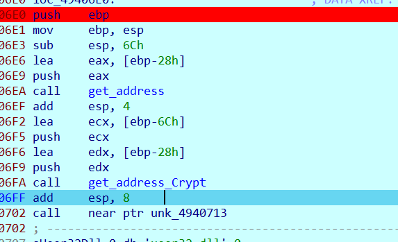
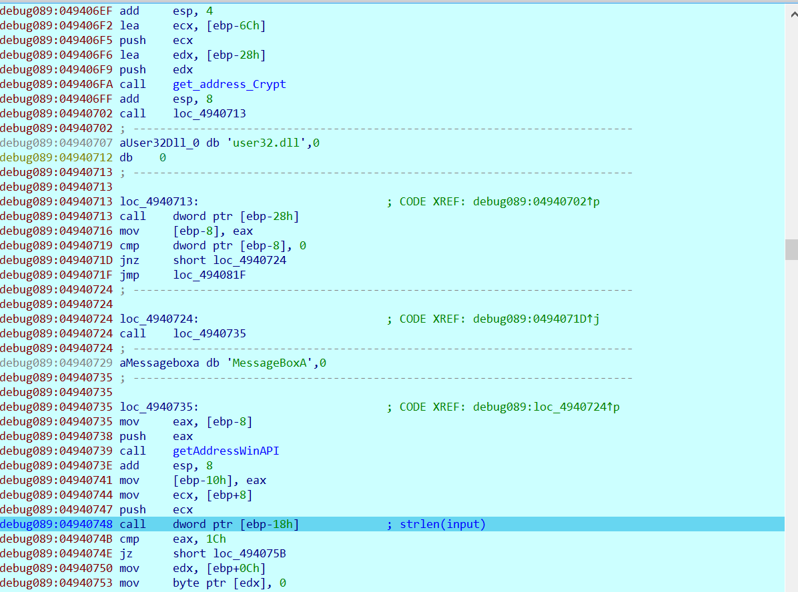
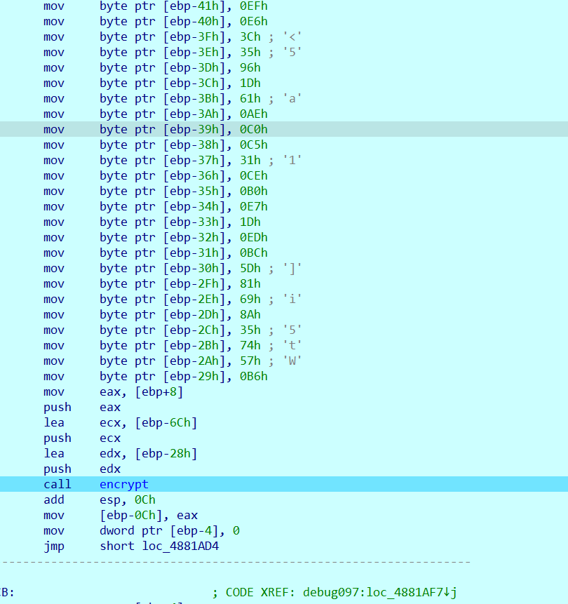

len(input) = 28

```python
flag_en = [
    0xF8, 0x50, 0xCC, 0xEF, 0xE6, 0x3C, 0x35, 0x96, 0x1D, 0x61, 
    0xAE, 0xC0, 0xC5, 0x31, 0xCE, 0xB0, 0xE7, 0x1D, 0xED, 0xBC, 
    0x5D, 0x81, 0x69, 0x8A, 0x35, 0x74, 0x57, 0xB6
]

link_Youtube = [
    0x68, 0x74, 0x74, 0x70, 0x73, 0x3A, 0x2F, 0x2F, 0x77, 0x77, 
    0x77, 0x2E, 0x79, 0x6F, 0x75, 0x74, 0x75, 0x62, 0x65, 0x2E, 
    0x63, 0x6F, 0x6D, 0x2F, 0x77, 0x61, 0x74, 0x63, 0x68, 0x3F, 
    0x76, 0x3D, 0x64, 0x51, 0x77, 0x34, 0x77, 0x39, 0x57, 0x67, 
    0x58, 0x63, 0x51
]   # https://www.youtube.com/watch?v=dQw4w9WgXcQ

```