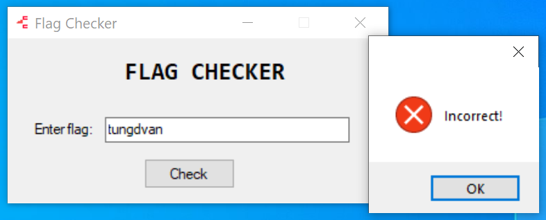

b# FLAG_CHECKER

- Chall: [FILE](CHALL/FlagChecker.zip).

- Sau khi ta đưa vào DIE thì ta thấy như sau:

    

    Như vậy file này được tạo với `AutoIt` và `C++`, đóng gói bằng `UPX`.

- Ta sẽ thực hiện unpack UPX bằng tool [này](https://github.com/upx/upx/releases/tag/v4.2.4). Sau đó sử dụng tool [này](CHALL/AutoIt-Extractor-net40-x64.rar) để xem resource AutoIT. Sau đó ta sẽ được script [sau](CHALL/resource_autoIT.txt).

- Trong hơn 16 nghìn dòng code thì ta thực hiện tìm những chuỗi hiện lên chương trình như `FLAG CHECKER`, `Enter flag`, `Incorrect` trên MessageBox hiện lên khi ta thực thi file để có thể tìm được đoạn code ở trong autoIT:

    

    Sau đó ta sẽ tìm được đoạn script sau:

    ```autoit
    While 0x1
        $nmsg = GUIGetMsg()
        Switch $nmsg
            Case $gui_event_close
                Exit
            Case $bntcheck
                CHECKER()
                Sleep(0x64)
        EndSwitch
    WEnd
    Func CHECKER()
        Local $input = GUICtrlRead($iflag)
        Local $len_input = StringLen($input)
        Local $opcode = "0x558bec83ec6c8d45d850e8aa05000083c4048d4d94518d55d8" & "52e8cb03000083c408e80c0000007573657233322e646c6c00" & "00ff55d88945f8837df8007505e9fb000000e80c0000004d65" & "7373616765426f7841008b45f850e8b306000083c4088945f0" & "8b4d0851ff55e883f81c740b8b550cc60200e9c4000000c645" & "bcf8c645bd50c645beccc645bfefc645c0e6c645c13cc645c2" & "35c645c396c645c41dc645c561c645c6aec645c7c0c645c8c5" & "c645c931c645cacec645cbb0c645cce7c645cd1dc645ceedc6" & "45cfbcc645d05dc645d181c645d269c645d38ac645d435c645" & "d574c645d657c645d7b68b4508508d4d94518d55d852e84700" & "000083c40c8945f4c745fc00000000eb098b45fc83c0018945" & "fc837dfc1c7d1f8b4df4034dfc0fb6118b45fc0fb64c05bc3b" & "d174088b550cc60200eb08ebd28b450cc600018be55dc3558b" & "ec83ec445657b90b000000e82c00000068747470733a2f2f77" & "77772e796f75747562652e636f6d2f77617463683f763d6451" & "773477395767586351005e8d7dbcf3a5c745f800000000c745" & "f400000000c745fc000000008b4510508b4d088b5110ffd289" & "45ec6a006a016a006a008d45f8508b4d0c8b11ffd285c07507" & "33c0e91b0200008d45f4506a006a0068048000008b4df8518b" & "550c8b420cffd085c075156a008b4df8518b550c8b4224ffd0" & "33c0e9e9010000837df40075156a008b4df8518b550c8b4224" & "ffd033c0e9ce0100006a008d4dbc518b55088b4210ffd0508d" & "4dbc518b55f4528b450c8b4808ffd185c075218b55f4528b45" & "0c8b481cffd16a008b55f8528b450c8b4824ffd133c0e98a01" & "00008d55fc526a008b45f45068016800008b4df8518b550c8b" & "4214ffd085c075218b4df4518b550c8b421cffd06a008b4df8" & "518b550c8b4224ffd033c0e94a0100008b4df4518b550c8b42" & "1cffd06a008d4dec516a006a006a016a008b55fc528b450c8b" & "4810ffd185c07527837dfc0074218b55fc528b450c8b4820ff" & "d16a008b55f8528b450c8b4824ffd133c0e9f90000006a0468" & "001000008b55ec83c201526a008b45088b4808ffd18945e883" & "7de8007527837dfc0074218b55fc528b450c8b4820ffd16a00" & "8b55f8528b450c8b4824ffd133c0e9b10000008b55ec83c201" & "528b45e850e8cc06000083c408c745f000000000eb098b4df0" & "83c101894df08b55f03b55ec73128b45e80345f08b4d10034d" & "f08a118810ebdd8b4510508b4d088b5110ffd2508d45ec508b" & "4de8516a006a016a008b55fc528b450c8b4810ffd185c07524" & "837dfc00741e8b55fc528b450c8b4820ffd16a008b55f8528b" & "450c8b4824ffd133c0eb23837dfc00741a8b55fc528b450c8b" & "4820ffd16a008b55f8528b450c8b4824ffd18b45e85f5e8be5" & "5dc3558bec51e81000000061647661706933322e646c6c0000" & "00008b45088b08ffd18945fc837dfc00750732c0e99b010000" & "e818000000437279707441637175697265436f6e7465787441" & "000000008b55fc52e8d102000083c4088b4d0c8901e8100000" & "00437279707443726561746548617368008b55fc52e8ab0200" & "0083c4088b4d0c89410ce8100000004372797074496d706f72" & "744b657900008b55fc52e88402000083c4088b4d0c894104e8" & "1000000043727970744465726976654b657900008b55fc52e8" & "5d02000083c4088b4d0c894114e81000000043727970744861" & "7368446174610000008b55fc52e83602000083c4088b4d0c89" & "4108e8100000004372797074456e6372797074000000008b55" & "fc52e80f02000083c4088b4d0c894110e81400000043727970" & "7447657448617368506172616d0000008b55fc52e8e4010000" & "83c4088b4d0c894118e814000000437279707444657374726f" & "7948617368000000008b55fc52e8b901000083c4088b4d0c89" & "411ce810000000437279707444657374726f794b6579008b55" & "fc52e89201000083c4088b4d0c894120e81400000043727970" & "7452656c65617365436f6e74657874008b55fc52e867010000" & "83c4088b4d0c894124b0018be55dc3558bec83ec18e81c0000" & "006b00650072006e0065006c00330032002e0064006c006c00" & "00000000e88602000083c4048945fc837dfc00750732c0e915" & "010000e8100000004c6f61644c69627261727941000000008b" & "45fc50e8fb00000083c4088945f8837df800750732c0e9e400" & "0000e81000000047657450726f634164647265737300008b4d" & "fc51e8ca00000083c4088945f4837df400750732c0e9b30000" & "00e8100000005669727475616c416c6c6f63000000008b55fc" & "52e89900000083c4088945f0837df000750732c0e982000000" & "e80c0000005669727475616c46726565008b45fc50e86c0000" & "0083c4088945ec837dec00750432c0eb58e80c0000006c7374" & "726c656e41000000008b4dfc51e84200000083c4088945e883" & "7de800750432c0eb2e8b55088b45f889028b4d088b55f48951" & "048b45088b4df08948088b55088b45ec89420c8b4d088b55e8" & "895110b0018be55dc3558bec83ec3c8b45088945ec8b4dec0f" & "b71181fa4d5a0000740733c0e9350100008b45ec8b4d080348" & "3c894de4ba080000006bc2008b4de48d5401788955e88b45e8" & "833800750733c0e9080100008b4de88b118955e08b45e00345" & "088945f48b4df48b51188955dc8b45f48b481c894dd08b55f4" & "8b42208945d88b4df48b51248955d4c745f800000000eb098b" & "45f883c0018945f88b4df83b4ddc0f83b30000008b55080355" & "d88b45f88d0c82894dc88b55080355d48b45f88d0c42894dcc" & "8b55080355d08b45cc0fb7088d148a8955c48b45c88b4d0803" & "08894df0c745fc00000000c745fc00000000eb098b55fc83c2" & "018955fc8b450c0345fc0fbe0885c974278b55f00355fc0fbe" & "0285c0741a8b4d0c034dfc0fbe118b45f00345fc0fbe083bd1" & "7402eb02ebc38b550c0355fc0fbe0285c075198b4df0034dfc" & "0fbe1185d2750c8b45c48b4d0803088bc1eb07e938ffffff33" & "c08be55dc3558bec83ec34c745e40000000064a13000000089" & "45e48b4de48b510c8955d88b45d88b480c8b5010894dcc8955" & "d08b45cc8945d48b4dd4894de8837de8000f845a0100008b55" & "e8837a18000f844d0100008b45e8837830007502ebde8b4de8" & "8b51308955ecc745f000000000c745f000000000eb098b45f0" & "83c0018945f08b4df08b55080fb7044a85c00f84dd0000008b" & "4df08b55ec0fb7044a85c00f84cb0000008b4df08b55080fb7" & "044a83f85a7f378b4df08b55080fb7044a83f8417c288b4df0" & "8b55080fb7044a83c0208945e08b4df08b5508668b45e06689" & "044a668b4de066894dfeeb0e8b55f08b4508668b0c5066894d" & "fe668b55fe668955f88b45f08b4dec0fb7144183fa5a7f378b" & "45f08b4dec0fb7144183fa417c288b45f08b4dec0fb7144183" & "c2208955dc8b45f08b4dec668b55dc66891441668b45dc6689" & "45fceb0e8b4df08b55ec668b044a668945fc668b4dfc66894d" & "f40fb755f80fb745f43bd07402eb05e908ffffff8b4df08b55" & "080fb7044a85c075168b4df08b55ec0fb7044a85c075088b4d" & "e88b4118eb0f8b55e88b028945e8e99cfeffff33c08be55dc3" & "558bec518b45088945fc837d0c00741a8b4dfcc601008b55fc" & "83c2018955fc8b450c83e80189450cebe08b45088be55dc300" & "00000000000000000000000000000000000000000000000000" & "00000000000000000000000000000000000000000000000000" & "00000000000000000000000000000000000000000000000000" & "00000000000000000000000000000000000000000000000000" & "00000000000000000000000000000000000000000000000000" & "00000000000000000000000000000000000000000000000000" & "00000000000000000000000000000000000000000000000000" & "00000000000000000000000000000000000000000000000000" & "00000000000000000000000000000000000000000000000000" & "00000000000000000000000000000000000000000000000000" & "00000000000000000000000000000000000000000000000000" & "00000000000000000000000000000000000000000000000000" & "00000000000000000000000000000000000000000000000000" & "00000000000000000000000000000000000000000000000000" & "00000000000000000000000000000000000000000000000000" & "00000000000000000000000000000000000000000000000000" & "00000000000000000000000000000000000000000000000000" & "00000000000000000000000000000000000000000000"
        Local $opcode_buf = DllStructCreate("byte[" & BinaryLen($opcode) & "]")
        DllStructSetData($opcode_buf, 0x1, Binary($opcode))
        Local $input_buf = DllStructCreate("byte[" & BinaryLen($input) + 0x1 & "]")
        DllStructSetData($input_buf, 0x1, Binary($input))
        Local $is_flag = DllStructCreate("byte[1]")
        DllStructSetData($is_flag, 0x1, Binary("0x00"))
        DllCall("user32.dll", "none", "CallWindowProcA", "ptr", DllStructGetPtr($opcode_buf), "ptr", DllStructGetPtr($input_buf), "ptr", DllStructGetPtr($is_flag), "int", 0x0, "int", 0x0)
        If DllStructGetData($is_flag, 0x1) == "0x01" Then
            MsgBox(0x0, "", "Correct!")
        Else
            MsgBox($mb_iconerror, "", "Incorrect!")
        EndIf
    EndFunc   ;==>CHECKER
    ```

## Phân tích code AutoIT

- Khai báo biến và xử lý ban đầu:

    ```autoit
    Local $input = GUICtrlRead($iflag)
    Local $len_input = StringLen($input)
    ```

    `$input`: Lấy dữ liệu từ một điều khiển GUI (do biến `$iflag` chỉ định).

    `$len_input`: Tính chiều dài chuỗi $input.

- Tạo và gán dữ liệu cho các `DllStruct`:

    ```autoit
    Local $opcode = "0x558bec83ec6c8d45d8..." ; (opcode này rất rất dài)
    Local $opcode_buf = DllStructCreate("byte[" & BinaryLen($opcode) & "]")
    DllStructSetData($opcode_buf, 0x1, Binary($opcode))
    ```

    Lệnh này dùng để tạo ra một vùng nhớ nhị phân binary `opcode_buf` để có thể truyền địa chỉ của vùng nhớ này (bằng việc sử dụng `DllStructGetPtr`). Tương tự như thế đối với vùng nhớ `input_buf` và vùng nhớ `is_flag`.

    ```autoit
    Local $input_buf = DllStructCreate("byte[" & BinaryLen($input) + 0x1 & "]")
    DllStructSetData($input_buf, 0x1, Binary($input))
    Local $is_flag = DllStructCreate("byte[1]")
    DllStructSetData($is_flag, 0x1, Binary("0x00")) # gán cho biến check giá trị 0
    ``` 

- Gọi hàm `DllCall` để thực thi mã lệnh:

    ```autoIt
    DllCall("user32.dll", "none", "CallWindowProcA", "ptr", DllStructGetPtr($opcode_buf), "ptr", DllStructGetPtr($input_buf), "ptr", DllStructGetPtr($is_flag), "int", 0x0, "int", 0x0)
    ```

    `DllCall`: Gọi hàm `CallWindowProcA` từ `user32.dll`.

    Tham số: `DllStructGetPtr($opcode_buf)` con trỏ đến mã nhị phân của `$opcode`, tương tự với dữ liệu `$input_buf` và `$is_flag`.

    Thực thi đoạn `shellcode` với tham số truyền vào là `$input`. 

- Kiểm tra kết quả:

    ```autoit
    If DllStructGetData($is_flag, 0x1) == "0x01" Then
        MsgBox(0x0, '', "Correct!")
    Else
        MsgBox($MB_ICONERROR, '', "Incorrect!")
    EndIf
    ```

    Câu lệnh thực hiện kiểm tra giá trị của `$is_flag`, nếu là 1 thì in ra `Correct`, ngược lại in ra `Incorrect`.

- TÓM TẮT: chương trình sẽ thực hiện load những opcode ở trên là shellcode để kiểm tra xem input nhập vào có đúng flag hay không.

## Phân tích chương trình

- Như ở trên ta có thấy gọi hàm `CallWindowProcA` từ thư viện `user32.dll` nên ta thực hiện đặt một break-point tại hàm đó rùi thực hiện nhảy vào.

- Khi debug ta thấy có một đoạn check debug ở đây:

    

    Ta thực hiện sửa cờ để có thể bypass qua đoaạn này.

    Sau khi đặt break-point trong hàm `CallWindowProcA` thì ta thấy đoạn opcode được load vào chương trình:

    

- Ta thực hiện MakeCode (C) đoạn shellcode đóa:

    

    Điều đặc biệt của đống Shellcode này chính là bên cạnh những câu lệnh thì nó có chèn thêm một số những string ở giữa. Nhưng mà đoạn shellcode ở trên vẫn hoạt động một cách trơn tru, chúng ta cùng phân tích đoạn shellcode.

## Phân tích Shellcode

> Shellcode là một đoạn mã máy (machine code) nhỏ được thiết kế để thực thi một nhiệm vụ cụ thể, thường được sử dụng trong các cuộc tấn công bảo mật như khai thác lỗ hổng phần mềm.

> Đặc điểm nổi bật của Shellcode chính là `Tự hoặt động một cách độc lập`: Shellcode không phụ thuộc vào các thành phần khác ngoài chính nó, cho phép nó chạy được lập trong trường hợp nó nhúng vào bất kì bộ nhớ của chương trình nào. 

> Shellcode thường sử dụng các API của hệ điều hành như `LoadLibrary` và `GetProcAddress`, vì tính linh hoạt của 2 hàm này cho phép Shellcode có thể hoạt động độc lập và chạy mọi thứ mà đoạn shell muốn. Vì hàm `LoadLibrary` cho phép shellcode tải một thư viện vào không gian địa chỉ của quy trình hiện tại và hàm `GetProcAddress` cho phép truy xuất địa chỉ của một hàm cụ thể trong DLL đã nạp (Điều này cho phép shellcode truy cập các hàm mà không được nạp sẵn).

- Chính vì sự quan trọng của 2 hàm `LoadLibrary` và `GetProcAddress` nên điều đầu tiên trong đoạn shellcode trên là ta thấy đoạn shell đang cố tìm thư viện `kernel32.dll` thông qua cấu trúc PEB vì 2 hàm trên ở trong thư viện `kernel32.dll`:

    ```C
    struct _LIST_ENTRY *__cdecl sub_49D339B(int kernel32)
    {
    __int16 v1; // ax
    __int16 v2; // dx
    struct _LIST_ENTRY *Flink; // [esp+1Ch] [ebp-18h]
    struct _LIST_ENTRY *v5; // [esp+20h] [ebp-14h]
    int i; // [esp+24h] [ebp-10h]
    __int16 v7; // [esp+30h] [ebp-4h]
    __int16 v8; // [esp+32h] [ebp-2h]

    Flink = NtCurrentPeb()->Ldr->InLoadOrderModuleList.Flink;
    while ( Flink && Flink[3].Flink )
    {
        if ( Flink[6].Flink )
        {
        v5 = Flink[6].Flink;
        for ( i = 0; *(_WORD *)(kernel32 + 2 * i) && *((_WORD *)&v5->Flink + i); ++i )
        {
            if ( *(unsigned __int16 *)(kernel32 + 2 * i) > 0x5Au || *(unsigned __int16 *)(kernel32 + 2 * i) < 0x41u )
            {
            v8 = *(_WORD *)(kernel32 + 2 * i);
            }
            else
            {
            v1 = *(_WORD *)(kernel32 + 2 * i);
            *(_WORD *)(kernel32 + 2 * i) = v1 + 32;
            v8 = v1 + 32;
            }
            if ( *((unsigned __int16 *)&v5->Flink + i) > 0x5Au || *((unsigned __int16 *)&v5->Flink + i) < 0x41u )
            {
            v7 = *((_WORD *)&v5->Flink + i);
            }
            else
            {
            v2 = *((_WORD *)&v5->Flink + i);
            *((_WORD *)&v5->Flink + i) = v2 + 32;
            v7 = v2 + 32;
            }
            if ( v8 != v7 )
            break;
        }
        if ( !*(_WORD *)(kernel32 + 2 * i) && !*((_WORD *)&v5->Flink + i) )
            return Flink[3].Flink;
        Flink = Flink->Flink;
        }
    }
    return 0;
    }
    ```

- Trong đó hàm `find_address_WinAPI` như sau:

    ```C
    int __cdecl sub_4B43931(int file_dll, _BYTE *name)
    {
    _DWORD *v3; // [esp+24h] [ebp-18h]
    _BYTE *v4; // [esp+2Ch] [ebp-10h]
    _DWORD *v5; // [esp+30h] [ebp-Ch]
    unsigned int i; // [esp+34h] [ebp-8h]
    int j; // [esp+38h] [ebp-4h]

    if ( *(_WORD *)file_dll != 'ZM' )
        return 0;
    v3 = (_DWORD *)(*(_DWORD *)(file_dll + 0x3C) + file_dll + 0x78);
    if ( !*v3 )
        return 0;
    v5 = (_DWORD *)(file_dll + *v3);
    for ( i = 0; i < v5[6]; ++i )
    {
        v4 = (_BYTE *)(*(_DWORD *)(v5[8] + file_dll + 4 * i) + file_dll);
        for ( j = 0; name[j] && v4[j] && name[j] == v4[j]; ++j )
        ;
        if ( !name[j] && !v4[j] )
        return *(_DWORD *)(v5[7] + file_dll + 4 * *(unsigned __int16 *)(v5[9] + file_dll + 2 * i)) + file_dll;
    }
    return 0;
    }
    ```

    Hàm này có chức năng tìm địa chỉ của hàm trong `file_dll` mà không cần đến sử dụng `GetProcAddress`. Ban đầu chương trình sẽ kiểm tra xem có đúng là tệp hợp lệ không (`*(_WORD *)file_dll != 'ZM'` vì tệp PE bắt đầu bằng chữ kí `MZ`), sau đó sẽ truy cập vào bảng `export` của tệp PE đó (`file_dll + *v3`). Sau đó thực hiện duyệt các tên có trong bảng `export` để xem có khớp với tên chỉ định `name` ban đầu không, nếu thấy sẽ trả về địa chỉ tương ứng của hàm đó, nếu không thấy sẽ trả về `NULL`. Với những hàm như **LoadLibraryA**, **VirtualAlloc**,... thì `file_dll` là `kernel32.dll`, còn những hàm như **CryptImportKey**, **CryptAcquireContextA** thì `file_dll` sẽ là `advapi32.dll`.


- Chú ý: Khi chương trình thực hiện một lời gọi hàm, vì chương trình sẽ thực hiện đẩy địa chỉ tiếp theo sau câu lệnh call (hay nó còn được gọi là return address).

    

    Như trong hình trên thì sau khi lệnh `call loc_49C2980` thì chương trình sẽ thực hiện đẩy địa chỉ phía bên dưới của câu lệnh đóa cụ thể là `aKernel32Dll_0` vào đỉnh stack, xong tiếp đóa là câu lệnh của hàm `call loc_49C2C0B`. Như vậy lúc này chương trình như đang truyền tham số vào hàm `loc_49C2C0B` một cách gián tiếp trước khi gọi hàm. Nếu chúng ta debug tiếp thì chúng ta biết chức năng của hàm `loc_49C2C0B` là tìm thư viện `kernel32.dll`.

    Như vậy ta có thể tóm biết được ý tưởng của những chuỗi string được chèn lẫn lộn ở trong opcode có chức năng như một tham số trước khi gọi hàm nào đó.

- Sau khi biết ý tưởng hoạt động của đoạn shellcode này ta thực hiện makecode và tránh những chuỗi sao để việc makecode cho chuẩn, và thực hiện đọc mã máy để hiểu đoạn shellcode đang làm gì.

- Tóm tắt đoạn shellcode trên sẽ làm những điều sau:

    ```C
    load:
        kernel32.dll // ebp-4

    find_address_WinAPI:
        LoadLibraryA
        aGetprocaddress
        VirtualAlloc
        VirtualFree
        lstrlenA

    LoadLibraryA:
        advapi32.dll

    find_address_WinAPI:
        CryptAcquireContextA
        CryptCreateHash
        CryptImportKey
        CryptDeriveKey
        CryptHashData
        CryptEncrypt
        CryptGetHashParam
        CryptDestroyHash
        CryptDestroyKey
        CryptReleaseContex

    LoadLibraryA:
        user32.dll

    find_address_WinAPI:
        MessageBoxA

    lstrlen(input)

    check(len(input) == 0x1C)

    flag_en = [
        0xF8, 0x50, 0xCC, 0xEF, 0xE6, 0x3C, 0x35, 0x96, 0x1D, 0x61, 
        0xAE, 0xC0, 0xC5, 0x31, 0xCE, 0xB0, 0xE7, 0x1D, 0xED, 0xBC, 
        0x5D, 0x81, 0x69, 0x8A, 0x35, 0x74, 0x57, 0xB6
    ]

    link = 'https://www.youtube.com/watch?v=dQw4w9WgXcQ' // ebp-44h
    HCRYPTPROV phProv; // ebp-8
    HCRYPTHASH phHash; // ebp-0Ch
    input; // ebp+10h
    DWORD dwDataLen; // ebp - 14h
    HCRYPTKEY phKey; // ebp-4

    CryptAcquireContextA(&phProv, 0, 0, PROV_RSA_FULL, 0)
    CryptCreateHash(phProv, CALG_SHA, 0, 0, &phHash)
    CryptHashData(phHash, link, dwDataLen, 0)
    CryptDeriveKey(phProv, CALG_RC4, phHash, 0, &phKey)
    CryptDestroyHash(phHash)
    CryptEncrypt(phKey, NULL, TRUE, 0, 0, &dwDataLen, 0)
    LPVOID _VirtualAlloc = VirtualAlloc(0, dwDataLen, MEM_COMMIT, PAGE_READWRITE);// ebp-18h
    CryptEncrypt(phKey, 0, 1, 0, input, &dwDataLen, lenInput)
    CryptDestroyKey(phKey)
    CryptReleaseContext(phProv, 0)

    check(intput == flag_en)

    ```


    

    <!-- Trong đó hàm `find_address_WinAPI` như sau:

    ```C
    int __cdecl sub_4B43931(int file_dll, _BYTE *name)
    {
    _DWORD *v3; // [esp+24h] [ebp-18h]
    _BYTE *v4; // [esp+2Ch] [ebp-10h]
    _DWORD *v5; // [esp+30h] [ebp-Ch]
    unsigned int i; // [esp+34h] [ebp-8h]
    int j; // [esp+38h] [ebp-4h]

    if ( *(_WORD *)file_dll != 'ZM' )
        return 0;
    v3 = (_DWORD *)(*(_DWORD *)(file_dll + 0x3C) + file_dll + 0x78);
    if ( !*v3 )
        return 0;
    v5 = (_DWORD *)(file_dll + *v3);
    for ( i = 0; i < v5[6]; ++i )
    {
        v4 = (_BYTE *)(*(_DWORD *)(v5[8] + file_dll + 4 * i) + file_dll);
        for ( j = 0; name[j] && v4[j] && name[j] == v4[j]; ++j )
        ;
        if ( !name[j] && !v4[j] )
        return *(_DWORD *)(v5[7] + file_dll + 4 * *(unsigned __int16 *)(v5[9] + file_dll + 2 * i)) + file_dll;
    }
    return 0;
    }
    ```

    Hàm này có chức năng tìm địa chỉ của hàm trong `file_dll` mà không cần đến sử dụng `GetProcAddress`. Ban đầu chương trình sẽ kiểm tra xem có đúng là tệp hợp lệ không (`*(_WORD *)file_dll != 'ZM'` vì tệp PE bắt đầu bằng chữ kí `MZ`), sau đó sẽ truy cập vào bảng `export` của tệp PE đó (`file_dll + *v3`). Sau đó thực hiện duyệt các tên có trong bảng `export` để xem có khớp với tên chỉ định `name` ban đầu không, nếu thấy sẽ trả về địa chỉ tương ứng của hàm đó, nếu không thấy sẽ trả về `NULL`. Với những hàm như **LoadLibraryA**, **VirtualAlloc**,... thì `file_dll` là `kernel32.dll`, còn những hàm như **CryptImportKey**, **CryptAcquireContextA** thì `file_dll` sẽ là `advapi32.dll`. -->

- Sau khi ngồi đọc chay đoạn mã máy ở trên thì ta thực hiện viết sc để tìm flag:

    ```C
    #include <windows.h>
    #include <wincrypt.h>
    #include <iostream>
    #include <cstring> 

    int main() {
        HCRYPTPROV phProv; // ebp-8
        HCRYPTHASH phHash; // ebp-0Ch
        unsigned char link[43] = { // ebp-44h
            0x68, 0x74, 0x74, 0x70, 0x73, 0x3A, 0x2F, 0x2F, 0x77, 0x77,
            0x77, 0x2E, 0x79, 0x6F, 0x75, 0x74, 0x75, 0x62, 0x65, 0x2E,
            0x63, 0x6F, 0x6D, 0x2F, 0x77, 0x61, 0x74, 0x63, 0x68, 0x3F,
            0x76, 0x3D, 0x64, 0x51, 0x77, 0x34, 0x77, 0x39, 0x57, 0x67,
            0x58, 0x63, 0x51
        };
        unsigned char input[28] = { // ebp+10h
            0x61, 0x61, 0x61, 0x61, 0x61, 0x61, 0x61, 0x61, 0x61, 0x61,
            0x61, 0x61, 0x61, 0x61, 0x61, 0x61, 0x61, 0x61, 0x61, 0x61,
            0x61, 0x61, 0x61, 0x61, 0x61, 0x61, 0x61, 0x61
        };
        unsigned char flag[28] = {
            0xF8, 0x50, 0xCC, 0xEF, 0xE6, 0x3C, 0x35, 0x96, 0x1D, 0x61,
            0xAE, 0xC0, 0xC5, 0x31, 0xCE, 0xB0, 0xE7, 0x1D, 0xED, 0xBC,
            0x5D, 0x81, 0x69, 0x8A, 0x35, 0x74, 0x57, 0xB6
        };

        DWORD dwDataLen = 43; // ebp - 14h
        HCRYPTKEY phKey; // ebp-4
        DWORD lenInput = 28;

        if (!CryptAcquireContextA(&phProv, 0, 0, PROV_RSA_FULL, 0)) {
            printf("Fail CryptAcquireContextA\n");
            DWORD errorCode = GetLastError();
            printf("Fail CryptAcquireContextA, Error Code: %lx\n", errorCode);
        }
        if (!CryptCreateHash(phProv, CALG_SHA, 0, 0, &phHash)) {
            printf("Fail CryptCreateHash\n");
            DWORD errorCode = GetLastError();
            printf("Fail CryptCreateHash, Error Code: %lx\n", errorCode);
        }
        if (!CryptHashData(phHash, (BYTE*)link, dwDataLen, 0)) {
            printf("Fail CryptHashData\n");
            DWORD errorCode = GetLastError();
            printf("Fail CryptHashData, Error Code: %lx\n", errorCode);
        }
        if (!CryptDeriveKey(phProv, CALG_RC4, phHash, 0, &phKey)) {
            printf("Fail CryptDeriveKey\n");
            DWORD errorCode = GetLastError();
            printf("Fail CryptDeriveKey, Error Code: %lx\n", errorCode);
        }
        if (!CryptDestroyHash(phHash)) {
            printf("Fail CryptDestroyHash\n");
            DWORD errorCode = GetLastError();
            printf("Fail CryptDestroyHash, Error Code: %lx\n", errorCode);
        }

        dwDataLen = 28;
        if (!CryptEncrypt(phKey, NULL, TRUE, 0, 0, &dwDataLen, 0)) {
            printf("Fail CryptEncrypt\n");
            DWORD errorCode = GetLastError();
            printf("Fail CryptEncrypt, Error Code: %lx\n", errorCode);
        }

        LPVOID _VirtualAlloc = VirtualAlloc(0, dwDataLen, MEM_COMMIT, PAGE_READWRITE);// ebp-18h


        ////Encrypt
        //if (!CryptEncrypt(phKey, 0, 1, 0, (BYTE*)input, &dwDataLen, lenInput)) {
        //	printf("Fail CryptEncrypt\n");
        //	DWORD errorCode = GetLastError();
        //	printf("Fail CryptEncrypt, Error Code: %lx\n", errorCode);
        //}

        //Decrypt
        if (!CryptDecrypt(phKey, 0, 1, 0, (BYTE*)flag, &dwDataLen)) {
            printf("Fail CryptEncrypt\n");
            DWORD errorCode = GetLastError();
            printf("Fail CryptEncrypt, Error Code: %lx\n", errorCode);
        }
        for (int i = 0; i < 28; i++) {
            printf("%c", flag[i]);
        }
        if (!CryptDestroyKey(phKey)) {
            printf("Fail CryptDestroyKey\n");
            DWORD errorCode = GetLastError();
            printf("Fail CryptDestroyKey, Error Code: %lx\n", errorCode);
        }
        if (!CryptReleaseContext(phProv, 0)) {
            printf("Fail CryptReleaseContext\n");
            DWORD errorCode = GetLastError();
            printf("Fail CryptReleaseContext, Error Code: %lx\n", errorCode);
        }
        return 0;
    }
    ```

- Flag:

    ```txt
    KCSC{rC4_8uT_1T_L00k2_W31Rd}
    ```


